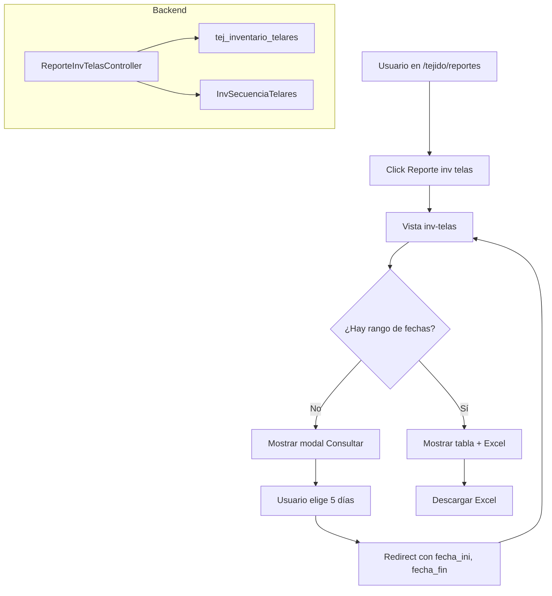

# Plan: Reporte Inv Telas - Backend y Vista

## Resumen

El reporte mostrará datos de `tej_inventario_telares` agrupados por secciones (JACQUARD SULZER, JACQUARD SMIT, SMIT, ITEMA VIEJO, ITEMA NUEVO), con columnas **cuenta pie**, **cuenta rizo**, **fibra** y **calibre**, más **5 columnas de días** según el rango de fechas elegido (no fechas fijas como "12-16 febrero").

---

## Estructura del reporte (según imagen de referencia)

| No. Telar | FIBRA CALIBR | CUENTA RIZO | CUENTA PIE | Día 1 | Día 2 | Día 3 | Día 4 | Día 5 |
| --------- | ------------ | ----------- | ---------- | ----- | ----- | ----- | ----- | ----- |
| 207       | hilo-calibre | cuenta      | cuenta     | ...   | ...   | ...   | ...   | ...   |
| 208       | ...          | ...         | ...        | ...   | ...   | ...   | ...   | ...   |

- **Secciones**: Encabezados tipo JACQUARD SULZER, JACQUARD SMIT, SMIT, ITEMA VIEJO, ITEMA NUEVO.
- **Mapeo de secciones**: Combinar `salon` de [tej_inventario_telares](app/Models/Tejido/TejInventarioTelares.php) con `TipoTelar` de [InvSecuenciaTelares](app/Models/Inventario/InvSecuenciaTelares.php).
- **Datos**: `hilo` (fibra), `calibre`, y para cada fila: `cuenta` cuando `tipo='Rizo'` y `cuenta` cuando `tipo='Pie'`. En inventario cada rollo tiene un solo tipo; se agrupará por `no_telar` para mostrar cuenta_rizo y cuenta_pie.
- **Días**: Exactamente 5 columnas, generadas dinámicamente según el rango (ej. si el usuario elige 10–14 feb, columnas serán 10-feb, 11-feb, etc.).

---

## Archivos a crear/modificar

### 1. Rutas

En [routes/modules/tejido.php](routes/modules/tejido.php):

- Ruta `GET /tejido/reportes/inv-telas` para la vista del reporte (modal de rango de fechas).
- Ruta `GET /tejido/reportes/inv-telas/excel` para exportar Excel.
- Actualizar el ítem "Reporte inv telas" en el índice para que `url` apunte a la nueva ruta.

### 2. Controlador

Crear `App\Http\Controllers\Tejido\Reportes\ReporteInvTelasController.php`:

- **index**: Muestra la vista con modal para elegir rango de fechas (5 días).
- **reporte**: Si hay `fecha_ini` y `fecha_val`, valida que el rango sea ≤ 5 días, consulta `tej_inventario_telares` y `InvSecuenciaTelares`, construye la estructura de datos y pasa todo a la vista.
- **exportarExcel**: Igual lógica de datos y genera el Excel.

**Consulta de datos**:

- Filtrar `tej_inventario_telares` por `fecha` en el rango seleccionado y `status = 'Activo'`.
- Agrupar por `no_telar` y `salon`.
- Para cada telar: obtener `cuenta_rizo` (cuenta donde tipo=Rizo) y `cuenta_pie` (cuenta donde tipo=Pie); `fibra` = `hilo`, `calibre`.
- Unir con `InvSecuenciaTelares` por `NoTelar`/`no_telar` para obtener `TipoTelar` y definir la sección.
- Mapear `salon` + `TipoTelar` a nombres como JACQUARD SULZER, JACQUARD SMIT, SMIT, ITEMA VIEJO, ITEMA NUEVO.
- Generar 5 columnas de días: desde `fecha_ini` hasta `fecha_ini + 4` (máx 5 días).

**Valores en las celdas de días**: cantidad de rollos en inventario para ese `no_telar` y esa fecha (filtrar `tej_inventario_telares` por `fecha`).

### 3. Vista del reporte

Crear `resources/views/modulos/tejido/reportes/inv-telas.blade.php`:

- Encabezado azul similar a [reporte tejedores](resources/views/modulos/tejedores/reportes/programa.blade.php).
- Botón "Consultar" que abre modal SweetAlert2 para elegir `fecha_ini` y `fecha_fin` (validar ≤ 5 días).
- Tabla HTML: secciones resaltadas (bg amarillo), filas con no_telar, fibra+calibre, cuenta_rizo, cuenta_pie, y 5 columnas dinámicas con encabezados de día.
- Botón "Descargar Excel" cuando ya exista un rango consultado.

### 4. Export Excel

Crear `App\Exports\ReporteInvTelasExport.php` (con Maatwebsite\Excel):

- Misma estructura: secciones, filas (no_telar, fibra, calibre, cuenta_rizo, cuenta_pie) y 5 columnas de días.
- Usar la plantilla [Reportes Tejido.xlsx](resources/templates/Reportes Tejido.xlsx) como base si el formato lo permite, o generar un Excel nuevo con la misma estructura.

### 5. Actualizar índice de reportes

En [routes/modules/tejido.php](routes/modules/tejido.php), en el closure de `/reportes`, cambiar el `url` del reporte "Reporte inv telas" de `#` a `route('tejido.reportes.inv-telas')`.

---

## Diagrama de flujo

---

## Notas técnicas

- **Modelo**: [TejInventarioTelares](app/Models/Tejido/TejInventarioTelares.php) (campos: `no_telar`, `tipo`, `cuenta`, `calibre`, `hilo`, `salon`, `fecha`).
- **Conexión**: `tej_inventario_telares` puede usar la conexión por defecto o `sqlsrv`; validar en [InventarioTelaresService](app/Services/ProgramaUrdEng/InventarioTelaresService.php).
- **Mapeo salon → sección**: Si `InvSecuenciaTelares` no cubre JACQUARD SULZER vs JACQUARD SMIT, usar un mapeo en código (`JACQUARD` + rango de telares → SULZER vs SMIT) o tabla de configuración futura.

