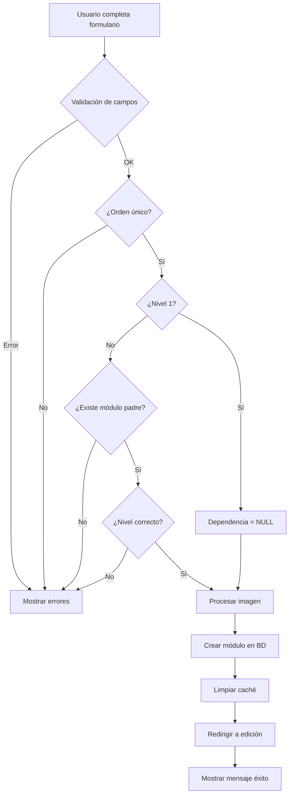

# 📚 Lógica de Creación de Módulos en SYSRoles

## 🎯 Resumen Ejecutivo

El sistema de módulos en `SYSRoles` utiliza una estructura jerárquica de 3 niveles que permite organizar funcionalidades de manera estructurada. Cada módulo puede ser principal o depender de otro módulo padre.

---

## 📋 Estructura de la Tabla SYSRoles

| Campo         | Tipo              | Descripción                      | Ejemplo               |
| ------------- | ----------------- | -------------------------------- | --------------------- |
| `idrol`       | int (PK)          | ID único auto-incremental        | 36, 37, 38            |
| `orden`       | string            | Identificador único del módulo   | "300", "304", "401-1" |
| `modulo`      | string            | Nombre descriptivo del módulo    | "Reportes Urdido"     |
| `acceso`      | boolean           | Permiso de acceso al módulo      | 1 (true)              |
| `crear`       | boolean           | Permiso para crear registros     | 1 (true)              |
| `modificar`   | boolean           | Permiso para modificar registros | 1 (true)              |
| `eliminar`    | boolean           | Permiso para eliminar registros  | 1 (true)              |
| `reigstrar`   | boolean           | Permiso especial de registro     | 1 (true)              |
| `imagen`      | string            | Nombre del archivo de imagen     | "1761057080.jpg"      |
| `Dependencia` | string (nullable) | Orden del módulo padre           | "300", "400", NULL    |
| `Nivel`       | int               | Nivel jerárquico (1, 2, o 3)     | 1, 2, 3               |
| `created_at`  | datetime          | Fecha de creación                | 2025-10-12 23:43:06   |
| `updated_at`  | datetime          | Fecha de actualización           | 2025-10-13 11:40:40   |

---

## 🏗️ Jerarquía de Módulos

### **Nivel 1 - Módulos Principales**

Son los módulos raíz que NO dependen de ningún otro módulo.

**Características:**

-   `Nivel = 1`
-   `Dependencia = NULL`
-   Representan las secciones principales del sistema

**Ejemplo:**

```
idrol: 36
orden: "300"
modulo: "Reportes Urdido"
Nivel: 1
Dependencia: NULL
```

---

### **Nivel 2 - Submódulos Nivel 2**

Son submódulos que dependen directamente de un módulo de Nivel 1.

**Características:**

-   `Nivel = 2`
-   `Dependencia = orden de un módulo Nivel 1`
-   Son hijos directos de módulos principales

**Ejemplo:**

```
idrol: 37
orden: "304"
modulo: "Catálogos Julios"
Nivel: 2
Dependencia: "300"  ← Depende del módulo con orden "300"
```

---

### **Nivel 3 - Submódulos Nivel 3**

Son submódulos que dependen de un módulo de Nivel 2.

**Características:**

-   `Nivel = 3`
-   `Dependencia = orden de un módulo Nivel 2`
-   Son "nietos" de módulos principales

**Ejemplo:**

```
idrol: 43
orden: "401-1"
modulo: "Producción Engomado"
Nivel: 3
Dependencia: "401"  ← Depende del módulo con orden "401" (Nivel 2)
```

---

## 🔄 Visualización de Jerarquía

```
📦 Reportes Urdido (300) - Nivel 1
   └─ 📂 Catálogos Julios (304) - Nivel 2
   └─ 📂 Catálogo de Pavos (304-2) - Nivel 2

📦 Engomado (400) - Nivel 1
   ├─ 📂 Programa Engomado (401) - Nivel 2
   │    └─ 📄 Producción Engomado (401-1) - Nivel 3
   ├─ 📂 BPM (Buenas Practicas Manufactura) Eng (402) - Nivel 2
   └─ 📂 Reportes Engomado (403) - Nivel 2

📦 Atadores (500) - Nivel 1
   └─ 📂 Programa Atadores (501) - Nivel 2
```

---

## ✅ Reglas de Validación

### 1️⃣ **Unicidad del Campo `orden`**

-   El campo `orden` debe ser **único** en toda la tabla
-   No puede haber dos módulos con el mismo `orden`
-   Validación: `unique:SYSRoles,orden`

### 2️⃣ **Dependencias según Nivel**

| Nivel | Dependencia             | Validación                   |
| ----- | ----------------------- | ---------------------------- |
| 1     | NULL (obligatorio)      | No debe tener dependencia    |
| 2     | orden de módulo Nivel 1 | Debe existir el módulo padre |
| 3     | orden de módulo Nivel 2 | Debe existir el módulo padre |

### 3️⃣ **Validación de Jerarquía**

-   Un módulo **Nivel 2** solo puede depender de un **Nivel 1**
-   Un módulo **Nivel 3** solo puede depender de un **Nivel 2**
-   No se permiten ciclos (un módulo no puede depender de sí mismo ni crear dependencias circulares)

### 4️⃣ **Campos Obligatorios**

```php
'orden' => 'required|string|max:50',
'modulo' => 'required|string|max:255',
'Nivel' => 'required|integer|min:1|max:3',
'Dependencia' => 'nullable|string|max:50',
```

---

## 🎨 Esquema de Nomenclatura Recomendado

### **Nivel 1 (Principales)**

-   Usar números de 100 en 100: `100`, `200`, `300`, `400`, `500`
-   Ejemplo: `"300"` para "Reportes Urdido"

### **Nivel 2 (Submódulos)**

-   Usar el número del padre + incremento: `301`, `302`, `303`, `304`
-   Ejemplo: `"304"` para "Catálogos Julios" (hijo de "300")

### **Nivel 3 (Sub-submódulos)**

-   Usar formato padre-incremento: `401-1`, `401-2`, `401-3`
-   Ejemplo: `"401-1"` para "Producción Engomado" (hijo de "401")

---

## 🖼️ Gestión de Imágenes

### **Ubicación**

```
public/images/fotos_modulos/
```

### **Formatos Permitidos**

-   JPG, JPEG, PNG, GIF
-   Tamaño máximo: 2MB

### **Nomenclatura**

-   Se genera automáticamente: `timestamp_nombreoriginal.extension`
-   Ejemplo: `1761057080_engomado.jpg`

### **Campo en BD**

```php
'imagen' => '1761057080_engomado.jpg'  // Solo el nombre del archivo
```

---

## 🔐 Permisos del Módulo

Cada módulo tiene 5 tipos de permisos configurables:

| Permiso   | Campo       | Descripción                         |
| --------- | ----------- | ----------------------------------- |
| Acceso    | `acceso`    | Permite ver/acceder al módulo       |
| Crear     | `crear`     | Permite crear nuevos registros      |
| Modificar | `modificar` | Permite editar registros existentes |
| Eliminar  | `eliminar`  | Permite borrar registros            |
| Registrar | `reigstrar` | Permiso especial para registro      |

**Valores:**

-   `1` = Permiso habilitado
-   `0` = Permiso deshabilitado

---

## 📝 Ejemplo Completo de Creación

### **Caso de Uso: Crear "BPM Engomado"**

#### Paso 1: Verificar módulo padre

```sql
SELECT * FROM SYSRoles WHERE orden = '400' AND Nivel = 1;
-- Resultado: Engomado (Nivel 1)
```

#### Paso 2: Crear módulo Nivel 2

```php
[
    'orden' => '402',  // Único en la tabla
    'modulo' => 'BPM (Buenas Practicas Manufactura) Eng',
    'Nivel' => 2,
    'Dependencia' => '400',  // Orden del módulo "Engomado"
    'acceso' => 1,
    'crear' => 1,
    'modificar' => 1,
    'eliminar' => 1,
    'reigstrar' => 1,
    'imagen' => '1761056548.png'
]
```

#### Resultado en BD:

```
idrol: 41
orden: "402"
modulo: "BPM (Buenas Practicas Manufactura) Eng"
Nivel: 2
Dependencia: "400"
created_at: 2025-10-12 23:43:06.427
```

---

## ⚠️ Errores Comunes y Soluciones

### Error 1: "El orden ya existe"

**Causa:** Intentas usar un `orden` que ya está en uso.
**Solución:** Verifica los órdenes existentes y usa uno único.

```sql
SELECT orden FROM SYSRoles ORDER BY orden;
```

### Error 2: "Los módulos de Nivel 1 no deben tener dependencia"

**Causa:** Intentas crear un módulo Nivel 1 con dependencia.
**Solución:** Deja el campo `Dependencia` vacío o NULL para módulos Nivel 1.

### Error 3: "El módulo padre no existe"

**Causa:** La `Dependencia` apunta a un `orden` que no existe.
**Solución:** Primero crea el módulo padre, luego el hijo.

### Error 4: "El nivel del submódulo debe ser mayor que el nivel del módulo padre"

**Causa:** Intentas crear un Nivel 2 dependiendo de otro Nivel 2.
**Solución:**

-   Nivel 2 solo puede depender de Nivel 1
-   Nivel 3 solo puede depender de Nivel 2

---

## 🛠️ Flujo de Creación en el Sistema



---

## 📊 Consultas SQL Útiles

### Obtener todos los módulos con su jerarquía

```sql
SELECT
    idrol,
    orden,
    modulo,
    Nivel,
    Dependencia,
    CASE
        WHEN Nivel = 1 THEN '📦 Principal'
        WHEN Nivel = 2 THEN '📂 Submódulo Nivel 2'
        WHEN Nivel = 3 THEN '📄 Submódulo Nivel 3'
    END as tipo
FROM SYSRoles
ORDER BY Dependencia ASC, Nivel ASC, orden ASC;
```

### Ver estructura de un módulo con sus hijos

```sql
-- Ver módulo y sus hijos directos
SELECT * FROM SYSRoles
WHERE orden = '400' OR Dependencia = '400';
```

### Contar módulos por nivel

```sql
SELECT
    Nivel,
    COUNT(*) as total
FROM SYSRoles
GROUP BY Nivel;
```

---

## 🎓 Conclusión

La creación de módulos sigue una lógica jerárquica clara:

1. **Nivel 1 = Raíz** (sin dependencia)
2. **Nivel 2 = Hijos** (dependen de Nivel 1)
3. **Nivel 3 = Nietos** (dependen de Nivel 2)

**Recuerda:**

-   ✅ El campo `orden` debe ser único
-   ✅ Valida que el módulo padre exista antes de crear hijos
-   ✅ Respeta la jerarquía de niveles
-   ✅ Usa una nomenclatura consistente para los órdenes

---

**Fecha de última actualización:** 18 de noviembre de 2025
**Versión:** 1.0
