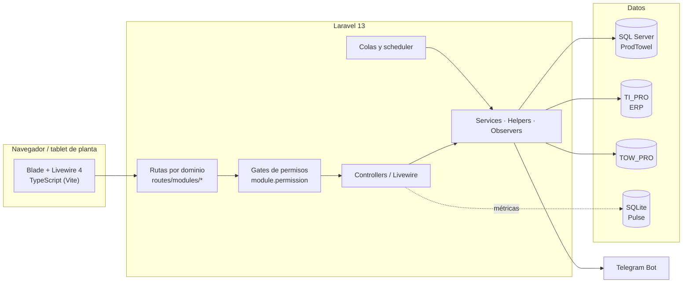

<div align="center">


**Plataforma de planeación y control de producción para manufactura textil**

Planeación · Tejido · Urdido · Engomado · Atadores · Tejedores · Mantenimiento · Calidad · Ventas

[](https://github.com/francosancheztowell/towell/actions/workflows/frontend-checks.yml)


</div>

---

## Contenido

- [Descripción](#descripción)
- [Módulos](#módulos)
- [Arquitectura](#arquitectura)
- [Stack](#stack)
- [Inicio rápido](#inicio-rápido)
- [Comandos](#comandos)
- [Calidad e integración continua](#calidad-e-integración-continua)
- [Convenciones](#convenciones)
- [Documentación](#documentación)
- [Licencia](#licencia)

## Descripción

Towell conecta en un solo flujo lo que ocurre entre la oficina de planeación y el piso de producción: se programa la orden, se reserva el material en el ERP, se ejecuta en máquina, se captura la producción por turno, se califica y se reporta. Cada paso queda auditado y los eventos críticos se notifican por Telegram.

Está pensado para uso diario en planta: pantallas táctiles de 768 px, login con código QR, sesiones por turno y un sistema de permisos granular por módulo.

**Puntos clave**

- **Permisos por módulo y acción** (`acceso`, `crear`, `modificar`, `eliminar`, `registrar`) sobre una jerarquía de módulos de 3 niveles, validados en el router mediante gates y cacheados por usuario.
- **Programación en cascada**: los cambios de catálogos (eficiencias, velocidades, calendarios) recalculan fechas y secuencias del programa de tejido.
- **Integración con el ERP** mediante conexiones SQL Server dedicadas (`TI_PRO`, `TOW_PRO`) para inventario, órdenes y fórmulas.
- **Auditoría**: contexto SQL por sesión (`SESSION_CONTEXT`), triggers de auditoría y una bitácora de acciones.
- **Monitoreo propio**: panel `/admin` en Livewire, Laravel Pulse, errores PHP y JS agrupados por huella y alertas por correo.
- **Reportes** en Excel (`maatwebsite/excel`) y PDF (`dompdf`), además de la exportación del OEE de atadores.

## Módulos

| Módulo | Alcance |
|---|---|
| **Planeación** | Programa de tejido (secuenciación por telar, duplicar, dividir, balancear, liberar con folio), muestras, catálogos maestros, codificación de modelos, alineación y utilerías |
| **Programa Urdido-Engomado** | Reserva de julios del ERP, proyección de requerimientos a 5 semanas y creación de órdenes URD/ENG (MC Coy y Karl Mayer) |
| **Urdido** | Priorización por máquina, captura de producción, BPM, catálogos y reportes |
| **Engomado** | Programación WP2/WP3, fórmulas químicas desde AX, producción por julio, calificación, control de merma |
| **Tejido** | Inventario de telas y trama, marcas finales, cortes de eficiencia, reenconado, reportes (RPM, saldos, paros) |
| **Atadores** | Ciclo de atado (Activo → En proceso → Terminado → Calificado → Autorizado), OEE anual |
| **Tejedores** | Julios por telar, checklist BPM, desarrolladores y muestras, notificaciones de atado y corte |
| **Mantenimiento / Mecánicos** | Paros y fallas, órdenes de trabajo, catálogo de operadores, autorización y estado de máquina |
| **Crudo · Producto terminado · Trazabilidad** | Auditorías de crudo con reporte diario programado, tiempos de preparación y trazabilidad por flog |
| **Ventas** | Tablero comercial con filtros |
| **Configuración** | Usuarios, módulos, permisos, folios, departamentos, destinatarios de Telegram y carga de planeación |

## Arquitectura



**Organización del código**

```
app/
├── Http/Controllers/<Dominio>/   # Un subdirectorio por dominio de negocio
├── Livewire/<Dominio>/           # Pantallas migradas a Livewire
├── Models/<Dominio>/             # Eloquent sobre el esquema dbo.
├── Services/                     # Reglas de negocio (ProgramaUrdEng, Engomado, Tejedores…)
├── Helpers/                      # FolioHelper, TurnoHelper, StringTruncator, AuditoriaHelper…
├── Observers/                    # Recalculo del programa de tejido y montado de telas
├── Imports/ · Exports/           # Excel
└── Console/Commands/             # Recalculo de fechas, reporte de crudo, correcciones de producción…
routes/
├── web.php                       # Dispatcher
├── public.php                    # Sin autenticación
└── modules/*.php                 # Una definición de rutas por dominio
resources/js/
├── utils/                        # http, notify, format, dom, combobox, sesión, acciones táctiles
├── componentes/                  # Runtime de los componentes Blade x-ui.*
├── modulos/**/index.ts           # Un bundle por módulo (Vite los descubre por glob)
└── monitoreo/                    # Telemetría del cliente
```

## Stack

| Capa | Tecnología |
|---|---|
| Backend | PHP 8.3+, Laravel 13, Livewire 4, Laravel Pulse |
| Base de datos | SQL Server (`pdo_sqlsrv`), compatible con 2008 R2 |
| Frontend | Blade, TypeScript, Vite 6, Tailwind CSS 4, Tom Select, SweetAlert2, Chart.js, SortableJS |
| Reportes | maatwebsite/excel, dompdf, pdfjs-dist y html2canvas-pro (carga bajo demanda) |
| Infraestructura | Redis/predis (caché y colas), scheduler de Laravel, bot de Telegram |
| Calidad | PHPUnit 11, `node --test`, Larastan nivel 5, Pint, PHPMD, jscpd, ratchet de deuda |

## Inicio rápido

**Requisitos:** PHP 8.3+ con `pdo_sqlsrv`, `sqlsrv`, `mbstring`, `xml`, `curl`, `zip` y `gd`; Composer 2; Node.js 20+ (el CI usa 24); SQL Server.

```bash
git clone https://github.com/francosancheztowell/towell.git
cd towell

composer install
npm ci

cp .env.example .env
php artisan key:generate
# Configura DB_* (sqlsrv) y las conexiones del ERP en .env

php artisan migrate
php artisan storage:link

composer dev      # servidor + cola + logs (pail) + Vite
```

La aplicación queda en `http://localhost:8000`. Después del login se redirige a `/produccionProceso`.

> **Compatibilidad con SQL Server 2008 R2.** Producción no dispone de `OFFSET/FETCH`, `STRING_AGG`, `IIF`, `CONCAT`, `FORMAT`, `TRY_CONVERT` ni `THROW`. Para paginar se usa `ROW_NUMBER()` a través de `PaginacionCompat`.

## Comandos

| Comando | Qué hace |
|---|---|
| `composer dev` | Levanta el entorno completo de desarrollo |
| `npm run build` | Compila los assets de producción |
| `php artisan test` | Suite PHP (SQLite en memoria; necesita haber corrido `npm run build` antes) |
| `php artisan test --group=sqlserver` | Tests que requieren SQL Server real ([guía](tests/README-sqlserver.md)) |
| `npm run test:js` | Tests de JavaScript con `node --test` |
| `npm run typecheck` | `tsc --noEmit` |
| `vendor/bin/phpstan analyse --memory-limit=2G` | Análisis estático (Larastan nivel 5) |
| `composer quality` | Gate previo al push: Pint, PHPStan, PHPMD y ratchet sobre los archivos cambiados |
| `npm run ratchet` | Falla si aumenta la deuda medida (`fetch(`, `Swal.fire`, `onclick=`, `<script>` inline, duplicación) |
| `php artisan optimize:clear` | Limpia caché de configuración, rutas y vistas |

## Calidad e integración continua

El workflow [`frontend-checks.yml`](.github/workflows/frontend-checks.yml) se ejecuta en cada PR y en cada push a `main`:

- **checks**: typecheck, tests JS, build de Vite y ratchet de deuda.
- **php**: PHPUnit, PHPStan y, solo sobre los archivos PHP modificados, Pint `--test` y PHPMD (únicamente falla ante violaciones nuevas respecto a la versión base del archivo). `composer audit` bloquea solo las advertencias de seguridad nuevas.

La deuda se administra con un **ratchet**: cada métrica tiene un techo en `scripts/ratchet-baseline.json` que solo puede bajar. El baseline de PHPStan (`phpstan-baseline.neon`) sigue la misma regla.

## Convenciones

- **Permisos**: `userCan('crear', 'Modulo')` y `userPermissions('Modulo')`. Después de cambiarlos, llama a `ModuloService::limpiarCacheUsuario()`. La columna de `SYSRoles` se llama `reigstrar` (con el error de escritura original); en `SYSUsuariosRoles` se llama `registrar`.
- **Folios**: `FolioHelper::obtenerFolioSugerido()` para vista previa y `obtenerSiguienteFolio()` solo al confirmar, porque incrementa la secuencia.
- **Turnos**: `TurnoHelper` (T1 6:30–14:30, T2 14:30–22:30, T3 22:30–6:30, `America/Mexico_City`).
- **Frontend**: usa `window.http` en lugar de `fetch` y `window.notify` para mensajes. Evita `onclick=` inline; cada módulo tiene su bundle en `resources/js/modulos/<modulo>/index.ts`.
- **UI**: los componentes `x-ui.*` y los tokens de `resources/css/app.css` están descritos en la [receta de componentes](docs/cerebro-towell/Arquitectura/receta-componentes.md).
- **Estilo**: Pint solo sobre los archivos que cambiaste; no se formatea el repositorio completo.

## Documentación

| Recurso | Para quién |
|---|---|
| [`docs/documentacion-corporativa/`](docs/documentacion-corporativa/README.md) | Dirección, jefaturas y capacitación: qué hace el sistema desde el punto de vista del negocio |
| [`docs/documentacion-tecnica/`](docs/documentacion-tecnica/README.md) | Desarrollo y soporte: rutas, controladores y matriz de trazabilidad |
| [`docs/documentacion-modulos/`](docs/documentacion-modulos/README.md) | Referencia detallada por módulo (99 controladores, 209 vistas) |
| [`docs/cerebro-towell/`](docs/cerebro-towell/00-Inicio.md) | Arquitectura, runbooks ([despliegue](docs/cerebro-towell/Runbooks/deploy.md)) y decisiones |
| [`CLAUDE.md`](CLAUDE.md) | Guía técnica condensada para quien contribuye (personas y agentes de IA) |

## Licencia

Software propietario. © Towell. Todos los derechos reservados. Queda prohibido copiarlo, distribuirlo o usarlo sin autorización expresa.
