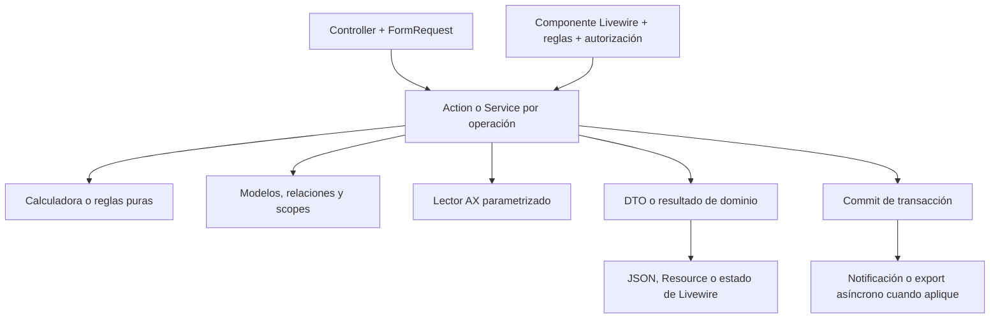

# Arquitectura de Towell con Laravel 13

Fecha: 7 de octubre de 2026. Código revisado: `main`, HEAD `99ad22d7`, árbol de trabajo inicialmente limpio.

## Conclusión

Towell **ya utiliza Laravel 13.35.0**, Livewire 4.4.7 y PHPUnit 12.5.38, según `composer.lock` y el framework instalado en `vendor`. Composer exige PHP `^8.3`; el CLI disponible en XAMPP es PHP 8.5.11. Esto no confirma la versión de PHP que utiliza el servidor web de producción.

La mejora de mayor valor es separar el negocio de HTTP, consolidar duplicación comprobada y hacer explícitos los efectos de cada mutación. Agregar atributos o cambiar carpetas por sí solo no reduce consultas ni hace más rápida la aplicación.

Este informe es un diagnóstico y una propuesta de ejecución. No modifica controllers, modelos, dependencias ni reglas de negocio. El inventario cubre los directorios indicados; la revisión detallada se concentra en los archivos citados. No equivale a una auditoría funcional exhaustiva de todos los endpoints.

## 1. Inventario actual

Conteo de archivos `.php` y líneas físicas, incluidos comentarios y espacios. `Controllers` incluye helpers y clases de funciones que no son controllers HTTP.

| Capa | Archivos | Líneas |
|---|---:|---:|
| Http/Controllers | 144 | 47.048 |
| Models | 105 | 7.036 |
| Services | 113 | 26.617 |
| Repositories | 4 | 627 |
| Http/Requests | 40 | 1.457 |
| Http/Resources | 1 | 123 |
| Livewire | 40 | 8.732 |
| Jobs | 3 | 424 |
| Policies | 0 | 0 |
| Tests, incluyendo infraestructura | 347 | 60.414 |
| Routes | 25 | 1.864 |

Hallazgos del conteo estático:

- 9 archivos de Controllers superan 1.000 líneas; 30 superan 500.
- 40 archivos de Controllers contienen `DB::`; 137 ocurrencias de `->validate(` y 12 de `Validator::make`.
- 401 capturas genéricas de `Throwable`/`Exception` en Controllers; no todas son prescindibles.
- 10 imports de clases de Controllers en Services y 6 en Livewire; también aparecen en Actions, Observers e Imports.
- 2.028 entradas `message:` en el baseline de PHPStan. Son reglas de supresión, no un conteo equivalente de errores activos.
- 3 enums; DTOs repartidos entre `app/Data` y `app/DTOs`; no existe todavía `app/Integrations`.

Duplicación actual: **6,20 %**, medida con jscpd mediante `scripts/ratchet.mjs`. Su configuración incluye app, vistas, JS/TS, rutas, configuración, migraciones, scripts y tests. No representa exclusivamente duplicación de backend ni líneas que se puedan borrar sin revisión.

## 2. Bases que conviene conservar

- `Services/Planeacion/Liberar/*`: ya hay calculadora, validaciones, resolución de BOM, código de dibujo y escritura de catálogo separadas.
- `Actions/Planeacion/ProgramaTejido/*`: mutaciones con DTOs y bloqueo transaccional. Su dependencia del legado es un paso de transición que falta terminar.
- `Services/Programas/ProgramBoardActionService`: punto común existente para urdido/engomado.
- `Services/Planeacion/Calendarios/*`: calendario separado en consultas, fórmulas, turnos y recálculos.
- `Support/Planeacion/TelarSalonResolver`: normalización de salones reutilizada.
- `Services/ProgramaUrdEng/InsercionEnBloques` y `Support/ActualizacionPorId`: lotes calculados considerando los límites de SQL Server.
- `Contracts/Crudo`, su repositorio y `CachedCrudoDashboardProvider`: separación de lectura, caché y presentación con control de reconstrucción concurrente.
- `HandlesApiErrors` y el handler de `bootstrap/app.php`: respuesta central de errores de servidor con código de referencia.
- `AppServiceProvider`: detección de lazy loading, atributos descartados y tiempo acumulado de consultas; adaptación de identidad para SQL Server con triggers.
- CI, PHPUnit, Larastan, PHPMD, Pint y ratchet: ya existe una base para refactorizar en pasos verificables.

## 3. Hallazgos y cambios concretos

### A. El negocio todavía depende de Controllers — prioridad alta

Ejemplos comprobados:

- `Services/Planeacion/Calendarios/RecalcularProgramasCalendario` importa `BalancearTejido`, ubicado en `Controllers/.../funciones`.
- `Actions/Planeacion/ProgramaTejido/ActualizarProgramaTejido` importa `UpdateTejido` y `TejidoHelpers`. Incluso interpreta un `JsonResponse` para decidir si la mutación fue rechazada.
- `Observers/ReqProgramaTejidoObserver` importa `TejidoHelpers` y usa una constante de `LiberarOrdenesController`.
- `Livewire/Crudo/MachineDetail:240` resuelve `AlineacionController` para obtener artículos.
- `LiberarOrdenesController:692` construye `OrdenDeCambioFelpaController` para generar Excel.

**Destino:** extraer operaciones y cálculos a Actions/Services; colocar utilidades técnicas en Support. Un servicio devuelve datos o lanza una excepción de dominio. El controller y Livewire convierten ese resultado a su respuesta. Los dos adaptadores deben consumir el mismo servicio.

Mover namespaces sin separar `Request`, `JsonResponse`, validación y cálculo conservaría el acoplamiento. Mantener adaptadores temporales cuando existan muchas referencias y retirarlos después de migrar consumidores.

### B. Observer demasiado grande y efectos implícitos — prioridad alta

`ReqProgramaTejidoObserver` tiene **1.073 líneas**. `saved()` genera líneas diarias, sincroniza CatCodificados y recalcula fórmulas. Algunos flujos deben llamarlo explícitamente cuando usan `saveQuietly()`.

**Destino:** extraer calculadora pura, generador de líneas y sincronizador de catálogo. El observer queda como adaptador que delega. Después, las Actions pueden coordinar la operación y su transacción con un orden explícito.

Los cálculos y escrituras que deben confirmar juntos siguen siendo síncronos y transaccionales. Notificaciones y exports costosos pueden ejecutarse después del commit cuando el flujo lo permita. No enviar toda la sincronización a una cola: cambiaría cuándo aparecen los datos.

**Riesgo concreto de lotes:** en `generarLineasDiarias`, cada fila tiene 15 columnas y el insert utiliza bloques de 500 (`:835`). Se compiló el INSERT con la gramática SQL Server del framework instalado, sin conexión ni ejecución: 139 filas producen 2.085 placeholders; 140, 2.100; 141, 2.115; 500, 7.500. Desde 141 filas se excede el límite de parámetros. No se reprodujo el error contra el motor real. Reutilizar el cálculo de tamaño de lote, conservando la conexión, tabla y transacción del observer. Un horizonte corto puede ocultar el problema.

### C. Controllers con varias responsabilidades — prioridad alta

| Archivo | Líneas | Separación propuesta |
|---|---:|---|
| OrdenDeCambioFelpaController | 1.941 | Mapeo de datos, escritura de CatCodificados y construcción de Excel |
| OrdenesTrabajoMecaController | 1.649 | Lectura de órdenes y acciones de captura/transición |
| CodificacionController | 1.648 | Requests, búsqueda, normalización de campos y operaciones de codificación |
| CortesEficienciaController | 1.537 | Lectura de cortes, captura, cierre y exportación |
| ReportesUrdidoController | 1.499 | Consulta del reporte, agregación y presentación/export |
| BalancearTejido | 1.408 | Simulación de fechas, algoritmo de reparto y persistencia |

Por ejemplo, `CodificacionController` mezcla introspección del esquema, caché, mapeo de catálogo, validación, CRUD e importación. `OrdenDeCambioFelpaController::generarExcelDesdeBD` puede escribir en BD según un booleano; conviene que generación y sincronización sean operaciones distinguibles.

El tamaño es una señal para revisar responsabilidades, no prueba de que todo el archivo sea código innecesario. Evitar extraer un servicio gigantesco con exactamente el mismo problema.

### D. Reutilización respaldada por duplicación actual — prioridad alta

Pares medidos por jscpd en esta revisión; las cifras suman bloques detectados por par y no son una estimación de ahorro neto.

| Par | Líneas duplicadas detectadas | Pieza común propuesta |
|---|---:|---|
| ReqProgramaTejidoSimpleImport / ReqProgramaTejidoUpdateImport | 704 | Parser y normalización; conservar diferencia alta/actualización |
| ReportesEngomadoController / ReportesUrdidoController | 280 | Consulta/agregación de reportes por proceso |
| ProcesarDesarrolladorService / ProcesarMuestrasDesarrolladorService | 257 | Flujo común con superficie Programa/Muestras explícita |
| ProgramarEngomadoController / ProgramarUrdidoController | 163 | Completar delegación a ProgramBoardActionService |
| CortesEficienciaController / MarcasController | 152 | Secuencia y cierre compartidos donde las reglas coincidan |
| ModuloProduccionEngomadoController / ModuloProduccionUrdidoController | 123 | Operaciones comunes de captura |

`ProduccionTrait` tiene 959 líneas y 105 líneas de clones internos detectados. Es reutilización existente, pero mezcla HTTP, validación, consultas y reglas. Convertirlo gradualmente en servicios de operaciones con configuración explícita de proceso. Conservar las diferencias de Kg Neto/Kg Bruto, AX y fechas.

### E. Validación, autorización y respuestas — prioridad media/alta

- Llevar validaciones repetidas a Form Requests. En Livewire reutilizar reglas y servicios de aplicación; no fabricar un Request HTTP para llamar al controller.
- Añadir Gates/Policies donde haya autorización por operación o entidad, delegando en el sistema `userCan()` existente. No reemplazar permisos por una interpretación nueva de los puestos.
- No tener Policies no demuestra falta de autorización: ya existe `EnsureModulePermission` y Gates de administración. El objetivo es consistencia entre rutas y acciones Livewire.
- Retirar catches que solo replican el handler, preservando contratos `success/message/errors`, rollback, recuperación y errores de negocio. Eliminar todos los catches indiscriminadamente perdería contexto y recuperación válida.
- Adoptar Resources cuando varias respuestas compartan una representación de negocio. Mantener los JSON que esperan las pantallas durante la transición.

### F. Modelos, enums y tipado — prioridad media

Los modelos suelen ser más pequeños que los controllers; hay 61 llamadas a relaciones detectadas en 105 archivos. Ese dato no demuestra N+1 ni que todos necesiten nuevas relaciones.

- Mantener casts, relaciones y scopes cerca del modelo; sacar exportación, HTTP y coordinación de flujos.
- Documentar propiedades y tipos de los modelos centrales y resultados de consultas; resolver deuda de Larastan por módulo.
- Unificar DTOs en `app/Data` al tocar sus consumidores; crear DTOs donde reduzcan ambigüedad, no para duplicar cada array pequeño.
- Usar enums por vocabulario de entidad. `Activo`, `En Proceso` y `Finalizado` pertenecen a contextos distintos.
- Auditar valores reales antes de activar casts de enum: un valor histórico desconocido rompe la hidratación. `Enums/Planeacion/Densidad` ya documenta por qué deliberadamente no usa cast.
- Preservar tipos heredados: Prioridad es texto; designaciones como `600/1T` no son floats; columnas de programa y CatCodificados no siempre tienen el mismo tipo.

### G. AX, cachés y procesos persistentes — prioridad media

`CatCodificacionController::queryLmatDesdeTi` utiliza JOIN + limit 50; `LiberarBomCrudoResolver::query` utiliza EXISTS. Ambos ya filtran salones mediante el resolver, pero no tienen idéntica semántica. Unificar la consulta base conservando filtros, fallback, deduplicación y límites explícitos por consumidor.

El destino `Integrations/Ax` previsto por el proyecto todavía no existe. Para AX puede usarse Query Builder parametrizado detrás de un lector específico; no crear un repositorio por cada modelo que solo reenvíe `find/create/update`.

Hay cachés estáticas en observer, balanceo y Excel, además de configuración global de superficie Programa/Muestras. No constituyen por sí solas un fallo en el ciclo normal de PHP. Antes de proponer Octane o ampliar su uso en workers, probar aislamiento entre operaciones y preferir servicios `scoped` para cachés por unidad de trabajo. `Tests/TestCase` ya vacía las cachés del observer por contaminación entre tests.

## 4. Laravel 13: qué aporta aquí

La selección de novedades se contrastó con la [documentación oficial de Laravel 13](https://laravel.com/docs/13.x/releases).

| Capacidad | Aplicación en Towell |
|---|---|
| Atributos de controller `Middleware` y `Authorize` | Útiles después de definir permisos estables. Evitar repartir la misma autorización entre rutas, atributos y métodos |
| Atributos de jobs y `Queue::route` | Configuración central de trabajos de exportación/notificación; verificar reintentos e idempotencia |
| JSON:API Resources | Opción para una API nueva. Cambiar todo el JSON actual implicaría modificar consumidores y no reduce consultas por sí mismo |
| `Cache::touch` | Aprovechar solo donde se necesite extender TTL sin reconstruir el valor; no sustituye invalidación |
| AI SDK y búsqueda vectorial | No atienden estos problemas de arquitectura. La búsqueda vectorial documentada se orienta a PostgreSQL/pgvector, mientras Towell usa SQL Server |

Requests, scopes, DI, servicios, relaciones, casts y transacciones ya existían antes de Laravel 13: la mayor parte del trabajo pendiente es aplicarlos consistentemente.

Revisión de compatibilidad basada en la [guía oficial de actualización](https://laravel.com/docs/13.x/upgrade):

- Dependencias mayores principales ya actualizadas; no hace falta reinstalar Laravel.
- Los tests encontrados que excluyen CSRF ya utilizan `PreventRequestForgery`. Falta verificación de origen/CSRF en navegador real para este diagnóstico.
- `config/cache.php` no declara `serializable_classes`; hay cachés que guardan Collections. Antes de incorporar la configuración restrictiva del nuevo skeleton, inventariar clases y probar lectura de caché fría/caliente. La omisión actual no demuestra una incompatibilidad: el framework instalado conserva un fallback para aplicaciones existentes.
- `config/session.php` no declara `serialization`. No introducir JSON sin tratar la invalidación de sesiones que documenta la guía.
- Conservar el procesador de identidad adaptado a SQL Server y probar inserts con triggers al actualizar framework/driver.

## 5. Rendimiento: medir cada cambio

La documentación del proyecto indica SQL Server 2008 R2. No se consultó el servidor para verificar versión, índices ni planes de ejecución. Respetar esa restricción hasta verificarla: usar `PaginacionCompat`, evitar asumir OFFSET/FETCH y dimensionar lotes según parámetros reales.

Para un flujo elegido registrar antes y después: número de queries por conexión, tiempo SQL acumulado, p50/p95, memoria máxima, tamaño de respuesta y volumen de filas. Los tiempos deben medir el mismo conjunto de datos y distinguir caché fría/caliente.

Orden recomendado:

1. Corregir lotes y eliminar consultas por fila mediante precarga comprobada.
2. Seleccionar columnas necesarias y hacer agregación en BD donde corresponda.
3. Revisar índices con planes de ejecución de consultas lentas; no agregar índices por suposición.
4. Cachear catálogos con llave que incluya conexión/superficie/filtros y definir invalidación.
5. Llevar exports pesados a jobs cuando exista almacenamiento, consulta de progreso y recuperación; preservar la descarga síncrona si el flujo la necesita.

No hay números de producción nuevos en este informe; las reducciones de líneas propuestas no se presentan como mejoras medidas de rendimiento.

## 6. Menos código innecesario sin perder negocio

- Empezar por duplicación de parsing, respuestas genéricas y operaciones idénticas comprobadas.
- Ejecutar Rector en modo dry-run por carpeta y revisar cada diff. `rector.php` ya advierte que reglas amplias eliminaron casts necesarios para SQL Server.
- No declarar una clase muerta por cero coincidencias textuales: verificar rutas, container, eventos, Blade/Livewire, scheduler, nombres dinámicos e integración externa.
- Usar telemetría cuando un endpoint tenga consumidores externos o pestañas antiguas.
- Evitar nuevas abstracciones que solo reenvíen llamadas de Eloquent. No imponer interfaz, repositorio, DTO y servicio a cada CRUD sencillo.
- Corregir documentación al retirar piezas: AGENTS.md sigue describiendo Laravel 12 y STATE.md contiene snapshots de septiembre. PROJECT.md rechaza Flux, mientras Composer y el build aún lo utilizan: inventariar uso antes de proponer retirada.

**Discrepancia de negocio para tratar aparte:** las instrucciones actuales del usuario indican REDONDEAR para SaldoMarbete, pero `LiberarMarbetesCalculator::saldoMarbeteDesdeFormula:157` utiliza `ceil` y sus comentarios defienden ese comportamiento. Un refactor no debe ocultar esta diferencia. Registrar casos numéricos y resolverla como cambio funcional explícito, manteniendo separadas las reglas de TotalRollos y SaldoMarbete.

## 7. Arquitectura destino

Convención compatible con `20-04-ESTRUCTURA-BACKEND.md`: Controllers para HTTP; Actions para mutaciones coordinadas; Services para consultas/cálculos compartidos; Data para DTOs; Models para persistencia; Support para utilidades técnicas; Integrations/Ax para consultas externas; Observers para delegación.

Los objetivos de 300 líneas por controller y 50 por método son señales de revisión, no requisitos para fragmentar código artificialmente. Ningún límite sustituye pruebas y responsabilidades claras.

## 8. Plan de ejecución propuesto

| Orden | Corte concreto | Prueba de cierre | Relación con plan existente |
|---|---|---|---|
| 1 | Fijar resultados de fórmulas y efectos de guardado; corregir tamaño de lote de líneas | Casos de redondeo y rollback; lote largo y límite de parámetros | PT 05.1 / 22-calidad |
| 2 | Extraer generador de líneas, sincronizador y cálculo del observer | Mismos valores, cantidad de líneas y atomicidad; imports y saves quietos cubiertos | PT 05.1 |
| 3 | Quitar dependencias de Controllers en calendarios y consumidores prioritarios | Servicios sin HTTP; resultado anterior/nuevo equivalente | 20-04 estructura |
| 4 | Extraer generador Excel de Felpa y separar escrituras | Reimpresión conserva CreaProd; fórmulas, formato y descarga equivalentes | Planeación / PT |
| 5 | Consolidar parser de imports y después pares Urd/Eng | Fixtures de alta/actualización; AX, estados, pesos, turnos y fechas | 20-05 / 22-calidad |
| 6 | Requests, Gates/Policies y resultados consistentes por módulo | Respuestas 200/403/422 esperadas en HTTP y Livewire | 20-04 AuthZ |
| 7 | Lectores AX, tipado de modelos y DTOs | Contratos/fallback iguales; deuda estática baja por módulo | 22-09 / estructura |
| 8 | Optimizar consultas priorizadas por medición y retirar adaptadores | Menos queries o menor p95 demostrado; sin consumidores del legado | 18 / 21 |

Primer piloto recomendado: observer y líneas diarias. Tiene acoplamiento concreto, un riesgo de parámetros identificable y permite introducir calculadoras reutilizables que después consuman liberar, balanceo e imports. Mantener cada corte revisable y evitar una reescritura global.

## 9. Validación de esta revisión

- `php artisan test --compact`: ejecución interrumpida después de más de 12 minutos, sin resumen final. Se observó avance de la suite, pero no se considera una validación completa ni se afirma que esté verde. Este trabajo solo agrega documentación; antes de implementar los cortes deben terminar sus pruebas de caracterización y la suite correspondiente.
- PHPStan con configuración del proyecto: **sin errores reportados**, nivel 5 con baseline.
- PHPStan nivel 9 con el mismo baseline: **más de 1.000 errores**, salida limitada a los primeros 1.000. La suite estática no está preparada para imponer nivel 9 global. Elevar rigor en módulos intervenidos y bajar deuda sin ampliarla.
- Ratchet: **pasa**, 14 métricas sin aumento; duplicación 6,23 % del baseline → **6,20 %** actual. No se actualizó el baseline.
- jscpd: pares de duplicación medidos para esta revisión.
- No se ejecutaron consultas, migraciones ni pruebas contra SQL Server de producción. Tampoco se midió rendimiento en producción ni se calculó cobertura.

Un ejemplo que necesita reforzarse antes del refactor: `ProgramaTejidoBalanceoPreviewTest:43` admite una respuesta 500 como válida. Hay 112 archivos de tests con lectura de fuente o aserciones textuales detectadas; algunos validan salida legítima, por lo que el conteo no permite descartarlos. Complementar las comprobaciones de estructura con comportamiento, datos, permisos y rollback.

También hay una discrepancia en la infraestructura: `tests/README-sqlserver.md` explica cómo ejecutar el grupo de integración, pero `Tests/TestCase::setUp` bloquea toda conexión SQL Server real. `AuditoriaProgramaTejidoTest` hereda ese bloqueo y no lo sustituye. Hace falta un perfil de integración explícito contra una BD de pruebas para verificar triggers, identidad y límites del motor, conservando el bloqueo de la suite normal. No se ejecutó ese grupo.

Fuentes internas contrastadas con el código: `.planning/phases/20-arq-sec/20-04-ESTRUCTURA-BACKEND.md`, `.planning/PROJECT.md`, auditorías previas y configuración real del repositorio. Sus cifras históricas no se reutilizaron como mediciones actuales.
