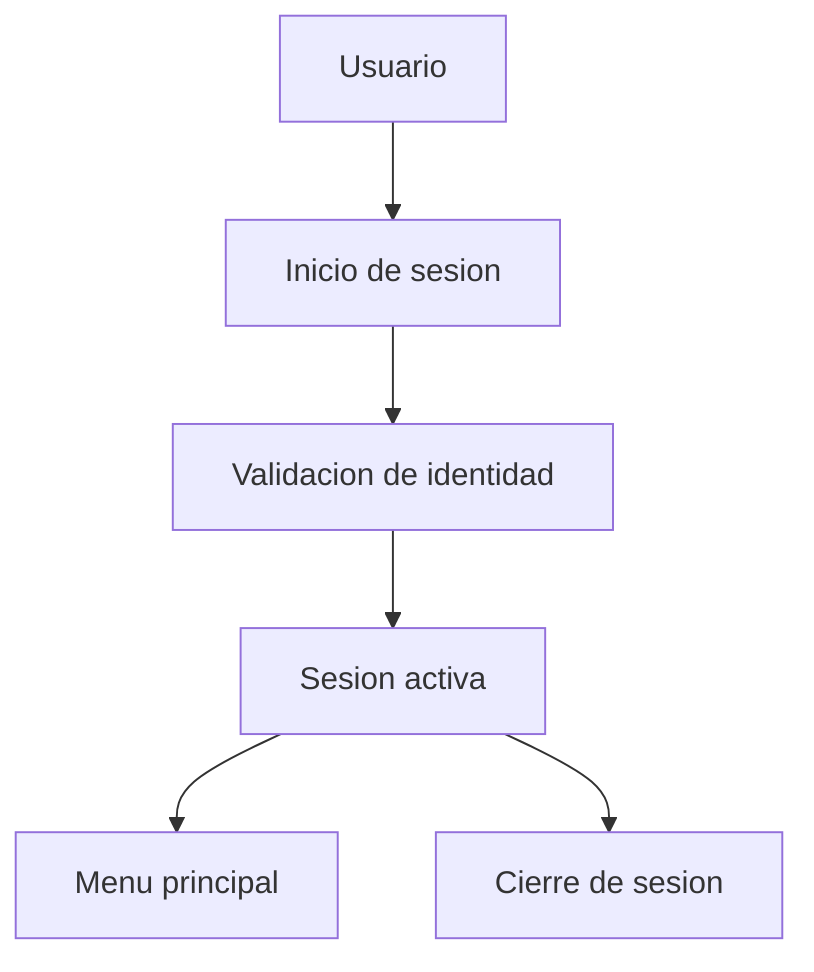

# Fase 00 - Acceso al sistema

## Proposito de negocio

Garantizar un punto de entrada controlado al sistema para que cada colaborador ingrese con su identidad y reciba acceso unicamente a los modulos autorizados.

## Que resuelve

- centraliza el acceso al sistema
- protege la informacion segun el perfil del usuario
- permite iniciar y cerrar sesion de forma controlada
- habilita algunos apoyos basicos de consulta y soporte

## Areas usuarias

- todo usuario que accede a Towell
- soporte interno
- administracion funcional del sistema

## Procesos principales

1. ingreso con numero de empleado y contrasena
2. validacion de identidad
3. redireccion al menu principal
4. cierre de sesion
5. acceso a utilidades publicas controladas

## Entradas y salidas

| Entradas | Salidas |
| --- | --- |
| numero de empleado, contrasena | sesion iniciada |
| solicitud de cierre de sesion | sesion cerrada |
| consulta de empleados por area | listado de empleados |

## Valor para la operacion

Es la puerta de entrada a todos los procesos. Sin esta fase, el resto de la operacion digital no puede ejecutarse de forma segura ni trazable.

## Riesgos operativos

- exposicion de utilidades administrativas fuera del flujo normal
- errores de configuracion de credenciales o permisos
- dependencia de la informacion base del usuario

## Indicadores sugeridos

- usuarios con acceso vigente
- intentos fallidos de acceso
- tiempo promedio de resolucion de incidencias de acceso

## Diagrama funcional

