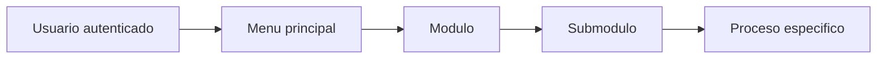

# Fase 01 - Navegacion principal

## Proposito de negocio

Presentar a cada usuario un menu de trabajo alineado a sus responsabilidades y permisos.

## Que resuelve

- organiza el acceso por modulos y submodulos
- reduce errores al mostrar solo lo autorizado
- facilita la navegacion diaria por area de trabajo

## Areas usuarias

- todas las areas operativas y administrativas que usan Towell

## Procesos principales

1. carga de menu principal por usuario
2. visualizacion de submodulos por area
3. acceso jerarquico a funciones especificas
4. soporte a navegacion contextual entre modulos

## Entradas y salidas

| Entradas | Salidas |
| --- | --- |
| perfil del usuario | menu principal personalizado |
| modulo seleccionado | submodulos disponibles |

## Valor para la operacion

Convierte la configuracion de permisos en una experiencia clara de uso. Cada puesto ve lo que necesita para trabajar.

## Riesgos operativos

- modulos mal configurados en la estructura jerarquica
- permisos desactualizados en cache
- rutas historicas que deban conservar compatibilidad

## Indicadores sugeridos

- modulos mas utilizados por area
- incidencias por acceso denegado
- tiempo de capacitacion por nuevo usuario

## Diagrama funcional

