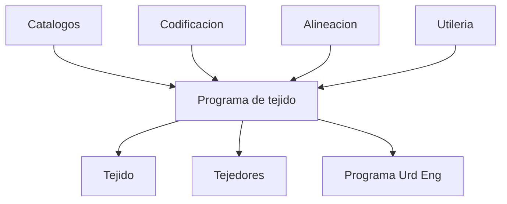

# Fase 02 - Planeacion

## Proposito de negocio

Coordinar la preparacion de la produccion textil a partir de datos maestros, reglas operativas, secuencias, prioridades y ordenes programadas.

## Que resuelve

- prepara la base tecnica para producir
- define calendarios, eficiencias, velocidades y catálogos de apoyo
- convierte necesidades operativas en un programa ordenado por telar y prioridad
- habilita ajustes, balanceos, divisiones y movimientos de carga

## Areas usuarias

- planeacion
- supervision de tejido
- areas que dependen del programa operativo

## Subprocesos principales

### 1. Catalogos de planeacion
- mantiene telares, calendarios, velocidades, eficiencias, aplicaciones, matriz de hilos y pesos por rollo
- asegura una base comun para calcular fechas, capacidades y formulas

### 2. Codificacion
- administra la informacion tecnica y comercial de modelos codificados
- soporta ordenes de cambio, reimpresiones y consistencia con la planeacion

### 3. Alineacion
- muestra una lectura consolidada de las ordenes en proceso por telar
- facilita seguimiento visual y coordinacion operativa

### 4. Utileria operativa
- permite finalizar, mover o reacomodar ordenes del programa cuando la operacion lo requiere

### 5. Programa de tejido
- concentra el tablero principal de planeacion
- permite liberar ordenes, cambiar telares, dividir, vincular, balancear y reprogramar

### 6. Muestras
- reutiliza la misma logica del programa, pero aplicada al flujo especifico de muestras

## Entradas y salidas

| Entradas | Salidas |
| --- | --- |
| datos maestros, reglas de negocio, ordenes base | programa de tejido actualizado |
| cambios operativos | fechas, posiciones y prioridades recalculadas |
| liberacion de ordenes | informacion sincronizada con codificacion y procesos posteriores |

## Valor para la operacion

Planeacion es el cerebro operativo del sistema. Si esta fase es correcta, las fases posteriores trabajan con mejor orden, menos ajustes urgentes y mayor visibilidad.

## Riesgos operativos

- dependencia alta de datos maestros correctos
- impacto transversal de cambios en calendarios, velocidades o eficiencias
- movimientos masivos que pueden alterar secuencias y tiempos comprometidos

## Indicadores sugeridos

- cumplimiento del programa por fecha
- porcentaje de reprogramaciones
- ordenes con cambios de telar
- carga por salon y telar
- ordenes balanceadas vs no balanceadas

## Diagrama funcional

