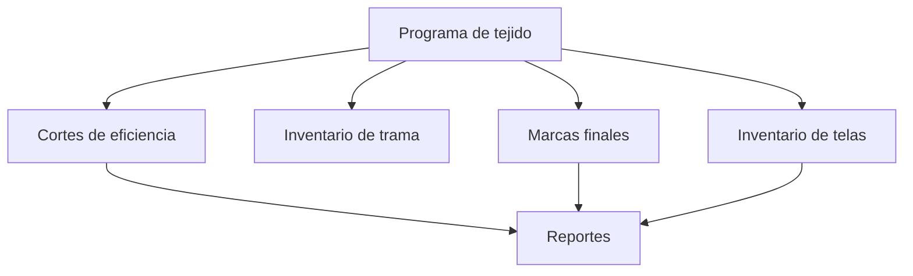

# Fase 03 - Tejido

## Proposito de negocio

Controlar la ejecucion operativa del area de tejido mediante inventarios, requerimientos de trama, marcas finales, cortes de eficiencia, produccion de reenconado y reportes.

## Que resuelve

- muestra el estado real de los telares
- registra necesidades de trama
- captura indicadores de calidad y eficiencia del proceso
- soporta seguimiento y exportacion de resultados

## Areas usuarias

- supervision de tejido
- operadores de piso
- control de produccion
- analisis operativo

## Subprocesos principales

### 1. Inventario de telas
- muestra la situacion actual y siguiente de cada telar
- ayuda a entender carga, continuidad y secuencia de operacion

### 2. Inventario de trama
- registra requerimientos de materiales para la operacion
- permite seguimiento por estado y resumen por folio

### 3. Marcas finales
- captura marcas por telar y turno
- genera consolidado diario y soporta exportaciones

### 4. Cortes de eficiencia
- registra desempeno operativo por horarios
- permite visualizar resultados por fecha y turno

### 5. Produccion de reenconado
- captura produccion y rendimiento del subproceso

### 6. Reportes
- entrega salidas gerenciales y operativas del estado de inventario

## Entradas y salidas

| Entradas | Salidas |
| --- | --- |
| programa de tejido, inventario, capturas de piso | estado de telares y requerimientos |
| mediciones de eficiencia y calidad | reportes operativos diarios |
| capturas de produccion | indicadores y exportaciones |

## Valor para la operacion

Esta fase convierte la planeacion en seguimiento real del piso, permitiendo actuar antes de que un problema se convierta en incumplimiento.

## Riesgos operativos

- capturas incompletas o tardias
- dependencia de secuencias correctas por telar
- coexistencia de rutas nuevas y legadas para procesos historicos

## Indicadores sugeridos

- eficiencia por turno
- porcentaje de telares con informacion actualizada
- requerimientos de trama por estado
- incidencias de marcas finales por fecha

## Diagrama funcional

