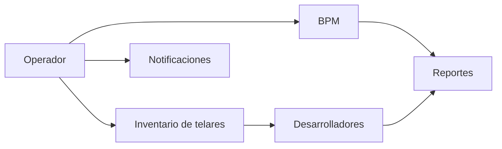

# Fase 04 - Tejedores

## Proposito de negocio

Gestionar los controles operativos relacionados con BPM, inventario de telares, desarrolladores, notificaciones y reportes para el area de tejedores.

## Que resuelve

- asegura cumplimiento de BPM por checklist
- da visibilidad de los telares asignados por operador
- formaliza el proceso de desarrolladores
- habilita avisos operativos sobre montaje y corte

## Areas usuarias

- tejedores
- supervisores de tejedores
- desarrolladores
- control de produccion

## Subprocesos principales

### 1. BPM de tejedores
- controla buenas practicas mediante folios y checklist por operador/telar

### 2. Inventario de telares
- administra el inventario operativo usado por el area

### 3. Desarrolladores
- captura y da seguimiento a procesos especiales de desarrollo y muestras

### 4. Notificaciones operativas
- informa eventos como atado de julio o cortado de rollo

### 5. Reportes
- consolida informacion BPM y de desarrolladores

## Valor para la operacion

Esta fase estandariza la disciplina operativa y fortalece la trazabilidad de actividades que suelen depender del seguimiento cercano en piso.

## Riesgos operativos

- checklist incompleto o autorizado fuera de tiempo
- dependencia de asignaciones correctas por operador
- procesos de desarrolladores con alto impacto sobre planeacion y codificacion

## Indicadores sugeridos

- BPM terminados vs autorizados
- desarrollos cerrados por periodo
- tiempos de respuesta a notificaciones operativas
- incidencias por operador o telar

## Diagrama funcional

