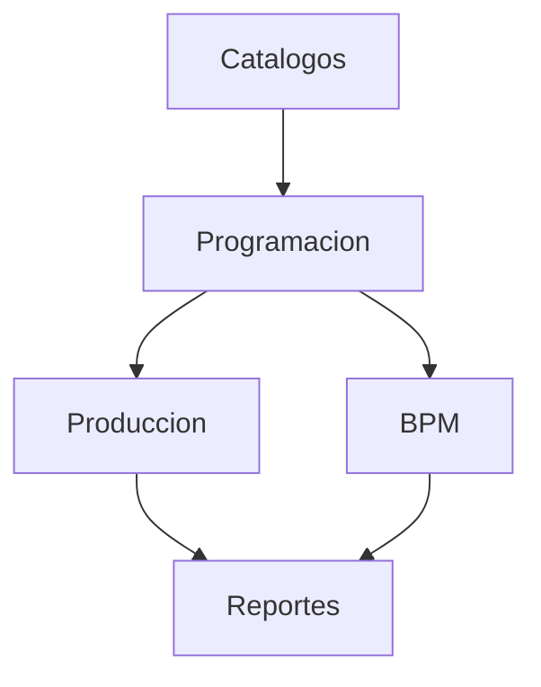

# Fase 05 - Urdido

## Proposito de negocio

Administrar la carga, ejecucion y control del proceso de urdido, desde la programacion de ordenes hasta la produccion, BPM y reportes de desempeno.

## Que resuelve

- prioriza ordenes por maquina
- registra avances reales de produccion
- controla checklist BPM del proceso
- mantiene catalogos operativos y genera reportes

## Areas usuarias

- planeacion de urdido
- supervision de urdido
- operadores de urdido
- mejora continua

## Subprocesos principales

### 1. Programacion
- organiza la cola de trabajo y sus prioridades

### 2. Produccion
- captura kilos, horas, oficiales, julios y cierre de la orden

### 3. BPM
- asegura cumplimiento de actividades de buenas practicas

### 4. Catalogos y reportes
- mantiene julios y maquinas
- genera indicadores como OEE, Kaizen, roturas y BPM

## Valor para la operacion

Permite pasar de una lista de ordenes a una ejecucion controlada, trazable y comparable contra los resultados esperados.

## Riesgos operativos

- cambios de prioridad sin sincronizacion completa
- cierres de orden con datos faltantes
- fuerte dependencia con el proceso de engomado en algunos folios

## Indicadores sugeridos

- ordenes programadas vs finalizadas
- kilos producidos por turno
- tiempos muertos o retrasos por maquina
- BPM autorizados
- OEE por periodo

## Diagrama funcional

