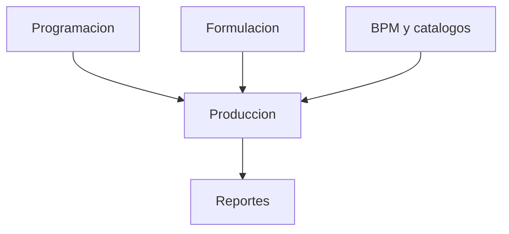

# Fase 06 - Engomado

## Proposito de negocio

Gestionar la secuencia productiva de engomado, su formulacion, produccion, BPM y reportes de control.

## Que resuelve

- programa ordenes de engomado
- controla la ejecucion de produccion
- obliga a registrar formulaciones asociadas
- mantiene controles BPM y catalogos de apoyo

## Areas usuarias

- supervision de engomado
- operadores de engomado
- personal de formulacion
- control de proceso

## Subprocesos principales

### 1. Programacion
- ordena y prioriza la carga de engomado

### 2. Produccion
- registra variables del proceso y cierre de orden

### 3. Formulacion
- guarda formulas y componentes necesarios para la operacion

### 4. BPM, catalogos y reportes
- asegura checklist, nucleos, julios, ubicaciones y reportes BPM

## Valor para la operacion

Ayuda a garantizar que el proceso no solo se ejecute, sino que quede soportado con la informacion tecnica necesaria para calidad y trazabilidad.

## Riesgos operativos

- dependencia con urdido para iniciar algunas ordenes
- imposibilidad de cerrar si falta formulacion
- diferencias entre datos de produccion y datos de formula

## Indicadores sugeridos

- ordenes cerradas con formulacion completa
- tiempo de ciclo por orden
- BPM autorizados
- incidencias por falta de formula o datos incompletos

## Diagrama funcional

