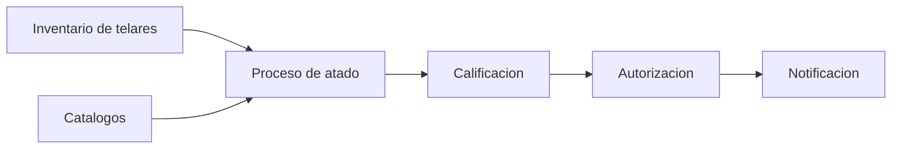

# Fase 07 - Atadores

## Proposito de negocio

Controlar el proceso de atado desde su inicio en piso hasta su autorizacion final, incluyendo catalogos, observaciones, calificacion y comunicacion operativa.

## Que resuelve

- organiza el trabajo de atado por telar
- registra actividades y maquinas utilizadas
- permite calificacion del proceso
- formaliza la autorizacion del supervisor

## Areas usuarias

- atadores
- tejedores
- supervisores de area

## Procesos principales

1. seleccion del telar a atender
2. apertura del proceso de atado
3. registro de actividades, observaciones y estados
4. terminacion del atado
5. calificacion del tejedor
6. autorizacion del supervisor

## Valor para la operacion

Da trazabilidad a una actividad critica de continuidad productiva y deja evidencia de quien hizo, califico y autorizo.

## Riesgos operativos

- dependencia de datos correctos del inventario de telares
- flujo de autorizacion sensible a capturas incompletas
- alta carga de reglas concentradas en un mismo proceso

## Indicadores sugeridos

- atados terminados por turno
- tiempo promedio de atado
- atados autorizados vs pendientes
- incidencias por calidad o limpieza

## Diagrama funcional

