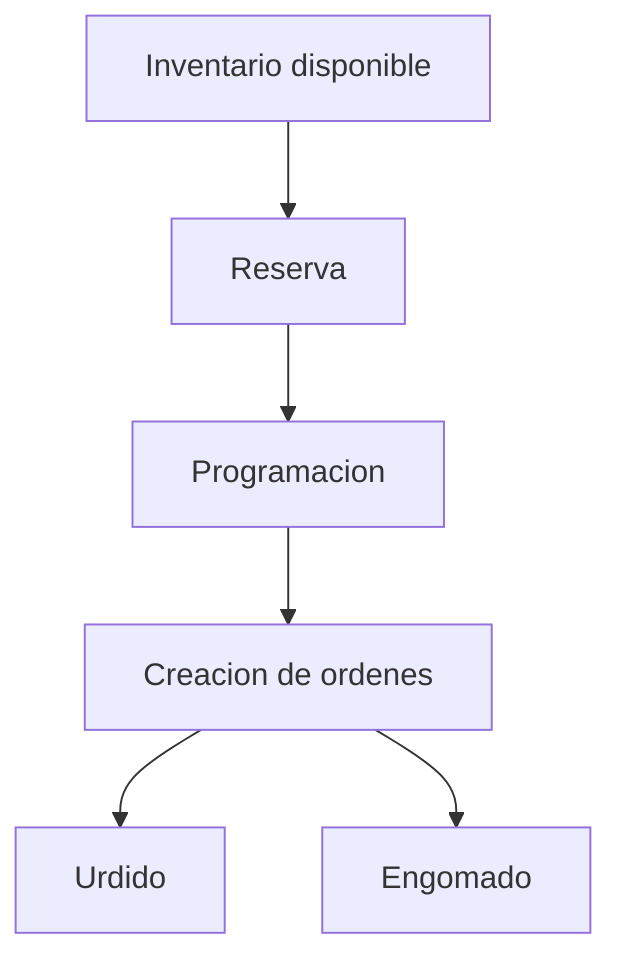

# Fase 08 - Programa Urd/Eng

## Proposito de negocio

Preparar la liberacion de trabajo hacia urdido y engomado mediante reservas de inventario, resumen de requerimientos y generacion formal de ordenes productivas.

## Que resuelve

- da visibilidad del inventario utilizable por telar
- permite reservar material antes de comprometer la produccion
- resume carga por semanas
- crea ordenes productivas de urdido y engomado

## Areas usuarias

- planeacion
- supervision de urdido y engomado
- control de inventarios relacionados

## Procesos principales

1. consulta de inventario disponible
2. reserva y liberacion de material
3. resumen de necesidades por semana
4. programacion por telar
5. creacion de ordenes URD/ENG o Karl Mayer

## Valor para la operacion

Es el puente entre la planeacion de tejido y la ejecucion de urdido/engomado. Reduce improvisacion y mejora la secuencia de arranque de ordenes.

## Riesgos operativos

- reservas mal asociadas al telar o a la pieza
- dependencia de fuentes externas de inventario
- diferencias entre inventario disponible y realidad fisica

## Indicadores sugeridos

- porcentaje de telar con reserva completa
- ordenes creadas por semana
- reservas canceladas o reprocesadas
- tiempos de respuesta para crear ordenes productivas

## Diagrama funcional

