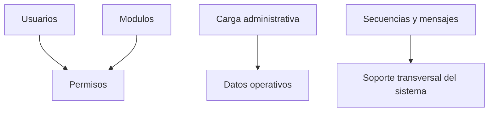

# Fase 09 - Configuracion

## Proposito de negocio

Administrar usuarios, modulos, permisos, secuencias, mensajes y cargas de informacion para asegurar que Towell opere con reglas correctas y datos base vigentes.

## Que resuelve

- alta y mantenimiento de usuarios
- control de permisos y accesos
- mantenimiento de estructura modular del sistema
- administracion de secuencias y mensajes
- cargas administrativas de informacion

## Areas usuarias

- administracion del sistema
- soporte funcional
- responsables de seguridad y control operativo

## Subprocesos principales

### 1. Usuarios
- alta, edicion, baja, QR y permisos

### 2. Modulos y permisos
- mantenimiento de la estructura funcional del sistema

### 3. Carga de planeacion
- importacion administrativa de informacion base

### 4. Catalogos administrativos
- departamentos, secuencia de folios, mensajes y algunos ajustes de entorno

## Valor para la operacion

Sin esta fase, el sistema no podria mantenerse alineado a la estructura organizacional, ni escalar a nuevos usuarios, procesos o necesidades de control.

## Riesgos operativos

- configuraciones incorrectas de permisos
- cargas administrativas destructivas o incompletas
- cambios en modulos con impacto transversal en la navegacion

## Indicadores sugeridos

- usuarios activos por area
- incidencias por permisos
- cargas administrativas exitosas vs fallidas
- mensajes configurados por proceso

## Diagrama funcional

