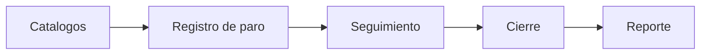

# Fase 10 - Mantenimiento

## Proposito de negocio

Registrar, atender y dar seguimiento a paros y fallas del proceso productivo, con apoyo de catalogos y reportes para analisis de causas y tiempos de respuesta.

## Que resuelve

- formaliza el levantamiento de paros
- clasifica fallas y responsables de atencion
- registra cierre y calidad de atencion
- genera informacion para analisis y mejora continua

## Areas usuarias

- mantenimiento
- supervision operativa
- mejora continua

## Procesos principales

1. alta de paro o falla
2. consulta de catalogos y apoyo contextual
3. seguimiento del evento
4. cierre del paro
5. analisis y reporte

## Valor para la operacion

Permite tratar cada paro como un evento trazable y medible, en vez de una incidencia informal de piso.

## Riesgos operativos

- clasificacion incorrecta de la falla
- cierre sin informacion suficiente
- dependencia de multiples fuentes para relacionar orden de trabajo y area

## Indicadores sugeridos

- paros por area
- tiempo promedio de atencion
- tiempo promedio de cierre
- principales tipos de falla

## Diagrama funcional

