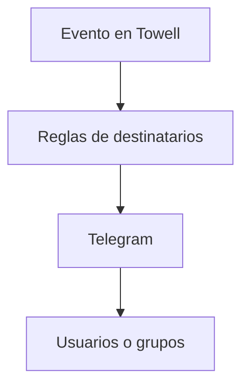

# Fase 11 - Telegram

## Proposito de negocio

Servir como canal de comunicacion automatica para alertas, avisos y notificaciones emitidas por Towell hacia responsables operativos o grupos definidos.

## Que resuelve

- acelera la comunicacion de eventos criticos
- reduce dependencia de mensajes manuales
- centraliza destinatarios por modulo o proceso

## Areas usuarias

- supervision
- mantenimiento
- atadores
- procesos que requieran alertamiento inmediato

## Procesos principales

1. definicion de destinatarios y chat IDs
2. envio de mensaje por modulo o evento
3. diagnostico del bot y recuperacion de chat IDs

## Valor para la operacion

Hace que el sistema no solo registre eventos, sino que tambien los comunique a tiempo a quienes deben actuar.

## Riesgos operativos

- destinatarios desactualizados
- dependencia del token y conectividad con Telegram
- mensajes largos o mal formateados

## Indicadores sugeridos

- eventos notificados por modulo
- destinatarios activos por proceso
- incidencias por envio fallido

## Diagrama funcional

