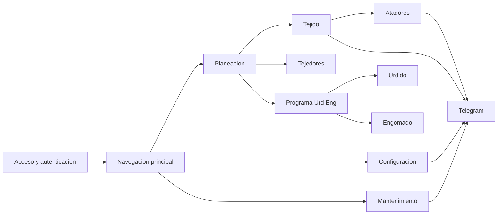
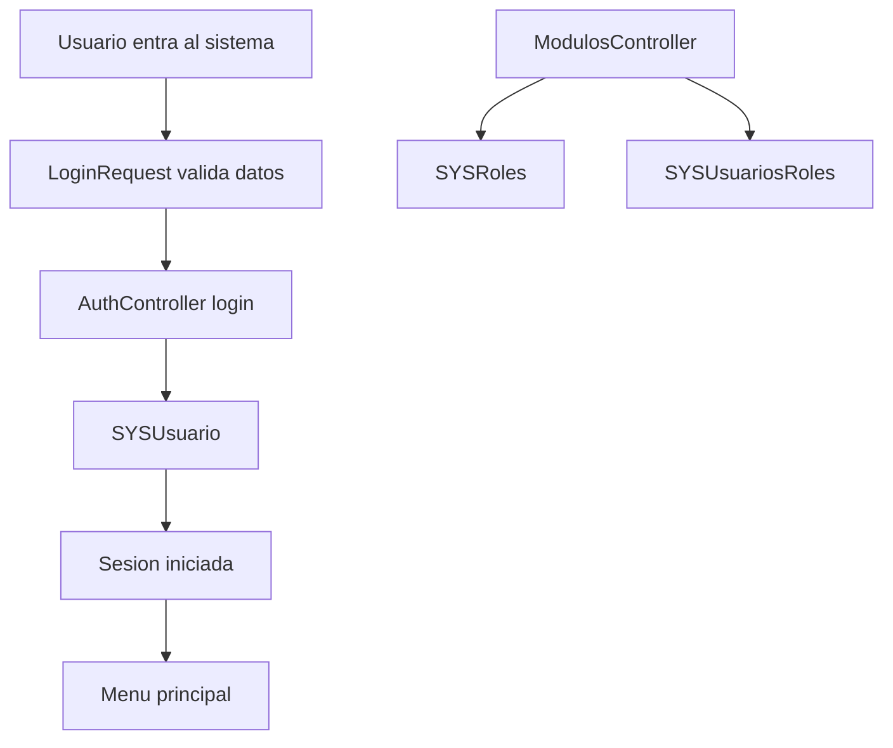
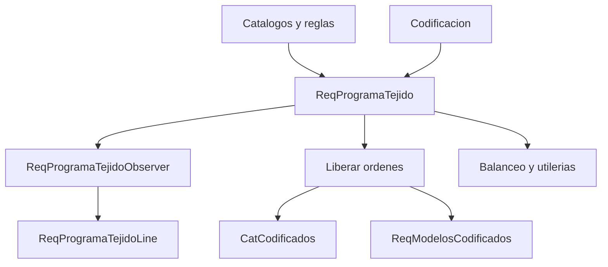
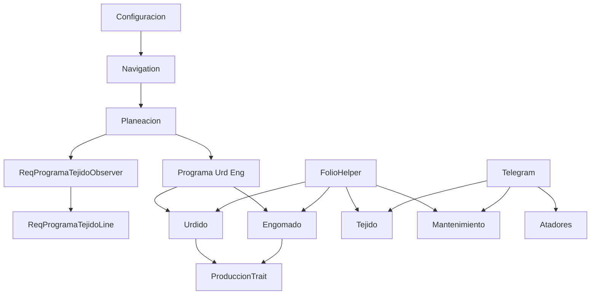

# Manual integral corporativo, funcional y tecnico de Towell

## Portada

**Documento:** Manual integral corporativo, funcional y tecnico de Towell  
**Codigo:** MAN-TOW-001  
**Version:** 2.0  
**Estatus:** Vigente  
**Fecha de emision:** 2026-03-12  
**Tipo de documento:** Manual institucional integral  
**Uso:** Interno  

## Control documental

| Campo | Detalle |
| --- | --- |
| Elaborado por | Documentacion asistida para Towell |
| Revisado por | Pendiente de asignacion interna |
| Aprobado por | Pendiente de asignacion interna |
| Frecuencia de revision | Semestral o por cambio mayor de proceso |
| Fuente base | Estructura funcional definida en `routes/web.php` |

## Indice

1. Presentacion
2. Objetivo del manual
3. Alcance
4. Perfil de lectores
5. Vision integral del sistema
6. Fases funcionales del sistema
7. Riesgos generales de operacion
8. Indicadores sugeridos de seguimiento
9. Recomendaciones de uso institucional
10. Control de cambios recomendado
11. Anexo detallado por fases y funciones
12. Componentes transversales y dependencias criticas

## 1. Presentacion

Towell es la plataforma de control operativo utilizada para conectar la planeacion, la ejecucion en piso, la captura de produccion, los procesos de seguimiento, la administracion funcional y la comunicacion de eventos relevantes dentro de la operacion textil.

Su principal valor institucional no esta solo en registrar informacion, sino en enlazar las distintas fases del proceso para que las decisiones y las acciones de una etapa impacten correctamente en la siguiente.

## 2. Objetivo del manual

Este manual tiene como finalidad explicar de manera clara, ordenada y ejecutiva como esta organizado Towell, que resuelve cada fase del sistema, quienes lo usan y cual es su aportacion dentro del flujo operativo.

## 3. Alcance

El manual cubre las fases funcionales principales observadas en la estructura de rutas del sistema:

- acceso y autenticacion
- navegacion principal
- planeacion
- tejido
- tejedores
- urdido
- engomado
- atadores
- programa URD/ENG
- configuracion
- mantenimiento
- telegram y alertamiento

## 4. Perfil de lectores

Este manual esta dirigido a:

- direccion y gerencia
- jefaturas y coordinaciones operativas
- supervision de planta
- analistas funcionales
- capacitacion interna
- auditoria operativa

## 5. Vision integral del sistema

Towell funciona como una cadena de control operativo:

1. permite el acceso seguro al sistema
2. muestra a cada usuario solo los modulos que necesita
3. organiza la planeacion de la carga de trabajo
4. baja esa planeacion hacia la ejecucion operativa
5. registra evidencias de produccion, BPM, calidad y eventos
6. soporta reportes, seguimiento y alertamiento

### Diagrama general institucional

## 6. Fases funcionales del sistema

### 6.1 Fase 00 - Acceso al sistema

**Proposito**  
Controlar el ingreso de usuarios y asegurar que cada colaborador vea solo los procesos autorizados.

**Que resuelve**
- inicio de sesion
- cierre de sesion
- validacion de identidad
- acceso inicial al entorno de trabajo

**Valor para la organizacion**  
Es la puerta de entrada de todo el ecosistema Towell y la base de la trazabilidad por usuario.

### 6.2 Fase 01 - Navegacion principal

**Proposito**  
Organizar el acceso a modulos y submodulos segun el rol del usuario.

**Que resuelve**
- menu principal por perfil
- acceso a modulos permitidos
- estructura jerarquica de funciones

**Valor para la organizacion**  
Reduce errores de uso y simplifica la experiencia diaria de operacion.

### 6.3 Fase 02 - Planeacion

**Proposito**  
Preparar y ordenar la carga de trabajo que despues sera ejecutada por las areas productivas.

**Que resuelve**
- catalogos tecnicos y maestros
- programa de tejido
- codificacion y ordenes de cambio
- alineacion visual de ordenes
- ajustes operativos como mover, balancear o finalizar

**Valor para la organizacion**  
Es el cerebro operativo del sistema. Si esta fase esta bien mantenida, las demas fases reciben informacion mas consistente y ejecutable.

### 6.4 Fase 03 - Tejido

**Proposito**  
Dar seguimiento a la ejecucion operativa del tejido y registrar informacion de calidad, eficiencia e inventario.

**Que resuelve**
- inventario de telas y telares
- requerimientos de trama
- marcas finales
- cortes de eficiencia
- produccion de reenconado
- reportes de seguimiento

**Valor para la organizacion**  
Convierte el programa en monitoreo real de piso y facilita reaccion operativa oportuna.

### 6.5 Fase 04 - Tejedores

**Proposito**  
Formalizar controles BPM, desarrolladores, notificaciones y reportes asociados al area de tejedores.

**Que resuelve**
- checklist BPM
- inventario operativo de telares del area
- flujo de desarrolladores y muestras
- eventos de montaje y corte
- reportes de supervision

**Valor para la organizacion**  
Mejora disciplina operativa, seguimiento y evidencia de actividades clave.

### 6.6 Fase 05 - Urdido

**Proposito**  
Controlar la programacion, produccion y medicion del proceso de urdido.

**Que resuelve**
- cola de ordenes y prioridades
- captura de produccion
- BPM de urdido
- catalogos operativos
- reportes como OEE, Kaizen y roturas

**Valor para la organizacion**  
Da visibilidad al avance real del proceso y permite compararlo contra lo programado.

### 6.7 Fase 06 - Engomado

**Proposito**  
Gestionar la programacion, formulacion y produccion del proceso de engomado.

**Que resuelve**
- ordenamiento de trabajo
- captura de produccion
- formulaciones por orden
- BPM y catalogos tecnicos
- reportes del proceso

**Valor para la organizacion**  
Fortalece la trazabilidad tecnica y asegura que la produccion este soportada con su informacion de formulacion.

### 6.8 Fase 07 - Atadores

**Proposito**  
Controlar el proceso de atado desde el inicio hasta la autorizacion final.

**Que resuelve**
- apertura del proceso por telar
- seguimiento de actividades y maquinas
- observaciones y tiempos
- calificacion del resultado
- autorizacion del supervisor

**Valor para la organizacion**  
Formaliza una actividad critica de continuidad productiva y deja evidencia de responsabilidad y calidad.

### 6.9 Fase 08 - Programa Urd/Eng

**Proposito**  
Servir como puente entre planeacion y la creacion de ordenes productivas para urdido y engomado.

**Que resuelve**
- consulta y reserva de inventario
- resumen de necesidades por semana
- programacion previa por telar
- generacion formal de ordenes URD/ENG o Karl Mayer

**Valor para la organizacion**  
Reduce improvisacion antes del arranque productivo y mejora la preparacion de materiales.

### 6.10 Fase 09 - Configuracion

**Proposito**  
Administrar usuarios, permisos, modulos, secuencias, mensajes y cargas administrativas.

**Que resuelve**
- gestion de usuarios
- estructura de modulos del sistema
- configuracion de permisos
- cargas de informacion base
- secuencias y mensajes

**Valor para la organizacion**  
Sostiene la gobernanza funcional del sistema.

### 6.11 Fase 10 - Mantenimiento

**Proposito**  
Registrar y dar seguimiento a paros y fallas de mantenimiento.

**Que resuelve**
- alta de eventos
- clasificacion de fallas
- cierre y calidad de atencion
- reportes de seguimiento

**Valor para la organizacion**  
Convierte incidencias de mantenimiento en informacion trazable y medible.

### 6.12 Fase 11 - Telegram

**Proposito**  
Soportar la comunicacion automatica de eventos relevantes del sistema.

**Que resuelve**
- envio de notificaciones
- administracion de destinatarios
- pruebas y diagnostico del bot

**Valor para la organizacion**  
Hace que la informacion critica llegue mas rapido a quien debe actuar.

## 7. Riesgos generales de operacion

- dependencia de datos maestros correctos en Planeacion
- dependencia de sincronizacion entre fases encadenadas
- uso de rutas historicas que requieren compatibilidad operativa
- riesgo de configuraciones sensibles en usuarios, permisos y secuencias
- necesidad de mantener destinatarios de alertamiento actualizados

## 8. Indicadores sugeridos de seguimiento

| Dimension | Indicadores sugeridos |
| --- | --- |
| Acceso | usuarios activos, intentos fallidos, tiempos de atencion a incidencias |
| Planeacion | ordenes reprogramadas, balanceos, cambios de telar, cumplimiento de fechas |
| Produccion | ordenes finalizadas, kilos por turno, tiempos de ciclo |
| BPM | folios creados, terminados, autorizados y rechazados |
| Calidad operativa | incidencias por marcas, cortes, atados y fallas |
| Alertamiento | mensajes enviados, destinatarios activos, fallas de envio |

## 9. Recomendaciones de uso institucional

1. Mantener responsables claros por fase funcional.
2. Revisar periodicamente catalogos, permisos y secuencias.
3. Establecer un calendario formal de revision de mensajes y destinatarios.
4. Usar este manual como base de capacitacion para nuevos lideres o supervisores.
5. Vincular reportes del sistema con indicadores de seguimiento por area.

## 10. Control de cambios recomendado

Cada vez que exista un cambio relevante en una fase funcional, se recomienda actualizar:

- este manual corporativo
- la documentacion corporativa por fase
- la documentacion tecnica asociada
- la matriz tecnica de rutas si cambia una traza funcional

## Anexos recomendados

- `docs/documentacion-corporativa/README.md`
- `docs/documentacion-tecnica/README.md`
- `docs/documentacion-tecnica/MATRIZ-TECNICA-RUTAS.md`

## 11. Anexo detallado por fases y funciones

### 11.1 Fase 00 - Acceso al sistema

**Resumen de la fase**  
Esta fase concentra el acceso seguro al sistema, la autenticacion del usuario y algunas utilidades base que sirven de soporte a la entrada del ecosistema Towell.

**Archivos principales**

- `app/Http/Controllers/AuthController.php`
- `app/Http/Controllers/UsuarioController.php`
- `app/Http/Controllers/SystemController.php`
- `app/Http/Controllers/ModulosController.php`
- `app/Http/Requests/LoginRequest.php`
- `app/Models/Sistema/Usuario.php`
- `app/Models/Sistema/SYSRoles.php`
- `app/Models/Sistema/SYSUsuariosRoles.php`

**Funciones documentadas**

| Controlador | Funcion | Resumen de lo que hace |
| --- | --- | --- |
| `AuthController` | `showLoginForm` | Renderiza la vista de acceso al sistema. |
| `AuthController` | `login` | Valida credenciales contra `SYSUsuario`, migra contrasenas legacy cuando aplica e inicia sesion. |
| `AuthController` | `logout` | Cierra la sesion autenticada y limpia el acceso del usuario. |
| `UsuarioController` | `obtenerEmpleados` | Devuelve empleados filtrados por area para consultas ligeras de interfaz. |
| `SystemController` | `test404` | Fuerza una respuesta 404 de prueba para soporte o validacion. |
| `ModulosController` | `index` | Lista los modulos dados de alta y su configuracion actual. |
| `ModulosController` | `create` | Prepara el formulario de alta de un nuevo modulo. |
| `ModulosController` | `store` | Guarda un modulo nuevo, su jerarquia, permisos base e imagen si existe. |
| `ModulosController` | `edit` | Carga la informacion de un modulo existente para editarlo. |
| `ModulosController` | `update` | Actualiza la configuracion funcional del modulo seleccionado. |
| `ModulosController` | `destroy` | Elimina un modulo siempre que no tenga dependencias hijas que lo bloqueen. |

**Flujo funcional**

### 11.2 Fase 01 - Navegacion principal

**Resumen de la fase**  
Organiza visualmente el acceso del usuario a modulos, submodulos y niveles de navegacion, tomando como base los permisos disponibles.

**Archivos principales**

- `app/Http/Controllers/UsuarioController.php`
- `app/Http/Controllers/StorageController.php`
- `app/Services/ModuloService.php`
- `resources/views/produccionProceso.blade.php`
- `resources/views/modulos/submodulos.blade.php`

**Funciones documentadas**

| Controlador | Funcion | Resumen de lo que hace |
| --- | --- | --- |
| `UsuarioController` | `index` | Construye el tablero principal de modulos visibles para el usuario autenticado. |
| `UsuarioController` | `showSubModulos` | Resuelve y muestra submodulos del modulo seleccionado. |
| `UsuarioController` | `showSubModulosNivel3` | Muestra submodulos de tercer nivel cuando la jerarquia lo requiere. |
| `UsuarioController` | `getSubModulosAPI` | Entrega submodulos en formato API para componentes dinamicos del frontend. |
| `UsuarioController` | `getModuloPadre` | Ayuda a reconstruir el modulo padre o ruta de regreso contextual. |
| `StorageController` | `usuarioFoto` | Entrega la fotografia del usuario desde almacenamiento publico. |

**Flujo funcional**

### 11.3 Fase 02 - Planeacion

**Resumen de la fase**  
Es la fase de mayor alcance del sistema. Administra datos maestros, define reglas de calculo, programa la carga de trabajo de tejido, sincroniza codificacion y soporta ajustes operativos sobre el programa.

#### 11.3.1 Catalogos de planeacion

**Archivos principales**

- `CatalagoTelarController.php`
- `CatalagoEficienciaController.php`
- `CatalagoVelocidadController.php`
- `CalendarioController.php`
- `AplicacionesController.php`
- `MatrizHilosController.php`
- `PesosRollosController.php`
- `ReqTelares.php`, `ReqEficienciaStd.php`, `ReqVelocidadStd.php`, `ReqCalendarioTab.php`, `ReqCalendarioLine.php`, `ReqAplicaciones.php`, `ReqMatrizHilos.php`

| Controlador | Funcion | Resumen de lo que hace |
| --- | --- | --- |
| `CatalagoTelarController` | `index` | Lista los telares configurados en el catalogo de planeacion. |
| `CatalagoTelarController` | `store` | Da de alta un telar nuevo en el maestro. |
| `CatalagoTelarController` | `update` | Modifica datos del telar existente. |
| `CatalagoTelarController` | `destroy` | Elimina el telar del catalogo cuando procede. |
| `CatalagoTelarController` | `procesarExcel` | Importa telares desde archivo Excel. |
| `CatalagoEficienciaController` | `index` | Lista eficiencias estandar configuradas. |
| `CatalagoEficienciaController` | `store` | Agrega una eficiencia estandar nueva. |
| `CatalagoEficienciaController` | `update` | Actualiza una eficiencia existente. |
| `CatalagoEficienciaController` | `destroy` | Elimina la eficiencia seleccionada. |
| `CatalagoEficienciaController` | `procesarExcel` | Importa eficiencias por lote desde Excel. |
| `CatalagoEficienciaController` | `actualizarProgramasYRecalcular` | Propaga cambios de eficiencia hacia programas existentes y recalcula datos. |
| `CatalagoVelocidadController` | `index` | Lista velocidades estandar del catalogo. |
| `CatalagoVelocidadController` | `store` | Agrega una velocidad nueva. |
| `CatalagoVelocidadController` | `update` | Actualiza la velocidad registrada. |
| `CatalagoVelocidadController` | `destroy` | Elimina la velocidad seleccionada. |
| `CatalagoVelocidadController` | `procesarExcel` | Importa velocidades por Excel. |
| `CatalagoVelocidadController` | `actualizarProgramasYRecalcular` | Recalcula programas ligados a la velocidad modificada. |
| `CalendarioController` | `index` | Muestra el catalogo principal de calendarios. |
| `CalendarioController` | `getCalendariosJson` | Entrega los calendarios en formato JSON. |
| `CalendarioController` | `getCalendarioDetalle` | Recupera el detalle de lineas del calendario seleccionado. |
| `CalendarioController` | `store` | Crea una cabecera nueva de calendario. |
| `CalendarioController` | `update` | Actualiza datos generales del calendario. |
| `CalendarioController` | `updateMasivo` | Aplica cambios masivos sobre lineas del calendario. |
| `CalendarioController` | `destroy` | Elimina un calendario completo. |
| `CalendarioController` | `storeLine` | Agrega una linea o dia al calendario. |
| `CalendarioController` | `updateLine` | Modifica una linea existente del calendario. |
| `CalendarioController` | `destroyLine` | Elimina una linea del calendario. |
| `CalendarioController` | `destroyLineasPorRango` | Elimina bloques de lineas por rango. |
| `CalendarioController` | `procesarExcel` | Importa calendarios desde Excel. |
| `CalendarioController` | `recalcularProgramas` | Ajusta programas y fechas ligadas a cambios de calendario. |
| `AplicacionesController` | `index` | Lista aplicaciones configuradas. |
| `AplicacionesController` | `store` | Crea una aplicacion con su factor. |
| `AplicacionesController` | `update` | Actualiza la aplicacion seleccionada. |
| `AplicacionesController` | `destroy` | Elimina la aplicacion del catalogo. |
| `AplicacionesController` | `procesarExcel` | Importa aplicaciones desde Excel. |
| `AplicacionesController` | `actualizarLineasPorCambioFactor` | Recalcula lineas diarias cuando cambia el factor de aplicacion. |
| `MatrizHilosController` | `index` | Presenta el catalogo tecnico de matriz de hilos. |
| `MatrizHilosController` | `list` | Devuelve el listado utilizable por grillas y consultas dinamicas. |
| `MatrizHilosController` | `store` | Agrega un registro tecnico a la matriz de hilos. |
| `MatrizHilosController` | `show` | Recupera un registro puntual de la matriz. |
| `MatrizHilosController` | `update` | Modifica los parametros del registro. |
| `MatrizHilosController` | `destroy` | Elimina el registro de matriz. |
| `MatrizHilosController` | `recalcularMtsRizoEnLineas` | Recalcula metros rizo en lineas derivadas impactadas. |
| `PesosRollosController` | `index` | Lista pesos de rollos configurados. |
| `PesosRollosController` | `store` | Agrega un peso por rollo nuevo. |
| `PesosRollosController` | `update` | Modifica el peso configurado. |
| `PesosRollosController` | `destroy` | Elimina el peso del catalogo. |

#### 11.3.2 Codificacion y modelos codificados

**Archivos principales**

- `CodificacionController.php`
- `CatCodificacionController.php`
- `OrdenDeCambioFelpaController.php`
- `ReimprimirOrdenesController.php`
- `ReqModelosCodificados.php`
- `CatCodificados.php`

| Controlador | Funcion | Resumen de lo que hace |
| --- | --- | --- |
| `CodificacionController` | `index` | Muestra el catalogo principal de modelos codificados. |
| `CodificacionController` | `create` | Prepara la alta de un modelo codificado. |
| `CodificacionController` | `edit` | Carga la informacion para editar un modelo. |
| `CodificacionController` | `getAll` | Entrega el listado completo de registros. |
| `CodificacionController` | `getAllFast` | Entrega una version optimizada o cacheada del listado. |
| `CodificacionController` | `show` | Recupera un registro puntual. |
| `CodificacionController` | `store` | Guarda un modelo codificado nuevo. |
| `CodificacionController` | `update` | Actualiza un modelo codificado. |
| `CodificacionController` | `destroy` | Elimina un modelo codificado si no rompe dependencias. |
| `CodificacionController` | `duplicate` | Duplica un modelo codificado existente. |
| `CodificacionController` | `procesarExcel` | Importa modelos codificados desde Excel. |
| `CodificacionController` | `importProgress` | Reporta avance del proceso de importacion. |
| `CodificacionController` | `buscar` | Permite busqueda de registros por filtros o texto. |
| `CodificacionController` | `estadisticas` | Devuelve datos de resumen o indicadores del catalogo. |
| `CodificacionController` | `duplicarImportar` | Soporta una operacion de duplicado/importacion combinada. |
| `CatCodificacionController` | `index` | Muestra el catalogo operativo de codificacion ligado a ordenes. |
| `CatCodificacionController` | `procesarExcel` | Importa registros operativos de codificacion desde Excel. |
| `CatCodificacionController` | `ordenesEnProceso` | Devuelve ordenes en proceso para relacionarlas con codificacion. |
| `CatCodificacionController` | `getCatCodificadosPorOrden` | Obtiene codificados asociados a una orden de tejido. |
| `CatCodificacionController` | `actualizarPesoMuestraLmat` | Sincroniza peso muestra y datos LMAT entre tablas relacionadas. |
| `CatCodificacionController` | `getAllFast` | Entrega un listado rapido del catalogo operativo. |
| `CatCodificacionController` | `registrosOrdCompartida` | Recupera registros ligados por orden compartida. |
| `CatCodificacionController` | `importProgress` | Informa el avance de importacion del catalogo operativo. |
| `OrdenDeCambioFelpaController` | `generarPDF` | Genera salida PDF de una orden de cambio. |
| `OrdenDeCambioFelpaController` | `generarExcel` | Genera salida Excel de orden de cambio. |
| `OrdenDeCambioFelpaController` | `generarExcelDesdeBD` | Genera la orden tomando datos ya persistidos en base de datos. |
| `ReimprimirOrdenesController` | `reimprimir` | Regenera o reimprime ordenes ya emitidas. |

#### 11.3.3 Alineacion

| Controlador | Funcion | Resumen de lo que hace |
| --- | --- | --- |
| `AlineacionController` | `index` | Carga la vista principal de alineacion de ordenes. |
| `AlineacionController` | `apiData` | Devuelve el dataset de alineacion para refresco dinamico. |
| `AlineacionController` | `obtenerItemsAlineacion` | Arma la coleccion base de items mostrados por telar. |
| `AlineacionController` | `obtenerCatCodificadosPorOrden` | Relaciona ordenes del programa con datos de cat codificados. |
| `AlineacionController` | `mapearProgramaTejidoAItem` | Convierte registros del programa en objetos visibles de alineacion. |

#### 11.3.4 Utileria operativa

| Controlador | Funcion | Resumen de lo que hace |
| --- | --- | --- |
| `FinalizarOrdenesController` | `getTelares` | Obtiene los telares disponibles para la utileria de finalizacion. |
| `FinalizarOrdenesController` | `getOrdenesByTelar` | Recupera ordenes pendientes o activas del telar seleccionado. |
| `FinalizarOrdenesController` | `finalizarOrdenes` | Finaliza y depura ordenes seleccionadas, recalculando la secuencia restante. |
| `MoverOrdenesController` | `getTelares` | Obtiene telares disponibles para la utileria de movimiento. |
| `MoverOrdenesController` | `getRegistrosByTelar` | Recupera la cola de registros del telar a reorganizar. |
| `MoverOrdenesController` | `moverOrdenes` | Reordena, cambia telar y recalcula posicion y fechas. |
| `MoverOrdenesController` | `recalcularFechasPorTelar` | Recalcula fechas secuenciales despues del movimiento. |
| `MoverOrdenesController` | `sincronizarCatCodificados` | Sincroniza datos derivados en codificacion despues del movimiento. |

#### 11.3.5 Programa de tejido y muestras

**Archivos principales**

- `ProgramaTejidoController.php`
- `ProgramaTejidoOperacionesController.php`
- `ProgramaTejidoBalanceoController.php`
- `ProgramaTejidoCalendariosController.php`
- `ProgramaTejidoCatalogosController.php`
- `LiberarOrdenesController.php`
- `DescargarProgramaController.php`
- `RepasoController.php`
- `ColumnasProgramaTejidoController.php`
- `ReqProgramaTejidoLineController.php`
- `ReqProgramaTejido.php`
- `ReqProgramaTejidoLine.php`
- `ReqProgramaTejidoObserver.php`

| Controlador | Funcion | Resumen de lo que hace |
| --- | --- | --- |
| `ProgramaTejidoController` | `index` | Muestra el tablero principal del programa de tejido o muestras. |
| `ProgramaTejidoController` | `store` | Crea un registro nuevo del programa. |
| `ProgramaTejidoController` | `update` | Modifica un registro existente del programa. |
| `ProgramaTejidoController` | `destroy` | Elimina un registro del programa. |
| `ProgramaTejidoController` | `destroyEnProceso` | Elimina registros considerando su estado operativo. |
| `ProgramaTejidoController` | `edit` | Recupera datos del registro para su edicion. |
| `ProgramaTejidoOperacionesController` | `moveToPosition` | Mueve una orden a una posicion distinta dentro de la cola. |
| `ProgramaTejidoOperacionesController` | `verificarCambioTelar` | Valida si el cambio de telar es posible. |
| `ProgramaTejidoOperacionesController` | `cambiarTelar` | Aplica el cambio de telar y ajusta dependencias. |
| `ProgramaTejidoOperacionesController` | `duplicarTelar` | Duplica una orden o carga a otro telar. |
| `ProgramaTejidoOperacionesController` | `dividirTelar` | Divide la carga entre telares o registros. |
| `ProgramaTejidoOperacionesController` | `dividirSaldo` | Separa saldos pendientes en un nuevo contexto de programa. |
| `ProgramaTejidoOperacionesController` | `vincularTelar` | Vincula registros para compartir secuencia o relacion operativa. |
| `ProgramaTejidoOperacionesController` | `vincularRegistrosExistentes` | Une registros ya existentes dentro del programa. |
| `ProgramaTejidoOperacionesController` | `desvincularRegistro` | Rompe la liga entre registros anteriormente vinculados. |
| `ProgramaTejidoOperacionesController` | `getRegistrosPorOrdCompartida` | Recupera el conjunto ligado a una orden compartida. |
| `ProgramaTejidoBalanceoController` | `balancear` | Muestra la vista principal del balanceo. |
| `ProgramaTejidoBalanceoController` | `detallesBalanceo` | Devuelve el detalle operativo de un grupo balanceado. |
| `ProgramaTejidoBalanceoController` | `previewFechasBalanceo` | Simula el impacto del balanceo sobre fechas. |
| `ProgramaTejidoBalanceoController` | `actualizarPedidosBalanceo` | Persiste cambios derivados del balanceo. |
| `ProgramaTejidoBalanceoController` | `balancearAutomatico` | Ejecuta una propuesta automatica de balanceo. |
| `ProgramaTejidoCalendariosController` | `getAllRegistrosJson` | Entrega registros del programa para procesos masivos. |
| `ProgramaTejidoCalendariosController` | `actualizarCalendariosMasivo` | Aplica calendarios en bloque a multiples registros. |
| `ProgramaTejidoCalendariosController` | `actualizarReprogramar` | Marca o actualiza intencion de reprogramacion. |
| `ProgramaTejidoCalendariosController` | `recalcularFechas` | Recalcula fechas del programa segun nuevas condiciones. |
| `ProgramaTejidoCatalogosController` | `*` | Atiende catalogos auxiliares como salon, telares, Flogs, calendarios, aplicaciones y STD para el frontend. |
| `LiberarOrdenesController` | `index` | Muestra la pantalla de liberacion de ordenes. |
| `LiberarOrdenesController` | `liberar` | Convierte registros planeados en ordenes operativas liberadas. |
| `LiberarOrdenesController` | `obtenerBomYNombre` | Consulta BOM y descripcion del item. |
| `LiberarOrdenesController` | `obtenerTipoHilo` | Resuelve el tipo de hilo de la orden. |
| `LiberarOrdenesController` | `obtenerCodigoDibujo` | Recupera el codigo de dibujo relacionado. |
| `LiberarOrdenesController` | `guardarCamposEditables` | Guarda datos manuales editables dentro de la liberacion. |
| `LiberarOrdenesController` | `obtenerOpcionesHilos` | Devuelve opciones tecnicas de hilos para la captura. |
| `DescargarProgramaController` | `descargar` | Genera la salida TXT del programa de tejido. |
| `RepasoController` | `createrepaso` | Inserta un registro de repaso dentro del programa. |
| `ColumnasProgramaTejidoController` | `index` | Muestra la configuracion de columnas visibles. |
| `ColumnasProgramaTejidoController` | `getColumnasVisibles` | Recupera las columnas activas para el usuario. |
| `ColumnasProgramaTejidoController` | `store` | Guarda la personalizacion de columnas visibles. |
| `ReqProgramaTejidoLineController` | `index` | Consulta lineas diarias o derivadas del programa. |

**Flujo funcional**

### 11.4 Fase 03 - Tejido

**Resumen de la fase**  
Tejido convierte la planeacion en visibilidad operativa diaria. Controla inventarios, requerimientos de trama, capturas de eficiencia y reportes de seguimiento.

#### 11.4.1 Inventario de telas

| Controlador | Funcion | Resumen de lo que hace |
| --- | --- | --- |
| `TelaresController` | `inventarioJacquard` | Muestra inventario de telares Jacquard. |
| `TelaresController` | `inventarioItema` | Muestra inventario de telares ITEMA o equivalentes. |
| `TelaresController` | `inventarioKarlMayer` | Muestra el inventario del flujo Karl Mayer. |
| `TelaresController` | `mostrarTelarSulzer` | Presenta el detalle de un telar puntual. |
| `TelaresController` | `obtenerOrdenesProgramadas` | Recupera ordenes programadas relacionadas con un telar. |
| `TelaresController` | `procesoActual` | Devuelve la orden o proceso actual de un telar. |
| `TelaresController` | `siguienteOrden` | Devuelve la siguiente orden prevista para el telar. |

#### 11.4.2 Inventario de trama

| Controlador | Funcion | Resumen de lo que hace |
| --- | --- | --- |
| `NuevoRequerimientoController` | `index` | Abre la captura del requerimiento de trama. |
| `NuevoRequerimientoController` | `guardarRequerimientos` | Guarda cabecera y consumos del requerimiento. |
| `NuevoRequerimientoController` | `getTurnoInfo` | Resuelve informacion del turno actual. |
| `NuevoRequerimientoController` | `enProcesoInfo` | Obtiene datos del proceso en curso. |
| `NuevoRequerimientoController` | `actualizarCantidad` | Ajusta cantidades capturadas en el requerimiento. |
| `NuevoRequerimientoController` | `buscarArticulos` | Busca articulos disponibles para captura. |
| `NuevoRequerimientoController` | `buscarFibras` | Busca fibras para el formulario. |
| `NuevoRequerimientoController` | `buscarCodigosColor` | Busca codigos de color. |
| `NuevoRequerimientoController` | `buscarNombresColor` | Busca nombres de color. |
| `ConsultarRequerimientoController` | `index` | Lista los requerimientos de trama capturados. |
| `ConsultarRequerimientoController` | `show` | Muestra el detalle de un requerimiento. |
| `ConsultarRequerimientoController` | `updateStatus` | Cambia el estado del requerimiento y puede notificarlo. |
| `ConsultarRequerimientoController` | `resumen` | Genera el resumen consolidado del folio. |

#### 11.4.3 Marcas finales

| Controlador | Funcion | Resumen de lo que hace |
| --- | --- | --- |
| `MarcasController` | `index` | Carga la captura de marcas finales. |
| `MarcasController` | `consultar` | Lista folios y capturas realizadas. |
| `MarcasController` | `generarFolio` | Genera el folio de trabajo por fecha y turno. |
| `MarcasController` | `obtenerDatosSTD` | Recupera informacion base o estandar para la captura. |
| `MarcasController` | `store` | Guarda la captura de marcas y sus lineas. |
| `MarcasController` | `show` | Recupera un folio especifico. |
| `MarcasController` | `update` | Actualiza datos generales de la captura. |
| `MarcasController` | `actualizarRegistro` | Actualiza un registro o linea puntual del folio. |
| `MarcasController` | `finalizar` | Cierra operativamente el folio. |
| `MarcasController` | `reabrirFolio` | Reabre un folio cerrado para correccion. |
| `MarcasController` | `visualizarFolio` | Presenta la visualizacion de un folio puntual. |
| `MarcasController` | `visualizar` | Consolida la informacion de varios folios por fecha. |
| `MarcasController` | `reporte` | Muestra el reporte general del modulo. |
| `MarcasController` | `exportarExcel` | Exporta el reporte a Excel. |
| `MarcasController` | `descargarPDF` | Exporta el reporte a PDF. |
| `SecuenciaMarcasFinalesController` | `index` | Lista la secuencia de telares de marcas finales. |
| `SecuenciaMarcasFinalesController` | `store` | Agrega un elemento a la secuencia. |
| `SecuenciaMarcasFinalesController` | `updateOrden` | Reordena la secuencia de trabajo. |
| `SecuenciaMarcasFinalesController` | `update` | Modifica la configuracion de un elemento. |
| `SecuenciaMarcasFinalesController` | `destroy` | Elimina un elemento de la secuencia. |

#### 11.4.4 Cortes de eficiencia y reenconado

| Controlador | Funcion | Resumen de lo que hace |
| --- | --- | --- |
| `CortesEficienciaController` | `index` | Carga la captura principal de cortes de eficiencia. |
| `CortesEficienciaController` | `consultar` | Lista folios capturados del modulo. |
| `CortesEficienciaController` | `getTurnoInfo` | Recupera el turno actual para la captura. |
| `CortesEficienciaController` | `getDatosProgramaTejido` | Obtiene datos del programa para enriquecer la captura. |
| `CortesEficienciaController` | `getDatosTelares` | Devuelve telares o filas a mostrar en la grilla. |
| `CortesEficienciaController` | `getFallasCe` | Recupera fallas disponibles del modulo. |
| `CortesEficienciaController` | `generarFolio` | Genera folio de trabajo para la captura. |
| `CortesEficienciaController` | `guardarHora` | Guarda horas de referencia por captura. |
| `CortesEficienciaController` | `guardarTabla` | Guarda el contenido tabular o matriz de eficiencia. |
| `CortesEficienciaController` | `store` | Persiste la captura principal. |
| `CortesEficienciaController` | `show` | Muestra el detalle de una captura. |
| `CortesEficienciaController` | `update` | Actualiza datos de la captura. |
| `CortesEficienciaController` | `actualizarRegistro` | Modifica un registro puntual. |
| `CortesEficienciaController` | `finalizar` | Cierra el folio de eficiencia. |
| `CortesEficienciaController` | `visualizar` | Consolida capturas por fecha o periodo. |
| `CortesEficienciaController` | `visualizarFolio` | Muestra un folio especifico. |
| `CortesEficienciaController` | `exportarVisualizacionExcel` | Exporta la visualizacion consolidada a Excel. |
| `CortesEficienciaController` | `descargarVisualizacionPDF` | Exporta la visualizacion consolidada a PDF. |
| `CortesEficienciaController` | `notificarTelegram` | Envia resultados o eventos del modulo por Telegram. |
| `SecuenciaCorteEficienciaController` | `index` | Lista la secuencia base para cortes de eficiencia. |
| `SecuenciaCorteEficienciaController` | `store` | Agrega elementos a la secuencia. |
| `SecuenciaCorteEficienciaController` | `updateOrden` | Reordena la secuencia. |
| `SecuenciaCorteEficienciaController` | `update` | Actualiza un elemento de la secuencia. |
| `SecuenciaCorteEficienciaController` | `destroy` | Elimina un elemento de la secuencia. |
| `ProduccionReenconadoCabezuelaController` | `index` | Muestra la pantalla principal de produccion de reenconado. |
| `ProduccionReenconadoCabezuelaController` | `store` | Guarda una captura de produccion de reenconado. |
| `ProduccionReenconadoCabezuelaController` | `generarFolio` | Genera el folio del proceso. |
| `ProduccionReenconadoCabezuelaController` | `getCalibres` | Recupera calibres disponibles para la captura. |
| `ProduccionReenconadoCabezuelaController` | `getFibras` | Recupera fibras disponibles. |
| `ProduccionReenconadoCabezuelaController` | `getColores` | Recupera colores disponibles. |
| `ProduccionReenconadoCabezuelaController` | `update` | Actualiza una captura existente. |
| `ProduccionReenconadoCabezuelaController` | `destroy` | Elimina una captura. |
| `ProduccionReenconadoCabezuelaController` | `cambiarStatus` | Cambia el estatus operativo del registro. |

#### 11.4.5 Reportes

| Controlador | Funcion | Resumen de lo que hace |
| --- | --- | --- |
| `ReporteInvTelasController` | `index` | Muestra el reporte de inventario de telas por rango. |
| `ReporteInvTelasController` | `exportarExcel` | Exporta el reporte a Excel. |
| `ReporteInvTelasController` | `exportarPdf` | Exporta el reporte a PDF. |
| `ReporteInvTelasController` | `obtenerDatosReporte` | Construye el dataset fuente del reporte. |

### 11.5 Fase 04 - Tejedores

**Resumen de la fase**  
Tejedores formaliza disciplinas BPM, da soporte al flujo de desarrolladores y centraliza notificaciones operativas de piso.

#### 11.5.1 BPM de tejedores

| Controlador | Funcion | Resumen de lo que hace |
| --- | --- | --- |
| `TelBpmController` | `index` | Lista o abre el modulo principal BPM de tejedores. |
| `TelBpmController` | `show` | Recupera el detalle de un folio BPM. |
| `TelBpmController` | `logDebug` | Soporta depuracion del flujo BPM. |
| `TelBpmController` | `store` | Crea un encabezado BPM nuevo. |
| `TelBpmController` | `update` | Actualiza datos del encabezado. |
| `TelBpmController` | `destroy` | Elimina un folio BPM. |
| `TelBpmLineController` | `index` | Carga el checklist o lineas del BPM. |
| `TelBpmLineController` | `toggle` | Cambia el estado de una actividad en la grilla. |
| `TelBpmLineController` | `bulkSave` | Guarda cambios masivos del checklist. |
| `TelBpmLineController` | `updateComentarios` | Actualiza comentarios del folio o linea. |
| `TelBpmLineController` | `finish` | Marca como terminado el BPM. |
| `TelBpmLineController` | `authorizeDoc` | Autoriza el documento BPM. |
| `TelBpmLineController` | `reject` | Rechaza el documento BPM. |
| `TelActividadesBPMController` | `index` | Lista actividades BPM configuradas. |
| `TelActividadesBPMController` | `store` | Crea una actividad BPM. |
| `TelActividadesBPMController` | `update` | Modifica una actividad BPM. |
| `TelActividadesBPMController` | `destroy` | Elimina una actividad BPM. |
| `TelTelaresOperadorController` | `index` | Lista asignaciones de telares por operador. |
| `TelTelaresOperadorController` | `store` | Crea una asignacion operador-telar. |
| `TelTelaresOperadorController` | `update` | Modifica la asignacion. |
| `TelTelaresOperadorController` | `destroy` | Elimina la asignacion. |

#### 11.5.2 Inventario de telares

| Controlador | Funcion | Resumen de lo que hace |
| --- | --- | --- |
| `InventarioTelaresController` | `index` | Lista el inventario operativo de telares del area. |
| `InventarioTelaresController` | `store` | Crea o actualiza un registro de inventario. |
| `InventarioTelaresController` | `verificarEstado` | Valida si un telar puede ser modificado o removido. |
| `InventarioTelaresController` | `destroy` | Elimina o libera el registro del inventario. |
| `InventarioTelaresController` | `updateFecha` | Actualiza la fecha asociada al registro. |
| `InventarioTelaresController` | `verificarTurnosOcupados` | Valida ocupacion de turnos del telar. |

#### 11.5.3 Desarrolladores y muestras

| Controlador | Funcion | Resumen de lo que hace |
| --- | --- | --- |
| `TelDesarrolladoresController` | `index` | Muestra el modulo principal de desarrolladores. |
| `TelDesarrolladoresController` | `formularioDesarrollador` | Carga el formulario de trabajo del desarrollador. |
| `TelDesarrolladoresController` | `obtenerProducciones` | Recupera producciones candidatas para trabajar. |
| `TelDesarrolladoresController` | `obtenerDetallesOrden` | Recupera el detalle tecnico de la orden seleccionada. |
| `TelDesarrolladoresController` | `obtenerCodigoDibujo` | Consulta o resuelve el codigo de dibujo. |
| `TelDesarrolladoresController` | `obtenerRegistroCatCodificado` | Busca el registro codificado asociado. |
| `TelDesarrolladoresController` | `store` | Guarda el proceso del desarrollador y sincroniza cambios. |
| `TelDesarrolladoresController` | `exportarExcel` | Exporta informacion del modulo a Excel. |
| `TelDesarrolladoresMuestrasController` | `index` | Abre la variante de muestras del modulo. |
| `TelDesarrolladoresMuestrasController` | `obtenerProducciones` | Recupera producciones de muestras. |
| `TelDesarrolladoresMuestrasController` | `obtenerDetallesOrden` | Recupera detalle tecnico del flujo de muestras. |
| `TelDesarrolladoresMuestrasController` | `obtenerCodigoDibujo` | Resuelve el codigo de dibujo en muestras. |
| `TelDesarrolladoresMuestrasController` | `obtenerRegistroCatCodificado` | Busca codificados asociados al flujo de muestras. |
| `TelDesarrolladoresMuestrasController` | `store` | Guarda el proceso del desarrollador para muestras. |
| `catDesarrolladoresController` | `index` | Lista el catalogo de desarrolladores autorizados. |
| `catDesarrolladoresController` | `store` | Agrega un desarrollador al catalogo. |
| `catDesarrolladoresController` | `update` | Actualiza datos del desarrollador. |
| `catDesarrolladoresController` | `destroy` | Elimina el registro del catalogo. |

#### 11.5.4 Notificaciones y reportes

| Controlador | Funcion | Resumen de lo que hace |
| --- | --- | --- |
| `NotificarMontadoJulioController` | `index` | Muestra la pantalla de notificacion de atado de julio. |
| `NotificarMontadoJulioController` | `notificar` | Registra y envia la notificacion del evento. |
| `NotificarMontRollosController` | `index` | Muestra el modulo de notificacion de cortado de rollo. |
| `NotificarMontRollosController` | `telares` | Recupera telares disponibles para el operador. |
| `NotificarMontRollosController` | `detalle` | Devuelve detalle operativo del telar. |
| `NotificarMontRollosController` | `notificar` | Registra la notificacion del corte de rollo. |
| `NotificarMontRollosController` | `obtenerOrdenesEnProceso` | Consulta ordenes activas del telar. |
| `NotificarMontRollosController` | `getOrdenProduccion` | Recupera la orden productiva ligada. |
| `NotificarMontRollosController` | `getDatosProduccion` | Recupera datos ampliados de produccion. |
| `NotificarMontRollosController` | `insertarMarbetes` | Inserta marbetes liberados en el sistema. |
| `ReportesTejedoresController` | `index` | Muestra el selector de reportes BPM. |
| `ReportesTejedoresController` | `reportePrograma` | Presenta el reporte consultado por rango. |
| `ReportesTejedoresController` | `exportarExcel` | Exporta el reporte a Excel. |
| `ReportesDesarrolladoresController` | `index` | Muestra el selector de reportes de desarrolladores. |
| `ReportesDesarrolladoresController` | `reportePrograma` | Presenta el reporte consultado. |
| `ReportesDesarrolladoresController` | `exportarExcel` | Exporta el reporte a Excel. |

### 11.6 Fase 05 - Urdido

**Resumen de la fase**  
Urdido administra la cola productiva, su ejecucion real, el BPM del proceso y la generacion de reportes de desempeno.

#### 11.6.1 Programacion y edicion

| Controlador | Funcion | Resumen de lo que hace |
| --- | --- | --- |
| `ProgramarUrdidoController` | `index` | Muestra el tablero principal de programacion de urdido. |
| `ProgramarUrdidoController` | `getOrdenes` | Devuelve ordenes activas filtradas. |
| `ProgramarUrdidoController` | `getTodasOrdenes` | Devuelve el conjunto completo de ordenes disponibles. |
| `ProgramarUrdidoController` | `verificarOrdenEnProceso` | Valida si la orden ya se encuentra en proceso. |
| `ProgramarUrdidoController` | `intercambiarPrioridad` | Permuta prioridad entre ordenes del tablero. |
| `ProgramarUrdidoController` | `actualizarPrioridades` | Persiste una nueva secuencia de prioridades. |
| `ProgramarUrdidoController` | `guardarObservaciones` | Guarda observaciones operativas de la orden. |
| `ProgramarUrdidoController` | `actualizarStatus` | Cambia el estatus de la orden y sincroniza efectos relacionados. |
| `ProgramarUrdidoController` | `reimpresionFinalizadas` | Lista ordenes finalizadas listas para reimpresion. |
| `ProgramarUrdidoController` | `reimpresionVentanaImprimir` | Abre la salida de impresion del folio. |
| `EditarOrdenesProgramadasController` | `index` | Muestra la pantalla de edicion de ordenes programadas. |
| `EditarOrdenesProgramadasController` | `actualizar` | Persiste los cambios generales de una orden programada. |
| `EditarOrdenesProgramadasController` | `obtenerOrden` | Recupera la orden a editar. |
| `EditarOrdenesProgramadasController` | `actualizarJulios` | Actualiza julios asociados a la orden. |
| `EditarOrdenesProgramadasController` | `actualizarHilosProduccion` | Actualiza hilos o datos tecnicos de produccion. |

#### 11.6.2 Produccion, BPM y reportes

| Controlador | Funcion | Resumen de lo que hace |
| --- | --- | --- |
| `ModuloProduccionUrdidoController` | `index` | Carga la produccion de una orden de urdido. |
| `ModuloProduccionUrdidoController` | `getUsuariosUrdido` | Devuelve usuarios disponibles del area. |
| `ModuloProduccionUrdidoController` | `actualizarCamposProduccion` | Actualiza campos operativos de la captura de produccion. |
| `ModuloProduccionUrdidoController` | `finalizar` | Cierra la orden validando condiciones del proceso. |
| `UrdBpmController` | `index` | Muestra el modulo BPM de urdido. |
| `UrdBpmController` | `store` | Crea un encabezado BPM. |
| `UrdBpmController` | `update` | Modifica datos del BPM. |
| `UrdBpmController` | `destroy` | Elimina el BPM seleccionado. |
| `UrdBpmLineController` | `index` | Carga lineas o checklist BPM. |
| `UrdBpmLineController` | `toggleActividad` | Cambia estado de una actividad BPM. |
| `UrdBpmLineController` | `terminar` | Marca BPM como terminado. |
| `UrdBpmLineController` | `autorizar` | Autoriza el BPM. |
| `UrdBpmLineController` | `rechazar` | Rechaza el BPM. |
| `UrdActividadesBpmController` | `index` | Lista actividades BPM configuradas. |
| `UrdActividadesBpmController` | `store` | Agrega actividad BPM. |
| `UrdActividadesBpmController` | `update` | Modifica actividad BPM. |
| `UrdActividadesBpmController` | `destroy` | Elimina actividad BPM. |
| `CatalogosUrdidoController` | `catalogosJulios` | Muestra el catalogo de julios. |
| `CatalogosUrdidoController` | `catalogoMaquinas` | Muestra el catalogo de maquinas. |
| `CatalogosUrdidoController` | `storeJulio` | Agrega un julio al catalogo. |
| `CatalogosUrdidoController` | `updateJulio` | Actualiza un julio. |
| `CatalogosUrdidoController` | `destroyJulio` | Elimina un julio. |
| `CatalogosUrdidoController` | `storeMaquina` | Agrega una maquina. |
| `CatalogosUrdidoController` | `updateMaquina` | Actualiza una maquina. |
| `CatalogosUrdidoController` | `destroyMaquina` | Elimina una maquina. |
| `ReportesUrdidoController` | `index` | Muestra el indice de reportes de urdido. |
| `ReportesUrdidoController` | `reporte03Oee` | Genera el reporte 03 OEE del proceso. |
| `ReportesUrdidoController` | `reporteKaizen` | Genera el reporte Kaizen. |
| `ReportesUrdidoController` | `exportarKaizenExcel` | Exporta Kaizen a Excel. |
| `ReportesUrdidoController` | `reporteRoturas` | Genera el reporte de roturas por millon. |
| `ReportesUrdidoController` | `exportarRoturasExcel` | Exporta roturas a Excel. |
| `ReportesUrdidoController` | `reporteBpm` | Genera el reporte BPM del area. |
| `ReportesUrdidoController` | `exportarBpmExcel` | Exporta BPM a Excel. |
| `ReportesUrdidoController` | `exportarExcel` | Exporta reportes generales de urdido. |

### 11.7 Fase 06 - Engomado

**Resumen de la fase**  
Engomado controla una cadena propia de programacion, produccion y formulacion, con dependencia funcional hacia urdido en varios escenarios operativos.

| Controlador | Funcion | Resumen de lo que hace |
| --- | --- | --- |
| `ProgramarEngomadoController` | `index` | Muestra el tablero de programacion de engomado. |
| `ProgramarEngomadoController` | `getOrdenes` | Recupera ordenes activas para el tablero. |
| `ProgramarEngomadoController` | `getTodasOrdenes` | Devuelve el conjunto completo de ordenes. |
| `ProgramarEngomadoController` | `verificarOrdenEnProceso` | Informa estatus de una orden respecto al proceso. |
| `ProgramarEngomadoController` | `intercambiarPrioridad` | Permuta prioridades del tablero. |
| `ProgramarEngomadoController` | `guardarObservaciones` | Guarda observaciones operativas. |
| `ProgramarEngomadoController` | `actualizarPrioridades` | Persiste el nuevo orden de prioridades. |
| `ProgramarEngomadoController` | `actualizarStatus` | Cambia el estatus operativo de la orden. |
| `ProgramarEngomadoController` | `reimpresionFinalizadas` | Lista ordenes finalizadas reimprimibles. |
| `ProgramarEngomadoController` | `reimpresionVentanaImprimir` | Abre salida de impresion. |
| `EditarOrdenesEngomadoController` | `index` | Carga la pantalla de edicion de ordenes. |
| `EditarOrdenesEngomadoController` | `actualizar` | Guarda cambios de una orden de engomado. |
| `EditarOrdenesEngomadoController` | `obtenerOrden` | Recupera una orden puntual. |
| `ModuloProduccionEngomadoController` | `index` | Carga la captura de produccion de engomado. |
| `ModuloProduccionEngomadoController` | `getUsuariosEngomado` | Recupera usuarios del area. |
| `ModuloProduccionEngomadoController` | `actualizarCamposProduccion` | Actualiza campos de captura del proceso. |
| `ModuloProduccionEngomadoController` | `actualizarCampoOrden` | Actualiza campos a nivel orden. |
| `ModuloProduccionEngomadoController` | `verificarFormulaciones` | Valida si existen formulaciones suficientes para cerrar. |
| `ModuloProduccionEngomadoController` | `finalizar` | Finaliza la orden de produccion. |
| `EngProduccionFormulacionController` | `index` | Muestra el modulo de captura de formula. |
| `EngProduccionFormulacionController` | `store` | Guarda encabezado y componentes de la formulacion. |
| `EngProduccionFormulacionController` | `validarFolio` | Verifica la validez de un folio para formular. |
| `EngProduccionFormulacionController` | `getFormulacionById` | Recupera una formulacion puntual. |
| `EngProduccionFormulacionController` | `getComponentesFormula` | Recupera componentes origen de una formula. |
| `EngProduccionFormulacionController` | `getComponentesFormulacion` | Recupera lineas ya guardadas de una formulacion. |
| `EngProduccionFormulacionController` | `getCalibresFormula` | Consulta calibres disponibles. |
| `EngProduccionFormulacionController` | `getFibrasFormula` | Consulta fibras disponibles. |
| `EngProduccionFormulacionController` | `getColoresFormula` | Consulta colores disponibles. |
| `EngProduccionFormulacionController` | `update` | Actualiza una formulacion existente. |
| `EngProduccionFormulacionController` | `destroy` | Elimina una formulacion. |
| `EngBpmController` | `index` | Muestra el modulo BPM de engomado. |
| `EngBpmController` | `store` | Crea un encabezado BPM. |
| `EngBpmController` | `update` | Modifica un BPM. |
| `EngBpmController` | `destroy` | Elimina un BPM. |
| `EngBpmLineController` | `index` | Carga checklist BPM. |
| `EngBpmLineController` | `toggleActividad` | Cambia estado de actividad BPM. |
| `EngBpmLineController` | `terminar` | Termina el BPM. |
| `EngBpmLineController` | `autorizar` | Autoriza el BPM. |
| `EngBpmLineController` | `rechazar` | Rechaza el BPM. |
| `EngActividadesBpmController` | `index` | Lista actividades BPM. |
| `EngActividadesBpmController` | `store` | Agrega una actividad BPM. |
| `EngActividadesBpmController` | `update` | Modifica una actividad BPM. |
| `EngActividadesBpmController` | `destroy` | Elimina una actividad BPM. |
| `UrdEngNucleosController` | `index` | Muestra el catalogo de nucleos. |
| `UrdEngNucleosController` | `store` | Agrega un nucleo. |
| `UrdEngNucleosController` | `update` | Actualiza un nucleo. |
| `UrdEngNucleosController` | `destroy` | Elimina un nucleo. |
| `UrdEngNucleosController` | `getNucleos` | Devuelve nucleos disponibles para formularios. |
| `CatUbicacionesController` | `index` | Lista ubicaciones configuradas. |
| `CatUbicacionesController` | `store` | Agrega una ubicacion. |
| `CatUbicacionesController` | `update` | Actualiza una ubicacion. |
| `CatUbicacionesController` | `destroy` | Elimina una ubicacion. |
| `ReportesEngomadoController` | `index` | Muestra el indice de reportes de engomado. |
| `ReportesEngomadoController` | `reporteBpm` | Genera el reporte BPM del area. |
| `ReportesEngomadoController` | `exportarBpmExcel` | Exporta BPM de engomado a Excel. |

### 11.8 Fase 07 - Atadores

**Resumen de la fase**  
Atadores formaliza el proceso de atado desde el inicio del trabajo hasta la calificacion y autorizacion final.

| Controlador | Funcion | Resumen de lo que hace |
| --- | --- | --- |
| `AtadoresController` | `index` | Muestra el programa principal de atadores. |
| `AtadoresController` | `exportarExcel` | Exporta informacion del programa. |
| `AtadoresController` | `iniciarAtado` | Abre un proceso nuevo de atado para el telar seleccionado. |
| `AtadoresController` | `calificarAtadores` | Muestra la pantalla de calificacion y autorizacion. |
| `AtadoresController` | `save` | Centraliza operaciones del proceso: operador, supervisor, observaciones, merma, estado de maquinas, calificacion y cierre. |
| `AtaActividadesController` | `index` | Lista actividades del catalogo de atadores. |
| `AtaActividadesController` | `store` | Agrega una actividad al catalogo. |
| `AtaActividadesController` | `show` | Recupera una actividad puntual. |
| `AtaActividadesController` | `update` | Modifica una actividad. |
| `AtaActividadesController` | `destroy` | Elimina una actividad. |
| `AtaComentariosController` | `index` | Lista comentarios o causas configuradas. |
| `AtaComentariosController` | `store` | Agrega un comentario al catalogo. |
| `AtaComentariosController` | `show` | Recupera un comentario puntual. |
| `AtaComentariosController` | `update` | Actualiza el comentario. |
| `AtaComentariosController` | `destroy` | Elimina el comentario. |
| `AtaMaquinasController` | `index` | Lista maquinas del catalogo de atadores. |
| `AtaMaquinasController` | `store` | Agrega una maquina al catalogo. |
| `AtaMaquinasController` | `show` | Recupera una maquina puntual. |
| `AtaMaquinasController` | `update` | Actualiza la maquina. |
| `AtaMaquinasController` | `destroy` | Elimina la maquina. |
| `ReportesAtadoresController` | `index` | Muestra el indice de reportes del area. |
| `ReportesAtadoresController` | `reportePrograma` | Presenta el reporte principal del programa. |
| `ReportesAtadoresController` | `exportarExcel` | Exporta el reporte a Excel. |

### 11.9 Fase 08 - Programa Urd/Eng

**Resumen de la fase**  
Esta fase es el puente entre la planeacion y la generacion formal de ordenes para urdido y engomado, apoyandose en inventario, reservas y materiales disponibles.

| Controlador | Funcion | Resumen de lo que hace |
| --- | --- | --- |
| `ReservarProgramarController` | `index` | Muestra la pantalla principal de reservar y programar. |
| `ReservarProgramarController` | `programacionRequerimientos` | Carga la vista de requerimientos por telar. |
| `ReservarProgramarController` | `getGrupoByTelar` | Agrupa o recupera requerimientos por telar. |
| `ReservarProgramarController` | `creacionOrdenes` | Abre la pantalla de creacion de ordenes URD/ENG. |
| `ReservarProgramarController` | `karlMayer` | Abre la variante de creacion para Karl Mayer. |
| `ReservarProgramarController` | `programarTelar` | Programa un telar dentro del flujo. |
| `ReservarProgramarController` | `actualizarTelar` | Actualiza la configuracion o asignacion del telar. |
| `ReservarProgramarController` | `liberarTelar` | Libera el telar o deshace la reserva/programacion. |
| `InventarioTelaresController` | `getInventarioTelares` | Devuelve inventario base de telares operativos. |
| `InventarioDisponibleController` | `disponible` | Consulta inventario disponible para reservar. |
| `InventarioDisponibleController` | `porTelar` | Filtra la disponibilidad por telar. |
| `InventarioDisponibleController` | `diagnosticarReservas` | Apoya diagnostico de diferencias de reserva. |
| `ReservaInventarioController` | `reservar` | Aplica la reserva operativa del inventario. |
| `ReservaInventarioController` | `cancelar` | Cancela una reserva existente. |
| `ResumenSemanasController` | `getResumenSemanas` | Resume necesidades o cargas por semanas. |
| `BomMaterialesController` | `buscarBomUrdido` | Consulta BOM para urdido. |
| `BomMaterialesController` | `buscarBomEngomado` | Consulta BOM para engomado. |
| `BomMaterialesController` | `getMaterialesUrdido` | Devuelve materiales base de urdido. |
| `BomMaterialesController` | `getMaterialesUrdidoCompleto` | Devuelve una consulta ampliada de materiales de urdido. |
| `BomMaterialesController` | `getMaterialesEngomado` | Devuelve materiales de engomado. |
| `BomMaterialesController` | `getAnchosBalona` | Consulta anchos de balona. |
| `BomMaterialesController` | `getMaquinasEngomado` | Devuelve maquinas de engomado posibles. |
| `BomMaterialesController` | `obtenerHilos` | Recupera hilos asociados. |
| `BomMaterialesController` | `obtenerTamanos` | Recupera tamanos asociados. |
| `BomMaterialesController` | `getBomFormula` | Consulta informacion BOM aplicable a formula. |
| `ProgramarUrdEngController` | `crearOrdenes` | Crea las ordenes productivas URD/ENG. |
| `CrearOrdenKarlMayerController` | `store` | Crea el flujo especifico de Karl Mayer. |

### 11.10 Fase 09 - Configuracion

**Resumen de la fase**  
Configuracion sostiene la gobernanza del sistema: usuarios, estructura modular, permisos, secuencias, mensajes y cargas administrativas.

| Controlador | Funcion | Resumen de lo que hace |
| --- | --- | --- |
| `UsuarioController` | `showConfiguracion` | Muestra el acceso principal al modulo de configuracion. |
| `UsuarioController` | `select` | Lista usuarios para administracion. |
| `UsuarioController` | `create` | Prepara el alta de usuario. |
| `UsuarioController` | `store` | Guarda un usuario nuevo y sus permisos. |
| `UsuarioController` | `showQR` | Genera o muestra QR del usuario. |
| `UsuarioController` | `edit` | Abre la edicion de usuario. |
| `UsuarioController` | `update` | Actualiza datos del usuario. |
| `UsuarioController` | `destroy` | Elimina al usuario. |
| `UsuarioController` | `updatePermiso` | Ajusta un permiso puntual del usuario. |
| `ModulosController` | `index` | Lista modulos configurados. |
| `ModulosController` | `create` | Prepara alta de modulo. |
| `ModulosController` | `store` | Guarda modulo nuevo. |
| `ModulosController` | `edit` | Carga informacion del modulo para editar. |
| `ModulosController` | `update` | Actualiza modulo existente. |
| `ModulosController` | `destroy` | Elimina modulo sin dependencias bloqueantes. |
| `ModulosController` | `toggleAcceso` | Activa o desactiva el permiso de acceso. |
| `ModulosController` | `togglePermiso` | Activa o desactiva permisos individuales. |
| `ModulosController` | `sincronizarPermisos` | Reaplica permisos hacia los usuarios. |
| `ModulosController` | `duplicar` | Duplica la configuracion de un modulo. |
| `ModulosController` | `getModulosPorNivel` | Devuelve modulos segun nivel jerarquico. |
| `ModulosController` | `getSubmodulos` | Recupera submodulos de un modulo padre. |
| `ConfiguracionController` | `cargarPlaneacion` | Muestra la pantalla de carga de planeacion. |
| `ConfiguracionController` | `procesarExcel` | Ejecuta carga completa de planeacion desde Excel. |
| `ConfiguracionController` | `procesarExcelUpdate` | Ejecuta actualizacion incremental desde Excel. |
| `DepartamentosController` | `index` | Lista departamentos configurados. |
| `DepartamentosController` | `store` | Agrega un departamento. |
| `DepartamentosController` | `update` | Actualiza departamento. |
| `DepartamentosController` | `destroy` | Elimina departamento. |
| `SecuenciaFoliosController` | `index` | Lista secuencias de folios. |
| `SecuenciaFoliosController` | `store` | Agrega una secuencia de folio. |
| `SecuenciaFoliosController` | `update` | Modifica una secuencia. |
| `SecuenciaFoliosController` | `destroy` | Elimina una secuencia. |
| `MensajesController` | `index` | Lista mensajes y destinatarios configurados. |
| `MensajesController` | `store` | Agrega un destinatario o regla de mensajes. |
| `MensajesController` | `update` | Actualiza una regla de mensajes. |
| `MensajesController` | `destroy` | Elimina un registro de mensajes. |
| `MensajesController` | `obtenerChatIds` | Consulta chat IDs disponibles en Telegram. |
| `MensajesController` | `actualizarChatId` | Asigna o cambia el chat ID del destinatario. |
| `BaseDeDatosController` | `index` | Muestra la pantalla administrativa de base de datos. |
| `BaseDeDatosController` | `updateProductivo` | Cambia el indicador de entorno o productivo del usuario. |

### 11.11 Fase 10 - Mantenimiento

**Resumen de la fase**  
Mantenimiento captura paros, clasifica fallas, registra atencion y produce reportes utiles para seguimiento y mejora.

| Controlador | Funcion | Resumen de lo que hace |
| --- | --- | --- |
| `MantenimientoParosController` | `nuevoParo` | Muestra la pantalla para levantar un nuevo paro. |
| `MantenimientoParosController` | `departamentos` | Devuelve departamentos disponibles para la captura. |
| `MantenimientoParosController` | `maquinas` | Recupera maquinas por departamento. |
| `MantenimientoParosController` | `tiposFalla` | Recupera tipos de falla disponibles. |
| `MantenimientoParosController` | `fallas` | Devuelve fallas candidatas segun area y tipo. |
| `MantenimientoParosController` | `ordenTrabajo` | Sugiere ordenes de trabajo relacionadas. |
| `MantenimientoParosController` | `store` | Guarda el evento de paro o falla. |
| `MantenimientoParosController` | `index` | Lista paros capturados. |
| `MantenimientoParosController` | `show` | Recupera el detalle de un paro. |
| `MantenimientoParosController` | `finalizar` | Registra el cierre del paro. |
| `MantenimientoParosController` | `operadores` | Devuelve operadores de mantenimiento disponibles. |
| `CatalogosFallasController` | `index` | Lista el catalogo de fallas. |
| `CatalogosFallasController` | `store` | Agrega una falla al catalogo. |
| `CatalogosFallasController` | `update` | Actualiza una falla. |
| `CatalogosFallasController` | `destroy` | Elimina una falla. |
| `ManOperadoresMantenimientoController` | `index` | Lista operadores de mantenimiento. |
| `ManOperadoresMantenimientoController` | `store` | Agrega operador. |
| `ManOperadoresMantenimientoController` | `update` | Modifica operador. |
| `ManOperadoresMantenimientoController` | `destroy` | Elimina operador. |
| `ReportesMantenimientoController` | `index` | Muestra el indice de reportes del area. |
| `ReportesMantenimientoController` | `reporteFallasParos` | Genera el reporte principal de fallas y paros. |
| `ReportesMantenimientoController` | `exportarExcel` | Exporta el reporte a Excel. |

### 11.12 Fase 11 - Telegram

**Resumen de la fase**  
Telegram sirve como capa de comunicacion automatica para eventos operativos relevantes del sistema.

| Controlador | Funcion | Resumen de lo que hace |
| --- | --- | --- |
| `TelegramController` | `sendMessage` | Envia un mensaje segun el modulo o destinatarios configurados. |
| `TelegramController` | `getBotInfo` | Consulta el estado e informacion del bot. |
| `TelegramController` | `getChatId` | Recupera chat IDs recientes desde Telegram para configuracion. |

## 12. Componentes transversales y dependencias criticas

### 12.1 `ReqProgramaTejidoObserver`

**Resumen**  
Es uno de los componentes mas sensibles del sistema. Recalcula formulas y reconstruye lineas derivadas cada vez que el programa de tejido cambia.

**Impacto**
- programa de tejido
- muestras
- utilerias
- liberacion de ordenes
- reportes y exportaciones basadas en lineas derivadas

### 12.2 `ProduccionTrait`

**Resumen**  
Concentra logica compartida entre urdido y engomado para captura de oficiales, horas, fechas, kilos, julios y marcado de registros.

**Impacto**
- produccion de urdido
- produccion de engomado

### 12.3 `FolioHelper`

**Resumen**  
Gestiona consecutivos de distintos modulos y asegura la generacion uniforme de folios.

**Impacto**
- inventario de trama
- marcas finales
- cortes de eficiencia
- reenconado
- urdido, engomado y mantenimiento

### 12.4 `TurnoHelper`

**Resumen**  
Resuelve el turno actual o de referencia para diferentes capturas operativas.

**Impacto**
- trama
- reenconado
- urdido
- engomado

### 12.5 `ModuloService`

**Resumen**  
Organiza y cachea la estructura de modulos y submodulos visibles para cada usuario.

**Impacto**
- navegacion principal
- configuracion de modulos

### 12.6 `UsuarioService` y `PermissionService`

**Resumen**  
Sostienen la administracion de usuarios, fotos, contrasenas y permisos dentro del sistema.

**Impacto**
- configuracion de usuarios
- acceso y seguridad funcional

### 12.7 Diagrama de dependencias criticas

