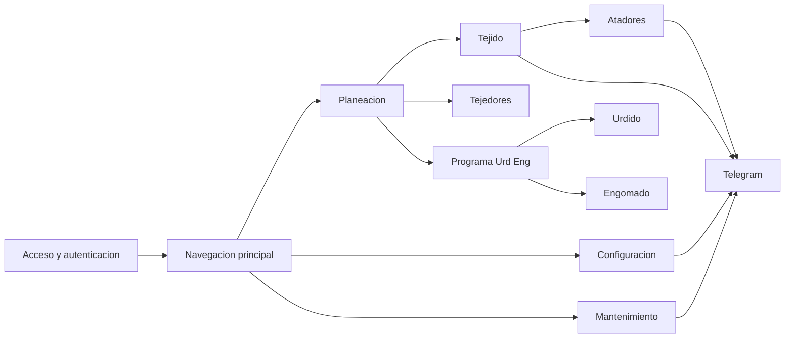

# Towell - Documentacion corporativa y funcional

## Presentacion

Towell es la plataforma central de control operativo para los procesos de planeacion y produccion textil de la organizacion. Su valor principal es conectar en un mismo flujo la planeacion, el seguimiento en piso, la captura de produccion, las alertas operativas y la administracion de usuarios, permisos y configuraciones.

Esta version de documentacion esta pensada para lectores no tecnicos. Su objetivo es explicar el sistema desde una perspectiva funcional, operativa y ejecutiva.

## Alcance

La documentacion sigue el orden de fases funcionales definido en `routes/web.php`, es decir, en el mismo orden en que el sistema organiza sus grandes modulos.

## Audiencia sugerida

- direccion y gerencia
- coordinadores de area
- supervisores de produccion
- analistas funcionales
- capacitacion interna
- auditoria operativa

## Mapa de fases

1. `00-fase-publica.md` - acceso al sistema y autenticacion
2. `01-navigation.md` - navegacion principal y acceso a modulos
3. `02-planeacion.md` - planeacion y preparacion operativa
4. `03-tejido.md` - control operativo de tejido
5. `04-tejedores.md` - BPM, desarrolladores y notificaciones de tejedores
6. `05-urdido.md` - programacion y produccion de urdido
7. `06-engomado.md` - programacion, formulacion y produccion de engomado
8. `07-atadores.md` - proceso de atado y autorizacion
9. `08-programa-urd-eng.md` - reserva de inventario y creacion de ordenes URD/ENG
10. `09-configuracion.md` - administracion del sistema
11. `10-mantenimiento.md` - paros, fallas y seguimiento de mantenimiento
12. `11-telegram.md` - comunicacion y alertamiento

## Entregables principales

- `MANUAL-CORPORATIVO-TOWELL.md` - manual integral corporativo, funcional y tecnico
- `MANUAL-CORPORATIVO-TOWELL-PDF.html` - version lista para abrir en navegador, imprimir o exportar a PDF

## Diagrama ejecutivo general

## Mensaje clave

Towell no es un conjunto aislado de pantallas. Es una cadena de control: planea, ordena, ejecuta, registra, reporta y comunica. Por eso su mayor valor esta en la integracion entre fases, no solo en cada modulo por separado.
