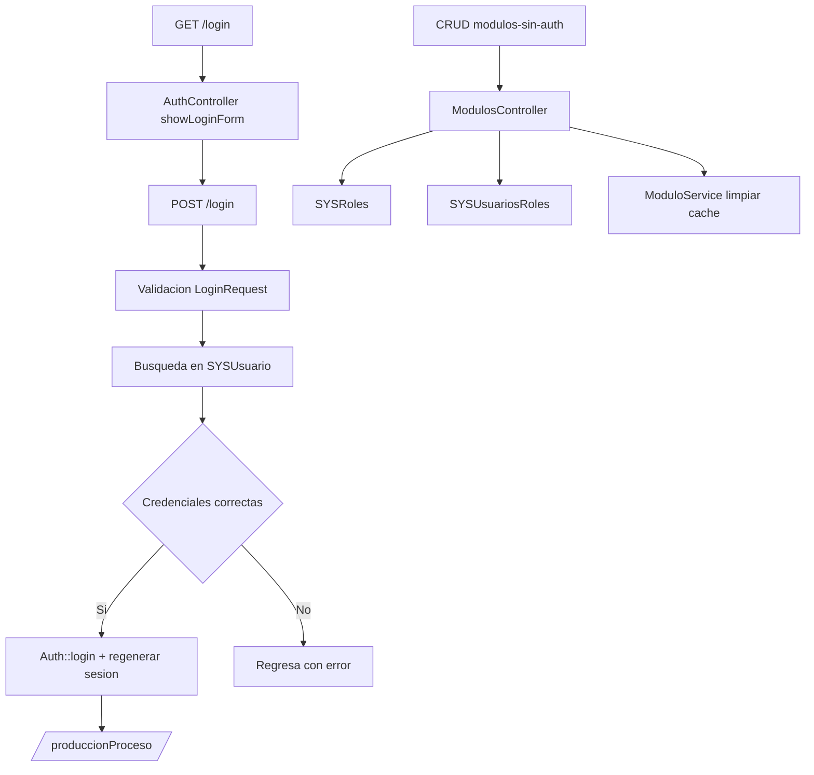

# Fase 00 - Publico y autenticacion

## Objetivo

Esta fase cubre la entrada al sistema antes del menu autenticado: login, logout, pruebas basicas, consulta publica de empleados y el CRUD administrativo de modulos expuesto fuera del grupo `auth`.

## Rutas principales

| Grupo | Rutas |
| --- | --- |
| Acceso | `GET /`, `GET /login`, `POST /login`, `POST /logout` |
| Soporte | `GET /test-404`, `GET /offline`, `GET /obtener-empleados/{area}` |
| Modulos sin auth | `GET /modulos-sin-auth`, `GET /modulos-sin-auth/create`, `POST /modulos-sin-auth`, `GET /modulos-sin-auth/{id}/edit`, `PUT /modulos-sin-auth/{id}`, `DELETE /modulos-sin-auth/{id}` |

## Controladores y funciones

| Archivo | Funciones documentadas | Funcion tecnica |
| --- | --- | --- |
| `app/Http/Controllers/AuthController.php` | `showLoginForm`, `login`, `logout` | Renderiza el login, valida credenciales de `SYSUsuario`, migra contrasenas legacy a bcrypt y cierra sesion. |
| `app/Http/Controllers/UsuarioController.php` | `obtenerEmpleados` | Devuelve empleados filtrados por area para consumos ligeros del frontend. |
| `app/Http/Controllers/SystemController.php` | `test404` | Fuerza un 404 controlado para pruebas. |
| `app/Http/Controllers/ModulosController.php` | `index`, `create`, `store`, `edit`, `update`, `destroy` | Administra modulos del sistema, jerarquia, permisos base e imagenes. |

## Archivos tecnicos relacionados

| Archivo | Rol en el modulo |
| --- | --- |
| `app/Http/Requests/LoginRequest.php` | Valida `numero_empleado` y `contrasenia`. |
| `app/Models/Sistema/Usuario.php` | Modelo autenticable principal sobre `dbo.SYSUsuario`. |
| `app/Models/Sistema/SYSRoles.php` | Catalogo jerarquico de modulos. |
| `app/Models/Sistema/SYSUsuariosRoles.php` | Permisos por usuario y modulo. |
| `app/Services/ModuloService.php` | Limpia cache de modulos y permisos al modificar catalogos. |
| `app/Helpers/ImageOptimizer.php` | Optimiza iconos/fotos de modulos al guardar archivos. |
| `resources/views/login.blade.php` | Pantalla de acceso. |
| `resources/views/offline.blade.php` | Vista offline. |
| `resources/views/modulos/gestion-modulos/index.blade.php` | UI para CRUD de modulos. |

## Funcionamiento tecnico

1. El invitado entra a `/login` y el controlador valida contra `SYSUsuario`.
2. Si la contrasena coincide y requiere rehash o migracion desde texto plano, se actualiza en el mismo login exitoso.
3. La sesion se regenera y el usuario es redirigido a `/produccionProceso`.
4. El CRUD de modulos crea o actualiza filas en `SYSRoles`, propaga permisos hacia `SYSUsuariosRoles` y limpia cache del menu.

## Diagrama

## Notas tecnicas

- `modulos-sin-auth` es funcionalmente sensible porque expone administracion fuera del grupo autenticado.
- El sistema conserva compatibilidad con contrasenas legacy y las migra al autenticar.
- Existe una diferencia historica entre `reigstrar` en `SYSRoles` y `registrar` en `SYSUsuariosRoles`.
