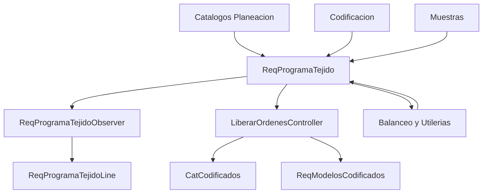

# Fase 02 - Planeacion

## Objetivo

Planeacion es el nucleo funcional del sistema. Mantiene catalogos tecnicos, codificacion de modelos, alineacion, utilerias operativas y el programa de tejido, incluyendo su variante de muestras.

## Submodulos cubiertos

- Catalogos de planeacion
- Codificacion y modelos codificados
- Alineacion
- Utileria operativa
- Programa de tejido
- Muestras

## Catalogos

### Rutas principales

- `GET /planeacion/catalogos`
- `GET|POST|PUT|DELETE /planeacion/telares`
- `GET|POST|PUT|DELETE /planeacion/eficiencia`
- `GET|POST|PUT|DELETE /planeacion/velocidad`
- `GET|POST|PUT|DELETE /planeacion/calendarios`
- `POST /planeacion/calendarios/{calendario}/recalcular-programas`
- `GET|POST|PUT|DELETE /planeacion/aplicaciones`
- `GET|POST|PUT|DELETE /planeacion/catalogos/matriz-hilos`
- `GET|POST|PUT|DELETE /planeacion/catalogos/pesos-rollos`

### Controladores y funciones

| Archivo | Funciones relevantes |
| --- | --- |
| `CatalagoTelarController.php` | `index`, `store`, `update`, `destroy`, `procesarExcel` |
| `CatalagoEficienciaController.php` | `index`, `store`, `update`, `destroy`, `procesarExcel`, `actualizarProgramasYRecalcular` |
| `CatalagoVelocidadController.php` | `index`, `store`, `update`, `destroy`, `procesarExcel`, `actualizarProgramasYRecalcular` |
| `CalendarioController.php` | `index`, `getCalendariosJson`, `getCalendarioDetalle`, `store`, `update`, `updateMasivo`, `destroy`, `storeLine`, `updateLine`, `destroyLine`, `destroyLineasPorRango`, `procesarExcel`, `recalcularProgramas` |
| `AplicacionesController.php` | `index`, `store`, `update`, `destroy`, `procesarExcel`, `actualizarLineasPorCambioFactor` |
| `MatrizHilosController.php` | `index`, `list`, `store`, `show`, `update`, `destroy`, `recalcularMtsRizoEnLineas` |
| `PesosRollosController.php` | `index`, `store`, `update`, `destroy` |

### Archivos clave

| Archivo | Proposito |
| --- | --- |
| `app/Models/Planeacion/ReqTelares.php` | Catalogo de telares de planeacion. |
| `app/Models/Planeacion/ReqEficienciaStd.php` | Eficiencia estandar por combinacion tecnica. |
| `app/Models/Planeacion/ReqVelocidadStd.php` | Velocidad estandar por combinacion tecnica. |
| `app/Models/Planeacion/ReqCalendarioTab.php` | Cabecera de calendario. |
| `app/Models/Planeacion/ReqCalendarioLine.php` | Dias/turnos del calendario. |
| `app/Models/Planeacion/ReqAplicaciones.php` | Factor de aplicacion para formulas. |
| `app/Models/Planeacion/ReqMatrizHilos.php` | Parametria tecnica de hilo y calculos derivados. |
| `app/Models/Planeacion/Catalogos/ReqPesosRollosTejido.php` | Peso por rollo para exportaciones y planeacion. |

### Funcionamiento tecnico

Los catalogos no solo mantienen maestros: tambien recalculan datos productivos. Cambios en eficiencia, velocidad, calendario, aplicacion o matriz impactan registros en `ReqProgramaTejido` y `ReqProgramaTejidoLine`.

## Codificacion

### Rutas principales

- `GET /planeacion/catalogos/codificacion-modelos`
- `GET /planeacion/codificacion`
- `POST /planeacion/catalogos/codificacion-modelos/excel`
- `POST /planeacion/codificacion/excel`
- `GET /planeacion/codificacion/orden-cambio-pdf`
- `GET /planeacion/codificacion/orden-cambio-excel`

### Controladores y funciones

| Archivo | Funciones relevantes |
| --- | --- |
| `CodificacionController.php` | `index`, `create`, `edit`, `getAll`, `getAllFast`, `show`, `store`, `update`, `destroy`, `duplicate`, `procesarExcel`, `importProgress`, `buscar`, `estadisticas`, `duplicarImportar` |
| `CatCodificacionController.php` | `index`, `procesarExcel`, `ordenesEnProceso`, `getCatCodificadosPorOrden`, `actualizarPesoMuestraLmat`, `getAllFast`, `registrosOrdCompartida`, `importProgress` |
| `OrdenDeCambioFelpaController.php` | `generarPDF`, `generarExcel`, `generarExcelDesdeBD` |
| `ReimprimirOrdenesController.php` | `reimprimir` |

### Archivos clave

| Archivo | Proposito |
| --- | --- |
| `app/Models/Planeacion/ReqModelosCodificados.php` | Maestro tecnico/comercial de modelos codificados. |
| `app/Models/Planeacion/Catalogos/CatCodificados.php` | Catalogo operativo ligado a ordenes y reimpresion. |
| `app/Imports/ReqModelosCodificadosImport.php` | Import masivo de modelos codificados. |
| `app/Imports/CatCodificadosImport.php` | Import masivo del catalogo operativo. |

### Funcionamiento tecnico

`ReqModelosCodificados` actua como maestro tecnico; `CatCodificados` como catalogo operativo ya conectado con ordenes, LMAT y peso muestra. Ambos se sincronizan desde liberacion de ordenes y ordenes de cambio.

## Alineacion

### Controlador y funciones

| Archivo | Funciones relevantes |
| --- | --- |
| `AlineacionController.php` | `index`, `apiData`, `obtenerItemsAlineacion`, `obtenerCatCodificadosPorOrden`, `mapearProgramaTejidoAItem` |

### Funcionamiento tecnico

Cruza `ReqProgramaTejido` en proceso con `CatCodificados` para mostrar estado de orden, tolerancia, observaciones y datos tecnicos enriquecidos por telar.

## Utileria

### Controladores y funciones

| Archivo | Funciones relevantes |
| --- | --- |
| `FinalizarOrdenesController.php` | `getTelares`, `getOrdenesByTelar`, `finalizarOrdenes` |
| `MoverOrdenesController.php` | `getTelares`, `getRegistrosByTelar`, `moverOrdenes`, `recalcularFechasPorTelar`, `sincronizarCatCodificados` |

### Funcionamiento tecnico

Las utilerias operan directamente sobre la cola: pueden finalizar/eliminar registros, mover ordenes entre telares, normalizar `EnProceso`, recalcular fechas y sincronizar catálogos derivados.

## Programa de tejido y muestras

### Rutas principales

- `GET /planeacion/programa-tejido`
- `GET /planeacion/programa-tejido/liberar-ordenes`
- `POST /planeacion/programa-tejido/{id}/prioridad/mover`
- `POST /planeacion/programa-tejido/{id}/cambiar-telar`
- `POST /planeacion/programa-tejido/duplicar-telar`
- `POST /planeacion/programa-tejido/dividir-telar`
- `POST /planeacion/programa-tejido/vincular-telar`
- `GET /planeacion/programa-tejido/balancear`
- `POST /planeacion/programa-tejido/recalcular-fechas`
- `POST /planeacion/programa-tejido/descargar-programa`
- Replica funcional bajo `/planeacion/muestras` y `/muestras/*`

### Controladores y funciones

| Archivo | Funciones relevantes |
| --- | --- |
| `ProgramaTejidoController.php` | `index`, `store`, `update`, `destroy`, `destroyEnProceso`, `edit` |
| `ProgramaTejidoOperacionesController.php` | `moveToPosition`, `verificarCambioTelar`, `cambiarTelar`, `duplicarTelar`, `dividirTelar`, `dividirSaldo`, `vincularTelar`, `vincularRegistrosExistentes`, `desvincularRegistro`, `getRegistrosPorOrdCompartida` |
| `ProgramaTejidoBalanceoController.php` | `balancear`, `detallesBalanceo`, `previewFechasBalanceo`, `actualizarPedidosBalanceo`, `balancearAutomatico` |
| `ProgramaTejidoCalendariosController.php` | `getAllRegistrosJson`, `actualizarCalendariosMasivo`, `actualizarReprogramar`, `recalcularFechas` |
| `ProgramaTejidoCatalogosController.php` | Catalogos auxiliares de salon, telares, Flogs, calendarios, aplicaciones y STD |
| `LiberarOrdenesController.php` | `index`, `liberar`, `obtenerBomYNombre`, `obtenerTipoHilo`, `obtenerCodigoDibujo`, `guardarCamposEditables`, `obtenerOpcionesHilos` |
| `DescargarProgramaController.php` | `descargar` |
| `RepasoController.php` | `createrepaso` |
| `ColumnasProgramaTejidoController.php` | `index`, `getColumnasVisibles`, `store` |
| `ReqProgramaTejidoLineController.php` | `index` |

### Archivos clave

| Archivo | Proposito |
| --- | --- |
| `app/Models/Planeacion/ReqProgramaTejido.php` | Modelo central del programa de tejido. |
| `app/Models/Planeacion/ReqProgramaTejidoLine.php` | Desglose diario generado por observer. |
| `app/Models/Planeacion/OrdColProgramaTejido.php` | Preferencias de columnas visibles por usuario. |
| `app/Observers/ReqProgramaTejidoObserver.php` | Recalcula formulas y reconstruye lineas diarias. |
| `resources/views/modulos/programa-tejido/req-programa-tejido.blade.php` | Vista principal del modulo. |
| `resources/views/modulos/programa-tejido/liberar-ordenes/index.blade.php` | Flujo de liberacion. |
| `resources/views/modulos/programa-tejido/balancear.blade.php` | Pantalla de balanceo. |

### Funcionamiento tecnico

1. Se crea o actualiza un registro en `ReqProgramaTejido`.
2. El observer recalcula formulas y reconstruye `ReqProgramaTejidoLine` por dia.
3. Las operaciones de mover, duplicar, dividir y vincular recalculan fechas y posiciones.
4. `LiberarOrdenesController` genera la salida operativa y sincroniza `CatCodificados` y `ReqModelosCodificados`.
5. Muestras reutiliza este mismo stack, pero cambia rutas, titulo y contexto visual.

## Diagrama

## Notas tecnicas

- Esta fase concentra gran parte de la logica de negocio y recalculo del sistema.
- `DescargarProgramaController` depende de una ruta de red para exportar TXT.
- Muestras reutiliza `ReqProgramaTejido` y `ReqProgramaTejidoLine`; no tiene aislamiento fuerte a nivel de tablas.
