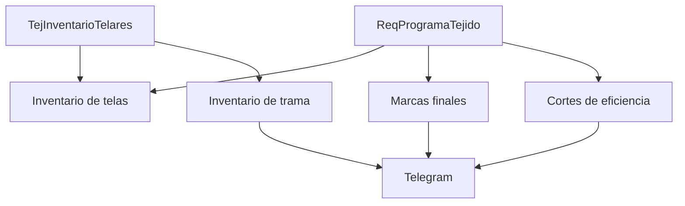

# Fase 03 - Tejido

## Objetivo

La fase de Tejido cubre inventarios de telares y trama, marcas finales, cortes de eficiencia, produccion de reenconado y reportes de inventario de telas.

## Inventario de telas

| Elemento | Detalle |
| --- | --- |
| Rutas | `GET /tejido/inventario-telas`, `GET /tejido/inventario-telas/jacquard`, `GET /tejido/inventario-telas/itema`, `GET /tejido/inventario-telas/karl-mayer`, `GET /api/telares/proceso-actual/{telarId}`, `GET /api/telares/siguiente-orden/{telarId}` |
| Controlador | `TelaresController.php` |
| Funciones | `inventarioJacquard`, `inventarioItema`, `inventarioKarlMayer`, `mostrarTelarSulzer`, `obtenerOrdenesProgramadas`, `procesoActual`, `siguienteOrden` |
| Archivos clave | `app/Models/Tejido/TejInventarioTelares.php`, `app/Models/Planeacion/ReqProgramaTejido.php`, `resources/views/modulos/tejido/inventario-telas/inventario-telas.blade.php` |

Funcion tecnica: muestra orden actual y siguiente por telar combinando inventario real y programa de tejido.

## Inventario de trama

| Elemento | Detalle |
| --- | --- |
| Rutas | `GET|POST /tejido/inventario/trama/nuevo-requerimiento`, `GET /tejido/inventario/trama/consultar-requerimiento`, `GET /.../{folio}/resumen`, auxiliares de turno, articulos, fibras y colores |
| Controladores | `NuevoRequerimientoController.php`, `ConsultarRequerimientoController.php` |
| Funciones | `index`, `guardarRequerimientos`, `getTurnoInfo`, `enProcesoInfo`, `actualizarCantidad`, `buscarArticulos`, `buscarFibras`, `buscarCodigosColor`, `buscarNombresColor`, `show`, `updateStatus`, `resumen` |
| Archivos clave | `app/Models/Tejido/TejTrama.php`, `app/Models/Tejido/TejTramaConsumos.php`, `app/Helpers/FolioHelper.php`, `app/Helpers/TurnoHelper.php` |

Funcion tecnica: captura consumos por requerimiento, cambia estatus del folio y al solicitar puede notificar por Telegram.

## Marcas finales

| Elemento | Detalle |
| --- | --- |
| Rutas | `/modulo-marcas`, `/modulo-marcas/consultar`, `/modulo-marcas/generar-folio`, `/modulo-marcas/store`, `/modulo-marcas/{folio}`, `/modulo-marcas/{folio}/finalizar`, `/modulo-marcas/{folio}/reabrir`, `/modulo-marcas/reporte` |
| Controladores | `MarcasController.php`, `SecuenciaMarcasFinalesController.php` |
| Funciones | `index`, `consultar`, `generarFolio`, `obtenerDatosSTD`, `store`, `show`, `update`, `actualizarRegistro`, `finalizar`, `reabrirFolio`, `visualizarFolio`, `reporte`, `exportarExcel`, `descargarPDF` |
| Archivos clave | `app/Models/Tejido/TejMarcas.php`, `app/Models/Tejido/TejMarcasLine.php`, `app/Models/Inventario/InvSecuenciaMarcas.php` |

Funcion tecnica: genera folio por fecha/turno, guarda lineas por telar, permite cierre, reapertura y consolidado por fecha con exportacion.

## Cortes de eficiencia

| Elemento | Detalle |
| --- | --- |
| Rutas | `/modulo-cortes-de-eficiencia`, `/consultar`, `/generar-folio`, `/guardar-hora`, `/guardar-tabla`, `/{id}`, `/{id}/finalizar`, `/visualizar/{folio}`, `/visualizar/exportar-excel`, `/visualizar/descargar-pdf` |
| Controladores | `CortesEficienciaController.php`, `SecuenciaCorteEficienciaController.php` |
| Funciones | `index`, `consultar`, `getTurnoInfo`, `getDatosProgramaTejido`, `getDatosTelares`, `getFallasCe`, `generarFolio`, `guardarHora`, `guardarTabla`, `store`, `show`, `update`, `actualizarRegistro`, `finalizar`, `visualizar`, `exportarVisualizacionExcel`, `descargarVisualizacionPDF`, `notificarTelegram` |
| Archivos clave | `app/Models/Tejido/TejEficiencia.php`, `app/Models/Tejido/TejEficienciaLine.php`, `app/Models/Tejido/TejeFallasCeModel.php`, `app/Models/Inventario/InvSecuenciaCorteEf.php` |

Funcion tecnica: captura RPM y eficiencia por horarios, consolida por turno y fecha, exporta a PDF/Excel y puede notificar resultados.

## Produccion de reenconado

| Elemento | Detalle |
| --- | --- |
| Rutas | `GET|POST /tejido/produccion-reenconado`, `POST /tejido/produccion-reenconado/generar-folio`, `GET /calibres`, `GET /fibras`, `GET /colores`, `PUT /{folio}`, `DELETE /{folio}`, `PATCH /{folio}/cambiar-status` |
| Controlador | `ProduccionReenconadoCabezuelaController.php` |
| Funciones | `index`, `store`, `generarFolio`, `getCalibres`, `getFibras`, `getColores`, `update`, `destroy`, `cambiarStatus` |
| Archivos clave | `app/Models/Tejido/TejProduccionReenconado.php`, `app/Helpers/FolioHelper.php`, `app/Helpers/TurnoHelper.php` |

Funcion tecnica: captura produccion, calcula capacidad y eficiencia y recorre un ciclo simple de estados.

## Reportes

| Elemento | Detalle |
| --- | --- |
| Rutas | `GET /tejido/reportes`, `GET /tejido/reportes/inv-telas`, `GET /tejido/reportes/inv-telas/excel`, `GET /tejido/reportes/inv-telas/pdf` |
| Controlador | `ReporteInvTelasController.php` |
| Funciones | `index`, `exportarExcel`, `exportarPdf`, `obtenerDatosReporte` |
| Archivos clave | `app/Exports/ReporteInvTelasExport.php`, `resources/views/modulos/tejido/reportes/inv-telas.blade.php`, `resources/views/modulos/tejido/reportes/inv-telas-pdf.blade.php` |

## Diagrama

## Notas tecnicas

- Tejido mezcla rutas nuevas con aliases legacy para compatibilidad.
- Varios reportes y tableros se apoyan en consultas manuales sobre `ReqProgramaTejido`.
- Marcas finales y cortes de eficiencia hacen reemplazo de lineas por `delete + insert`, por lo que conviene cuidar concurrencia.
