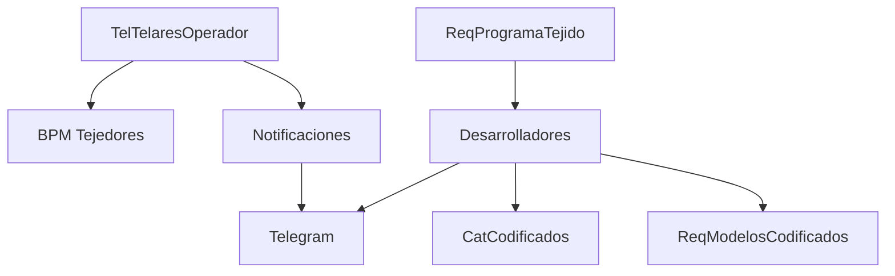

# Fase 04 - Tejedores

## Objetivo

Esta fase gestiona BPM de tejedores, inventario operativo de telares, flujo de desarrolladores, notificaciones de montaje/corte y reportes especializados.

## BPM de tejedores

| Elemento | Detalle |
| --- | --- |
| Rutas | `/tejedores/bpmtejedores`, `resource tel-bpm`, `GET tel-bpm/{folio}/lineas`, `POST /toggle`, `POST /bulk-save`, `POST /comentarios`, `PATCH /terminar`, `PATCH /autorizar`, `PATCH /rechazar` |
| Controladores | `TelBpmController.php`, `TelBpmLineController.php`, `TelActividadesBPMController.php`, `TelTelaresOperadorController.php` |
| Funciones | Creacion de encabezado BPM, carga de lineas, cambios de estado, comentarios y catalogos de actividades/telares por operador |
| Archivos clave | `app/Models/Tejedores/TelBpmModel.php`, `app/Models/Tejedores/TelBpmLineModel.php`, `app/Models/Tejedores/TelActividadesBPM.php`, `app/Models/Tejedores/TelTelaresOperador.php` |

Funcion tecnica: genera checklist BPM por folio y operador, permite capturar actividad/telar y autorizar por supervisor.

## Inventario de telares

| Elemento | Detalle |
| --- | --- |
| Rutas | `/inventario-telares`, `/guardar`, `/verificar-estado`, `/eliminar`, `/actualizar-fecha`, `/verificar-turnos-ocupados` |
| Controlador | `InventarioTelaresController.php` |
| Funciones | `index`, `store`, `verificarEstado`, `destroy`, `updateFecha`, `verificarTurnosOcupados` |
| Archivos clave | `app/Models/Tejido/TejInventarioTelares.php`, `app/Models/Inventario/InvTelasReservadas.php`, `app/Models/Urdido/UrdProgramaUrdido.php` |

Funcion tecnica: administra el inventario operativo del telar y valida reservas/programacion antes de eliminar o mover registros.

## Desarrolladores

| Elemento | Detalle |
| --- | --- |
| Rutas | `/tejedores/desarrolladores`, `/tejedores/desarrolladores-muestras`, APIs de producciones, ordenes, codigo dibujo y `POST /desarrolladores` |
| Controladores | `TelDesarrolladoresController.php`, `TelDesarrolladoresMuestrasController.php`, `catDesarrolladoresController.php` |
| Funciones | Seleccion de orden, consulta tecnica, captura de desarrollador, exportacion y mantenimiento del catalogo |
| Archivos clave | `app/Http/Controllers/Tejedores/Desarrolladores/Funciones/ConsultasDesarrolladorService.php`, `ProcesarDesarrolladorService.php`, `MovimientoDesarrolladorService.php`, `NotificacionTelegramDesarrolladorService.php`, `app/Models/Tejedores/catDesarrolladoresModel.php` |

Funcion tecnica: toma una orden del programa, consulta detalles tecnicos, mueve/sincroniza registros y notifica el resultado del proceso.

## Notificaciones operativas

| Elemento | Detalle |
| --- | --- |
| Rutas | `/tejedores/atadodejulio*`, `/tejedores/cortadoderollo*` |
| Controladores | `NotificarMontadoJulioController.php`, `NotificarMontRollosController.php` |
| Funciones | `index`, `telares`, `detalle`, `notificar`, `obtenerOrdenesEnProceso`, `getOrdenProduccion`, `getDatosProduccion`, `insertarMarbetes` |
| Archivos clave | `app/Models/Tejedores/TejNotificaTejedorModel.php`, `app/Models/Tejedores/TelMarbeteLiberadoModel.php`, `app/Models/Tejido/TejInventarioTelares.php` |

Funcion tecnica: identifica el telar del operador, registra la notificacion y, en corte de rollo, libera marbetes desde TI.

## Reportes

| Elemento | Detalle |
| --- | --- |
| Rutas | `/tejedores/reportes-tejedores*`, `/tejedores/reportes-desarrolladores*` |
| Controladores | `ReportesTejedoresController.php`, `ReportesDesarrolladoresController.php` |
| Funciones | `index`, `reportePrograma`, `exportarExcel` |
| Archivos clave | `app/Exports/TejedoresReporteExport.php`, `app/Exports/DesarrolladoresReporteExport.php` |

## Diagrama

## Notas tecnicas

- Tejedores reutiliza bastante informacion de planeacion e inventario; no es una fase aislada.
- El flujo de desarrolladores toca varias tablas y servicios, por lo que es uno de los puntos mas sensibles del sistema.
- Existen rutas legacy activas para preservar enlaces historicos.
