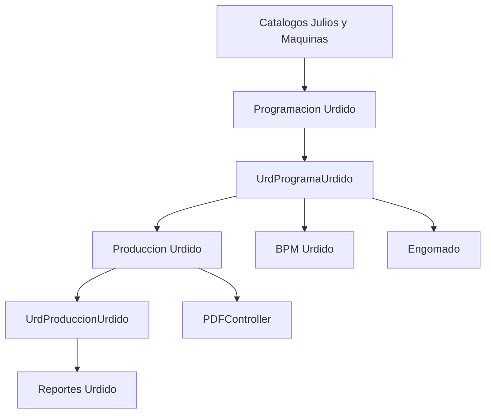

# Fase 05 - Urdido

## Objetivo

Urdido controla programacion, produccion, BPM, catalogos y reportes del proceso de urdido, incluyendo la sincronizacion con engomado cuando corresponde.

## Programacion

| Elemento | Detalle |
| --- | --- |
| Rutas | `/urdido/programaurdido`, `/urdido/programar-urdido*`, `/urdido/reimpresion-urdido*`, `/urdido/editar-ordenes-programadas*` |
| Controladores | `ProgramarUrdidoController.php`, `EditarOrdenesProgramadasController.php` |
| Funciones | `index`, `getOrdenes`, `getTodasOrdenes`, `verificarOrdenEnProceso`, `intercambiarPrioridad`, `actualizarPrioridades`, `guardarObservaciones`, `actualizarStatus`, `reimpresionFinalizadas`, `reimpresionVentanaImprimir`, `actualizar`, `actualizarJulios`, `actualizarHilosProduccion` |
| Archivos clave | `app/Models/Urdido/UrdProgramaUrdido.php`, `app/Models/Urdido/UrdJuliosOrden.php`, `app/Models/Engomado/EngProgramaEngomado.php`, `app/Models/Urdido/AuditoriaUrdEng.php` |

Funcion tecnica: organiza la cola por maquina, prioriza ordenes, guarda observaciones, cancela/sincroniza y permite reimpresion o edicion de folios.

## Produccion

| Elemento | Detalle |
| --- | --- |
| Rutas | `/urdido/modulo-produccion-urdido*`, `/guardar-oficial`, `/eliminar-oficial`, `/actualizar-turno-oficial`, `/actualizar-fecha`, `/actualizar-julio-tara`, `/actualizar-kg-bruto`, `/actualizar-campos-produccion`, `/actualizar-horas`, `/marcar-listo`, `/finalizar`, `/pdf` |
| Controlador | `ModuloProduccionUrdidoController.php` + `ProduccionTrait.php` |
| Funciones | `index`, `getUsuariosUrdido`, `actualizarCamposProduccion`, `finalizar` y las funciones compartidas del trait |
| Archivos clave | `app/Models/Urdido/UrdProduccionUrdido.php`, `app/Helpers/TurnoHelper.php`, `resources/views/modulos/urdido/modulo-produccion-urdido.blade.php` |

Funcion tecnica: carga una orden, genera registros faltantes por julio, captura oficiales, horas, kilos y cierre, y valida condiciones de finalizacion.

## BPM

| Elemento | Detalle |
| --- | --- |
| Rutas | `resource urd-bpm`, `GET urd-bpm-line/{folio}`, `POST /toggle`, `PATCH /terminar`, `PATCH /autorizar`, `PATCH /rechazar`, `resource urd-actividades-bpm` |
| Controladores | `UrdBpmController.php`, `UrdBpmLineController.php`, `UrdActividadesBpmController.php` |
| Archivos clave | `app/Models/Urdido/UrdBpmModel.php`, `app/Models/Urdido/UrdBpmLineModel.php`, `app/Models/Urdido/UrdActividadesBpmModel.php` |

Funcion tecnica: genera checklist BPM para la orden y permite terminar, autorizar o rechazar el folio.

## Catalogos y reportes

| Elemento | Detalle |
| --- | --- |
| Rutas | `/urdido/catalogos-julios*`, `/urdido/catalogo-maquinas*`, `/urdido/reportesurdido*` |
| Controladores | `CatalogosUrdidoController.php`, `ReportesUrdidoController.php` |
| Funciones | CRUD de julios/maquinas y reportes `reporte03Oee`, `reporteKaizen`, `reporteRoturas`, `reporteBpm`, exportaciones a Excel |
| Archivos clave | `app/Models/Urdido/UrdCatJulios.php`, `app/Models/Urdido/URDCatalogoMaquina.php`, `app/Exports/ReportesUrdidoExport.php`, `KaizenExport.php`, `RoturasMillonExport.php`, `BpmUrdidoExport.php` |

## Diagrama

## Notas tecnicas

- La sincronizacion con engomado es una dependencia importante de esta fase.
- La produccion comparte logica en `ProduccionTrait`, por eso cambios ahi impactan tanto urdido como engomado.
- Algunas validaciones historicas del trait estan deshabilitadas, por lo que conviene probar manualmente al tocar cierre u horas.
