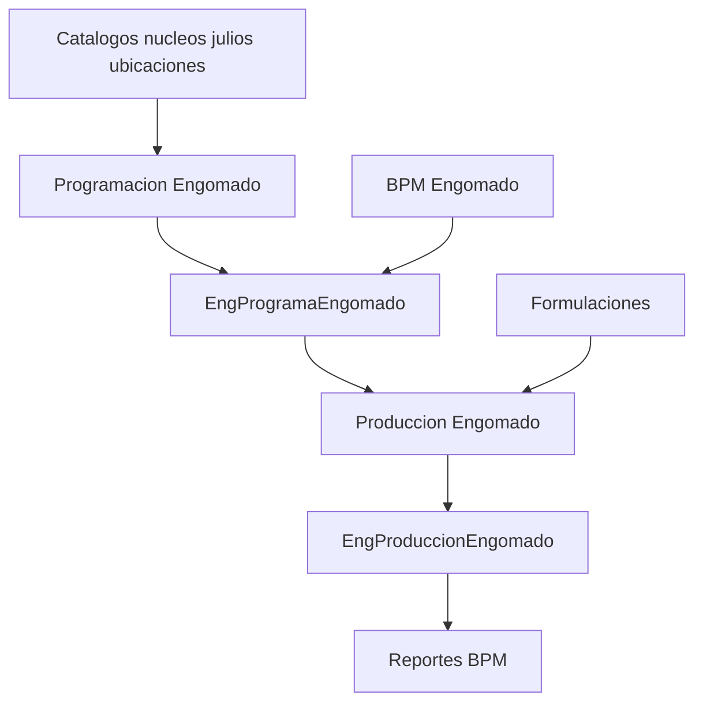

# Fase 06 - Engomado

## Objetivo

Engomado administra la programacion de ordenes, su ejecucion en produccion, la captura de formulaciones, BPM, catalogos tecnicos y reportes de la fase.

## Programacion

| Elemento | Detalle |
| --- | --- |
| Rutas | `/engomado/programaengomado`, `/engomado/programar-engomado*`, `/engomado/reimpresion-engomado*`, `/engomado/editar-ordenes-programadas*` |
| Controladores | `ProgramarEngomadoController.php`, `EditarOrdenesEngomadoController.php` |
| Funciones | `index`, `getOrdenes`, `getTodasOrdenes`, `verificarOrdenEnProceso`, `intercambiarPrioridad`, `guardarObservaciones`, `actualizarPrioridades`, `actualizarStatus`, `reimpresionFinalizadas`, `reimpresionVentanaImprimir`, `actualizar`, `obtenerOrden` |
| Archivos clave | `app/Models/Engomado/EngProgramaEngomado.php`, `app/Models/Urdido/AuditoriaUrdEng.php` |

Funcion tecnica: prioriza ordenes por tabla/maquina, valida dependencia con urdido y permite reimpresion o edicion.

## Produccion

| Elemento | Detalle |
| --- | --- |
| Rutas | `/engomado/modulo-produccion-engomado*`, endpoints de oficiales, fecha, kilos, horas, `verificar-formulaciones`, `finalizar`, `marcar-listo`, `pdf` |
| Controlador | `ModuloProduccionEngomadoController.php` + `ProduccionTrait.php` |
| Funciones | `index`, `getUsuariosEngomado`, `actualizarCamposProduccion`, `actualizarCampoOrden`, `verificarFormulaciones`, `finalizar` |
| Archivos clave | `app/Models/Engomado/EngProduccionEngomado.php`, `app/Models/Engomado/CatUbicaciones.php`, `resources/views/modulos/engomado/modulo-produccion-engomado.blade.php` |

Funcion tecnica: crea registros por `NoTelas`, captura variables de produccion y exige formulaciones previas para cerrar la orden.

## Formulacion

| Elemento | Detalle |
| --- | --- |
| Rutas | `/engomado/capturadeformula`, `/eng-formulacion*` |
| Controlador | `EngProduccionFormulacionController.php` |
| Funciones | `index`, `store`, `validarFolio`, `getFormulacionById`, `getComponentesFormula`, `getComponentesFormulacion`, `getCalibresFormula`, `getFibrasFormula`, `getColoresFormula`, `update`, `destroy` |
| Archivos clave | `app/Models/Engomado/EngProduccionFormulacionModel.php`, `app/Models/Engomado/EngFormulacionLineModel.php`, `resources/views/modulos/engomado/captura-formula/index.blade.php` |

Funcion tecnica: guarda encabezado y componentes de formula ligados a un folio de produccion; la finalizacion de engomado depende de estas capturas.

## BPM, catalogos y reportes

| Elemento | Detalle |
| --- | --- |
| Rutas | `resource eng-bpm`, `eng-bpm-line/*`, `resource eng-actividades-bpm`, `resource urd-eng-nucleos`, CRUD de `catalogojulioseng`, CRUD de `catalogo-ubicaciones`, `/engomado/reportesengomado*` |
| Controladores | `EngBpmController.php`, `EngBpmLineController.php`, `EngActividadesBpmController.php`, `UrdEngNucleosController.php`, `CatUbicacionesController.php`, `ReportesEngomadoController.php` |
| Archivos clave | `app/Models/Engomado/EngBpmModel.php`, `app/Models/Engomado/EngBpmLineModel.php`, `app/Models/Engomado/EngActividadesBpmModel.php`, `app/Models/UrdEngomado/UrdEngNucleos.php` |

## Diagrama

## Notas tecnicas

- Engomado depende de que urdido este finalizado antes de iniciar produccion.
- `ProduccionTrait` es compartido con urdido; cualquier cambio impacta ambas fases.
- Existen dos esquemas de relacion historicos en formulacion (`Folio` y `EngProduccionFormulacionId`).
