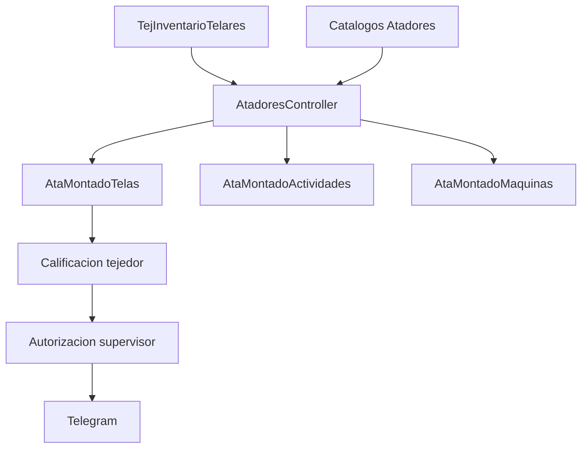

# Fase 07 - Atadores

## Objetivo

Atadores controla el programa de atado, la ejecucion del proceso por telar, la calificacion/autorizacion posterior y los catalogos de apoyo.

## Programa y operacion

| Elemento | Detalle |
| --- | --- |
| Rutas | `/atadores/programaatadores`, `/atadores/iniciar`, `/atadores/calificar`, `/atadores/julios-atados`, `POST /atadores/save`, `GET /atadores/show`, `POST /tejedores/validar` |
| Controlador | `AtadoresController.php` |
| Funciones | `index`, `exportarExcel`, `iniciarAtado`, `calificarAtadores`, `save`, mas acciones internas para operador, supervisor, calificacion, observaciones, merma, folio de paro, estado de maquina y terminar |
| Archivos clave | `app/Models/Atadores/AtaMontadoTelasModel.php`, `app/Models/Atadores/AtaMontadoMaquinasModel.php`, `app/Models/Atadores/AtaMontadoActividadesModel.php`, `app/Models/Tejido/TejInventarioTelares.php` |

Funcion tecnica: toma un telar del inventario, crea el expediente de atado, genera actividades y maquinas base, registra avance y luego permite calificacion del tejedor y autorizacion del supervisor.

## Catalogos

| Elemento | Detalle |
| --- | --- |
| Rutas | `/atadores/catalogos/actividades*`, `/atadores/catalogos/comentarios*`, `/atadores/catalogos/maquinas*` |
| Controladores | `AtaActividadesController.php`, `AtaComentariosController.php`, `AtaMaquinasController.php` |
| Funciones | CRUD de catalogos de actividades, comentarios y maquinas |
| Archivos clave | `app/Models/Atadores/AtaActividadesModel.php`, `app/Models/Atadores/AtaComentariosModel.php`, `app/Models/Atadores/AtaMaquinasModel.php` |

Funcion tecnica: proveen el catalogo que el proceso de atado usa para generar filas de trabajo y opciones de captura.

## Reportes

| Elemento | Detalle |
| --- | --- |
| Rutas | `/atadores/reportes-atadores`, `/atadores/reportes-atadores/programa`, `/atadores/reportes-atadores/programa/excel` |
| Controlador | `ReportesAtadoresController.php` |
| Funciones | `index`, `reportePrograma`, `exportarExcel` |
| Archivos clave | `app/Exports/ProgramaAtadoresExport.php` |

## Diagrama

## Notas tecnicas

- `save` concentra mucha logica de negocio; es uno de los puntos mas delicados para mantenimiento.
- El flujo cruza inventario, catalogos, notificacion y autorizacion final.
- En esta fase conviene verificar manualmente cualquier cambio sobre estados, tiempos de paro y autorizaciones.
