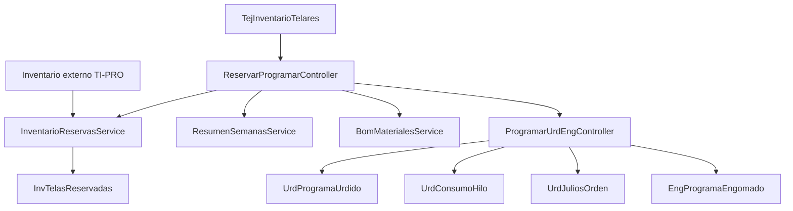

# Fase 08 - Programa Urd/Eng

## Objetivo

Esta fase prepara la programacion previa a urdido y engomado: consulta inventario disponible, reserva materiales, resume semanas de carga y crea ordenes productivas URD/ENG o Karl Mayer.

## Rutas principales

| Grupo | Rutas |
| --- | --- |
| Vista principal | `GET /programaurdeng`, `GET /programa-urd-eng/reservar-programar` |
| Requerimientos | `GET /programa-urd-eng/programacion-requerimientos`, `GET /programacion-requerimientos/grupo-by-telar`, `POST /programacion-requerimientos/resumen-semanas` |
| Inventario y reservas | `GET /inventario-telares`, `GET|POST /inventario-disponible`, `POST /reservar-inventario`, `GET /reservas/{noTelar}`, `POST /reservas/cancelar`, `GET /reservas/diagnostico` |
| Programacion | `POST /programar-telar`, `POST /actualizar-telar`, `POST /liberar-telar` |
| Materiales | `GET /buscar-bom-urdido`, `GET /buscar-bom-engomado`, `GET /materiales-urdido`, `GET /materiales-urdido-completo`, `GET /materiales-engomado`, `GET /anchos-balona`, `GET /maquinas-engomado`, `GET /nucleos`, `GET /hilos`, `GET /tamanos`, `GET /bom-formula` |
| Creacion de ordenes | `GET /creacion-ordenes`, `POST /crear-ordenes`, `GET /karl-mayer`, `POST /crear-orden-karl-mayer` |

## Controladores y funciones

| Archivo | Funciones documentadas |
| --- | --- |
| `ReservarProgramarController.php` | `index`, `programacionRequerimientos`, `getGrupoByTelar`, `creacionOrdenes`, `karlMayer`, `programarTelar`, `actualizarTelar`, `liberarTelar` |
| `InventarioTelaresController.php` | `getInventarioTelares` |
| `InventarioDisponibleController.php` | `disponible`, `porTelar`, `diagnosticarReservas` |
| `ReservaInventarioController.php` | `reservar`, `cancelar` |
| `ResumenSemanasController.php` | `getResumenSemanas` |
| `BomMaterialesController.php` | `buscarBomUrdido`, `buscarBomEngomado`, `getMaterialesUrdido`, `getMaterialesUrdidoCompleto`, `getMaterialesEngomado`, `getAnchosBalona`, `getMaquinasEngomado`, `obtenerHilos`, `obtenerTamanos`, `getBomFormula` |
| `ProgramarUrdEngController.php` | `crearOrdenes` |
| `CrearOrdenKarlMayerController.php` | `store` |

## Archivos tecnicos relacionados

| Archivo | Rol |
| --- | --- |
| `app/Services/ProgramaUrdEng/InventarioTelaresService.php` | Arma inventario operativo de telares activos. |
| `app/Services/ProgramaUrdEng/InventarioReservasService.php` | Consulta TI-PRO y aplica reservas/cancelaciones locales. |
| `app/Services/ProgramaUrdEng/ResumenSemanasService.php` | Resume carga semanal desde planeacion. |
| `app/Services/ProgramaUrdEng/BomMaterialesService.php` | Resuelve BOM, materiales, hilos, tamanos y anchos. |
| `app/Services/ProgramaUrdEng/ProgramasUrdidoEngomadoService.php` | Actualiza programas usando `Folio`. |
| `app/Models/Inventario/InvTelasReservadas.php` | Reserva local por telar y pieza. |
| `app/Models/Tejido/TejInventarioTelares.php` | Fuente de inventario activo a programar. |
| `app/Models/Sistema/SSYSFoliosSecuencia.php` | Secuencias de folios para consumo y URD/ENG. |

## Funcionamiento tecnico

1. Se consulta inventario activo por telar.
2. Se reserva material contra inventario externo y reservas locales.
3. Se resume la carga semanal para apoyar la programacion.
4. Al crear ordenes, se generan folios, registros en urdido, consumos de hilo, julios y, si aplica, la orden espejo en engomado.
5. Karl Mayer sigue un flujo paralelo sin crear orden de engomado.

## Diagrama

## Notas tecnicas

- Esta fase es el puente entre planeacion, inventario, urdido y engomado.
- Usa lecturas `READ UNCOMMITTED` en inventario externo para evitar bloqueos, con el costo de posibles lecturas sucias.
- La reserva depende de una llave dimensional estricta; diferencias de normalizacion rompen el match.
