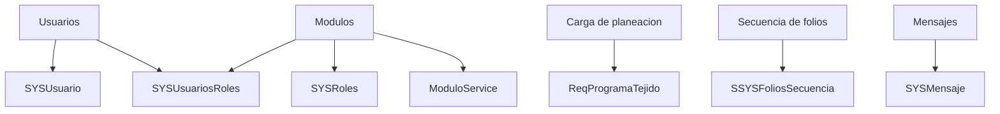

# Fase 09 - Configuracion

## Objetivo

Configuracion concentra administracion de usuarios, modulos, permisos, cargas administrativas, departamentos, secuencias de folios, mensajes y algunos ajustes de base de datos.

## Usuarios

| Elemento | Detalle |
| --- | --- |
| Rutas | `/configuracion/usuarios*` |
| Controlador | `UsuarioController.php` |
| Funciones | `select`, `create`, `store`, `showQR`, `edit`, `update`, `destroy`, `updatePermiso` |
| Archivos clave | `app/Services/UsuarioService.php`, `app/Services/PermissionService.php`, `app/Repositories/UsuarioRepository.php`, `app/Models/Sistema/Usuario.php`, `resources/views/modulos/usuarios/*.blade.php` |

Funcion tecnica: crea usuarios, administra foto, genera QR y persiste permisos por modulo.

## Modulos y utileria

| Elemento | Detalle |
| --- | --- |
| Rutas | `/configuracion/utileria/modulos*`, alias `/modulos/{modulo}/*`, APIs `/api/modulos/*` |
| Controlador | `ModulosController.php` |
| Funciones | `index`, `create`, `store`, `edit`, `update`, `destroy`, `toggleAcceso`, `togglePermiso`, `sincronizarPermisos`, `duplicar`, `getModulosPorNivel`, `getSubmodulos` |
| Archivos clave | `app/Models/Sistema/SYSRoles.php`, `app/Models/Sistema/SYSUsuariosRoles.php`, `app/Services/ModuloService.php` |

Funcion tecnica: administra la jerarquia de modulos, sus permisos base y la propagacion hacia usuarios existentes.

## Carga de planeacion

| Elemento | Detalle |
| --- | --- |
| Rutas | `/configuracion/utileria/cargarplaneacion*`, `/configuracion/cargar-planeacion*` |
| Controlador | `ConfiguracionController.php` |
| Funciones | `cargarPlaneacion`, `procesarExcel`, `procesarExcelUpdate` |
| Archivos clave | `app/Imports/ReqProgramaTejidoSimpleImport.php`, `app/Imports/ReqProgramaTejidoUpdateImport.php`, `app/Observers/ReqProgramaTejidoObserver.php` |

Funcion tecnica: importa o actualiza programa de tejido desde Excel y dispara recálculos sobre lineas derivadas.

## Departamentos, secuencias, mensajes y base de datos

| Submodulo | Controlador | Funciones principales | Archivos clave |
| --- | --- | --- | --- |
| Departamentos | `DepartamentosController.php` | `index`, `store`, `update`, `destroy` | `app/Models/Sistema/SysDepartamento.php` |
| Secuencia de folios | `SecuenciaFoliosController.php` | `index`, `store`, `update`, `destroy` | `app/Models/Sistema/SSYSFoliosSecuencia.php` |
| Mensajes | `MensajesController.php` | `index`, `store`, `update`, `destroy`, `obtenerChatIds`, `actualizarChatId` | `app/Models/Sistema/SYSMensaje.php` |
| Base de datos | `BaseDeDatosController.php` | `index`, `updateProductivo` | `app/Models/Sistema/SYSUsuario.php` |

## Diagrama

## Notas tecnicas

- Esta fase mezcla administracion funcional y operaciones sensibles de datos.
- La importacion de planeacion en modo completo es potencialmente destructiva.
- `BaseDeDatosController` modifica esquema/estado de entorno desde una ruta administrativa; conviene tratarla con cuidado.
