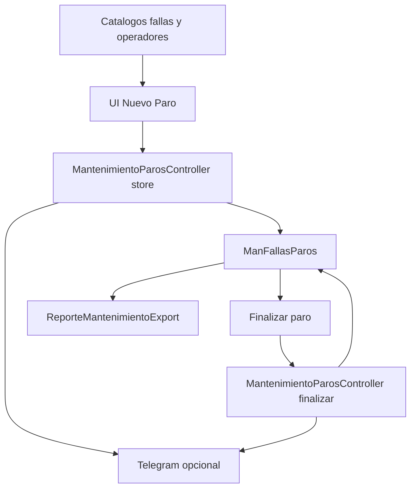

# Fase 10 - Mantenimiento

## Objetivo

Mantenimiento registra paros y fallas, gestiona catalogos de fallas y operadores, expone APIs auxiliares para la captura y genera reportes exportables.

## Rutas principales

| Grupo | Rutas |
| --- | --- |
| Reportes | `GET /mantenimiento/reportes`, `GET /mantenimiento/reportes/fallas-paros`, `GET /mantenimiento/reportes/fallas-paros/excel` |
| Vistas operativas | `GET /mantenimiento/nuevo-paro`, `GET /mantenimiento/finalizar-paro`, `GET /mantenimiento/reporte-fallos-paros` |
| Catalogos | `GET|POST|PUT|DELETE /mantenimiento/catalogodefallas`, `GET|POST|PUT|DELETE /mantenimiento/operadores-mantenimiento` |
| API | `GET /api/mantenimiento/departamentos`, `GET /api/mantenimiento/maquinas/{departamento}`, `GET /api/mantenimiento/tipos-falla`, `GET /api/mantenimiento/fallas/{departamento}/{tipoFallaId?}`, `GET /api/mantenimiento/orden-trabajo/{departamento}/{maquina}`, `GET /api/mantenimiento/operadores`, `POST /api/mantenimiento/paros`, `GET /api/mantenimiento/paros`, `GET /api/mantenimiento/paros/{id}`, `PUT /api/mantenimiento/paros/{id}/finalizar` |

## Controladores y funciones

| Archivo | Funciones documentadas |
| --- | --- |
| `MantenimientoParosController.php` | `nuevoParo`, `departamentos`, `maquinas`, `tiposFalla`, `fallas`, `ordenTrabajo`, `store`, `index`, `show`, `finalizar`, `operadores` |
| `CatalogosFallasController.php` | `index`, `store`, `update`, `destroy` |
| `ManOperadoresMantenimientoController.php` | `index`, `store`, `update`, `destroy` |
| `ReportesMantenimientoController.php` | `index`, `reporteFallasParos`, `exportarExcel` |

## Archivos tecnicos relacionados

| Archivo | Rol |
| --- | --- |
| `app/Models/Mantenimiento/ManFallasParos.php` | Registro principal de paros/fallas. |
| `app/Models/Mantenimiento/CatParosFallas.php` | Catalogo de fallas por departamento/tipo. |
| `app/Models/Mantenimiento/CatTipoFalla.php` | Tipos de falla. |
| `app/Models/Mantenimiento/ManOperadoresMantenimiento.php` | Operadores disponibles para cierre. |
| `app/Helpers/FolioHelper.php` | Genera folios del modulo. |
| `app/Exports/ReporteMantenimientoExport.php` | Exportacion Excel del reporte. |

## Funcionamiento tecnico

1. El frontend consulta catálogos auxiliares por API.
2. `store` genera el folio del paro y guarda departamento, maquina, tipo y descripcion.
3. `finalizar` registra hora/fecha de cierre, atendio, turno, calidad y observaciones.
4. El reporte agrupa por fechas y puede exportarse a Excel.

## Diagrama

## Notas tecnicas

- El modulo resuelve orden de trabajo desde distintos orígenes segun el departamento.
- Tambien usa Telegram de forma puntual para avisos de apertura/cierre.
- Varios mapeos de area y tipo de falla estan hardcodeados en el controlador.
