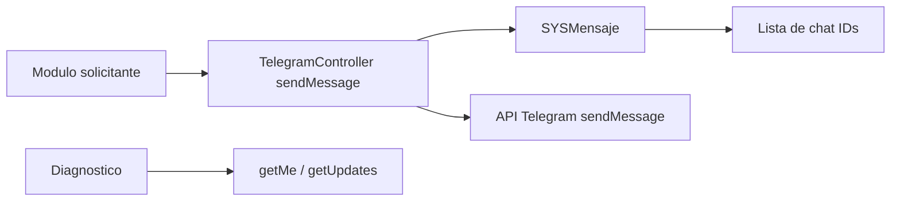

# Fase 11 - Telegram

## Objetivo

Esta fase expone un gateway sencillo para enviar mensajes Telegram, consultar informacion del bot y recuperar chat IDs detectados desde `getUpdates`.

## Rutas principales

| Ruta | Funcion |
| --- | --- |
| `POST /telegram/send` | Envia un mensaje a un modulo o chat configurado. |
| `GET /telegram/bot-info` | Consulta `getMe` y muestra diagnostico del bot. |
| `GET /telegram/get-chat-id` | Consulta `getUpdates` para descubrir chat IDs recientes. |

## Controlador y funciones

| Archivo | Funciones documentadas | Funcion tecnica |
| --- | --- | --- |
| `app/Http/Controllers/Telegram/TelegramController.php` | `sendMessage`, `getBotInfo`, `getChatId` | Resuelve destinatarios desde configuracion, llama a la API de Telegram y devuelve diagnostico del bot. |

## Archivos tecnicos relacionados

| Archivo | Rol |
| --- | --- |
| `app/Models/Sistema/SYSMensaje.php` | Define columnas permitidas por modulo y destinatarios activos. |
| `resources/views/modulos/telegram/bot-info.blade.php` | Diagnostico visual del bot. |
| `resources/views/modulos/telegram/get-chat-id.blade.php` | Visualizacion de chats detectados. |

## Funcionamiento tecnico

1. `sendMessage` recibe un texto y, opcionalmente, un modulo.
2. Si hay modulo, busca destinatarios activos en `SYSMensaje` usando las columnas permitidas por `columnasModuloPermitidas()`.
3. Si no encuentra destinatarios, usa `TELEGRAM_CHAT_ID` como fallback global.
4. `getBotInfo` valida el token contra `getMe` y `getChatId` consume `getUpdates` para obtener chat IDs recientes.

## Diagrama

## Notas tecnicas

- Las columnas de modulo permitidas estan hardcodeadas en `SYSMensaje`.
- Varios modulos del sistema no usan este controlador directamente, pero reutilizan la misma configuracion de destinatarios.
- Telegram tiene limite de 4096 caracteres por mensaje; el controlador ya hace truncado.
