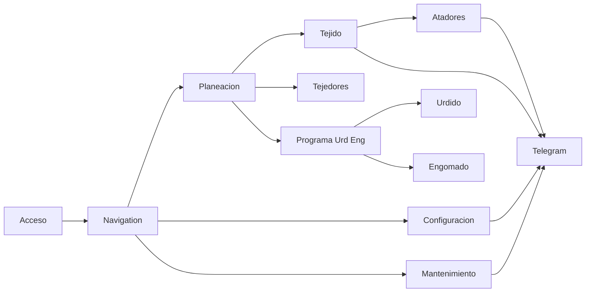
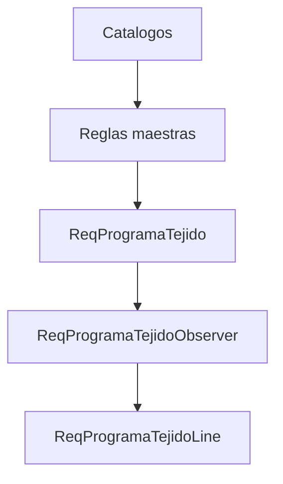

# Manual tecnico detallado de Towell

## Portada

**Documento:** Manual tecnico detallado de Towell  
**Codigo:** MTD-TOW-001  
**Version:** 1.0  
**Estatus:** Vigente  
**Fecha de emision:** 2026-03-12  
**Tipo de documento:** Manual tecnico de arquitectura funcional y operativa  
**Uso:** Interno  

## Objetivo

Este manual consolida, en un solo documento, la documentacion tecnica del sistema Towell. Su proposito es facilitar mantenimiento, soporte, analisis de impacto, onboarding tecnico y evolucion funcional del proyecto.

## Alcance tecnico

El manual se construye a partir de la estructura de rutas definida en `routes/web.php` y los archivos incluidos desde `routes/modules/*.php`, cruzando controladores, modelos, servicios, helpers, observers y vistas principales.

## Mapa tecnico del sistema



## Componentes transversales criticos

| Componente | Tipo | Impacto tecnico |
| --- | --- | --- |
| `ReqProgramaTejidoObserver` | Observer | Recalcula formulas y reconstruye `ReqProgramaTejidoLine`; afecta planeacion, muestras, liberacion y salidas. |
| `ProduccionTrait` | Trait | Comparte logica de captura entre urdido y engomado. |
| `FolioHelper` | Helper | Gestiona consecutivos de multiples modulos. |
| `TurnoHelper` | Helper | Resuelve turno actual en capturas operativas. |
| `ModuloService` | Service | Resuelve y cachea modulos visibles por usuario. |
| `UsuarioService` | Service | Administra foto, contrasena y ciclo base de usuario. |
| `PermissionService` | Service | Reescribe o sincroniza permisos funcionales del usuario. |
| `SYSMensaje` | Modelo + configuracion funcional | Soporta destinatarios y banderas de notificacion por modulo. |

## Fase 00 - Publico y autenticacion

### Rutas cubiertas

- `GET /`
- `GET /login`
- `POST /login`
- `POST /logout`
- `GET /test-404`
- `GET /offline`
- `GET /obtener-empleados/{area}`
- `GET|POST|PUT|DELETE /modulos-sin-auth/*`

### Controladores y funciones

| Controlador | Funcion | Descripcion tecnica |
| --- | --- | --- |
| `AuthController` | `showLoginForm` | Renderiza la vista de acceso inicial. |
| `AuthController` | `login` | Valida credenciales, busca en `SYSUsuario`, migra contrasenas legacy a hash y crea sesion. |
| `AuthController` | `logout` | Cierra sesion y limpia estado autenticado. |
| `UsuarioController` | `obtenerEmpleados` | Devuelve usuarios por area para consumos ligeros. |
| `SystemController` | `test404` | Fuerza una respuesta 404 de prueba. |
| `ModulosController` | `index` | Lista modulos configurados en `SYSRoles`. |
| `ModulosController` | `create` | Prepara formulario de alta de modulo. |
| `ModulosController` | `store` | Crea un modulo, jerarquia, imagen y permisos base. |
| `ModulosController` | `edit` | Carga un modulo existente para edicion. |
| `ModulosController` | `update` | Actualiza el modulo y su configuracion. |
| `ModulosController` | `destroy` | Elimina un modulo sin dependencias hijas. |

### Archivos clave

| Archivo | Rol tecnico |
| --- | --- |
| `app/Http/Requests/LoginRequest.php` | Valida `numero_empleado` y `contrasenia`. |
| `app/Models/Sistema/Usuario.php` | Modelo autenticable principal. |
| `app/Models/Sistema/SYSRoles.php` | Catalogo de modulos del sistema. |
| `app/Models/Sistema/SYSUsuariosRoles.php` | Permisos por usuario y modulo. |
| `app/Services/ModuloService.php` | Limpieza de cache al modificar modulos. |
| `app/Helpers/ImageOptimizer.php` | Optimiza imagenes de modulos. |
| `resources/views/login.blade.php` | Vista de acceso. |

### Flujo tecnico

```mermaid
flowchart TD
    A[Usuario] --> B[LoginRequest]
    B --> C[AuthController login]
    C --> D[SYSUsuario]
    D --> E{Credenciales validas}
    E -- Si --> F[Auth::login]
    F --> G[Sesion regenerada]
    G --> H[/produccionProceso]
    E -- No --> I[Error de acceso]
```

### Riesgos y notas

- `modulos-sin-auth` es una superficie sensible desde el punto de vista funcional.
- Existen campos historicos con diferencias tipograficas entre roles y permisos.
- El login realiza migracion de contrasenas legacy durante uso real.

## Fase 01 - Navigation

### Rutas cubiertas

- `GET /produccionProceso`
- `GET /submodulos/{modulo}`
- `GET /submodulos-nivel3/{moduloPadre}`
- `GET /api/submodulos/{moduloPrincipal}`
- `GET /api/modulo-padre`
- `GET /storage/usuarios/{filename}`

### Controladores y funciones

| Controlador | Funcion | Descripcion tecnica |
| --- | --- | --- |
| `UsuarioController` | `index` | Construye el dashboard principal segun permisos. |
| `UsuarioController` | `showSubModulos` | Muestra submodulos de segundo nivel. |
| `UsuarioController` | `showSubModulosNivel3` | Muestra submodulos de tercer nivel. |
| `UsuarioController` | `getSubModulosAPI` | Expone submodulos en formato JSON/API. |
| `UsuarioController` | `getModuloPadre` | Resuelve el modulo padre para navegacion contextual. |
| `StorageController` | `usuarioFoto` | Entrega archivos de foto desde storage publico. |

### Archivos clave

| Archivo | Rol tecnico |
| --- | --- |
| `app/Services/ModuloService.php` | Cachea y resuelve modulos visibles. |
| `app/Models/Sistema/SYSRoles.php` | Define `Nivel`, `Dependencia`, `Ruta`, `orden`. |
| `app/Models/Sistema/SYSUsuariosRoles.php` | Filtra el acceso efectivo. |
| `resources/views/produccionProceso.blade.php` | Vista principal de modulos. |
| `resources/views/modulos/submodulos.blade.php` | Vista de submodulos. |
| `resources/views/components/layout/module-grid.blade.php` | Render reutilizable de tarjetas. |

### Notas tecnicas

- Cambios en permisos o modulos requieren limpieza de cache.
- La navegacion depende fuertemente de la consistencia de `SYSRoles`.

## Fase 02 - Planeacion

### Alcance tecnico

Es la fase mas transversal. Mantiene catalogos, reglas de negocio, programa de tejido, muestras, codificacion, alineacion, balanceo, utilerias y liberacion de ordenes.

### 02.1 Catalogos de planeacion

**Rutas base**

- `GET /planeacion/catalogos`
- `GET|POST|PUT|DELETE /planeacion/telares`
- `GET|POST|PUT|DELETE /planeacion/eficiencia`
- `GET|POST|PUT|DELETE /planeacion/velocidad`
- `GET|POST|PUT|DELETE /planeacion/calendarios`
- `POST /planeacion/calendarios/{calendario}/recalcular-programas`
- `GET|POST|PUT|DELETE /planeacion/aplicaciones`
- `GET|POST|PUT|DELETE /planeacion/catalogos/matriz-hilos`
- `GET|POST|PUT|DELETE /planeacion/catalogos/pesos-rollos`

**Controladores y funciones**

| Controlador | Funcion | Descripcion tecnica |
| --- | --- | --- |
| `CatalagoTelarController` | `index`, `store`, `update`, `destroy`, `procesarExcel` | CRUD e importacion de telares. |
| `CatalagoEficienciaController` | `index`, `store`, `update`, `destroy`, `procesarExcel`, `actualizarProgramasYRecalcular` | CRUD de eficiencias y propagacion a programas. |
| `CatalagoVelocidadController` | `index`, `store`, `update`, `destroy`, `procesarExcel`, `actualizarProgramasYRecalcular` | CRUD de velocidades y recalculo de programas impactados. |
| `CalendarioController` | `index`, `getCalendariosJson`, `getCalendarioDetalle`, `store`, `update`, `updateMasivo`, `destroy`, `storeLine`, `updateLine`, `destroyLine`, `destroyLineasPorRango`, `procesarExcel`, `recalcularProgramas` | Gestion completa de cabecera, lineas e impacto del calendario sobre el programa. |
| `AplicacionesController` | `index`, `store`, `update`, `destroy`, `procesarExcel`, `actualizarLineasPorCambioFactor` | CRUD de aplicaciones y recalculo de lineas diarias. |
| `MatrizHilosController` | `index`, `list`, `store`, `show`, `update`, `destroy`, `recalcularMtsRizoEnLineas` | Catalogo tecnico de matriz de hilos y propagacion de cambios. |
| `PesosRollosController` | `index`, `store`, `update`, `destroy` | CRUD de pesos por rollo. |

**Modelos y archivos clave**

- `ReqTelares.php`
- `ReqEficienciaStd.php`
- `ReqVelocidadStd.php`
- `ReqCalendarioTab.php`
- `ReqCalendarioLine.php`
- `ReqAplicaciones.php`
- `ReqMatrizHilos.php`
- `ReqPesosRollosTejido.php`

**Flujo tecnico**



### 02.2 Codificacion

**Rutas base**

- `GET /planeacion/catalogos/codificacion-modelos`
- `GET /planeacion/codificacion`
- `POST /planeacion/catalogos/codificacion-modelos/excel`
- `POST /planeacion/codificacion/excel`
- `GET /planeacion/codificacion/orden-cambio-pdf`
- `GET /planeacion/codificacion/orden-cambio-excel`

**Controladores y funciones**

| Controlador | Funcion | Descripcion tecnica |
| --- | --- | --- |
| `CodificacionController` | `index`, `create`, `edit`, `getAll`, `getAllFast`, `show`, `store`, `update`, `destroy`, `duplicate`, `procesarExcel`, `importProgress`, `buscar`, `estadisticas`, `duplicarImportar` | Gestion del maestro tecnico de modelos codificados. |
| `CatCodificacionController` | `index`, `procesarExcel`, `ordenesEnProceso`, `getCatCodificadosPorOrden`, `actualizarPesoMuestraLmat`, `getAllFast`, `registrosOrdCompartida`, `importProgress` | Catalogo operativo ligado a ordenes reales. |
| `OrdenDeCambioFelpaController` | `generarPDF`, `generarExcel`, `generarExcelDesdeBD` | Salidas de orden de cambio. |
| `ReimprimirOrdenesController` | `reimprimir` | Reimpresion de ordenes emitidas. |

**Archivos clave**

- `ReqModelosCodificados.php`
- `CatCodificados.php`
- `ReqModelosCodificadosImport.php`
- `CatCodificadosImport.php`

### 02.3 Alineacion

| Controlador | Funcion | Descripcion tecnica |
| --- | --- | --- |
| `AlineacionController` | `index`, `apiData`, `obtenerItemsAlineacion`, `obtenerCatCodificadosPorOrden`, `mapearProgramaTejidoAItem` | Consolida ordenes en proceso y su enriquecimiento tecnico por telar. |

### 02.4 Utileria operativa

| Controlador | Funcion | Descripcion tecnica |
| --- | --- | --- |
| `FinalizarOrdenesController` | `getTelares`, `getOrdenesByTelar`, `finalizarOrdenes` | Cierra y depura registros del programa, ajustando secuencias remanentes. |
| `MoverOrdenesController` | `getTelares`, `getRegistrosByTelar`, `moverOrdenes`, `recalcularFechasPorTelar`, `sincronizarCatCodificados` | Reordena la cola, recalcula fechas y sincroniza derivados. |

### 02.5 Programa de tejido y muestras

**Rutas base**

- `GET /planeacion/programa-tejido`
- `GET /planeacion/programa-tejido/liberar-ordenes`
- `POST /planeacion/programa-tejido/{id}/prioridad/mover`
- `POST /planeacion/programa-tejido/{id}/cambiar-telar`
- `POST /planeacion/programa-tejido/duplicar-telar`
- `POST /planeacion/programa-tejido/dividir-telar`
- `POST /planeacion/programa-tejido/vincular-telar`
- `GET /planeacion/programa-tejido/balancear`
- `POST /planeacion/programa-tejido/recalcular-fechas`
- `POST /planeacion/programa-tejido/descargar-programa`
- Replica funcional en `/planeacion/muestras` y `/muestras/*`

**Controladores y funciones**

| Controlador | Funcion | Descripcion tecnica |
| --- | --- | --- |
| `ProgramaTejidoController` | `index`, `store`, `update`, `destroy`, `destroyEnProceso`, `edit` | CRUD base del programa de tejido. |
| `ProgramaTejidoOperacionesController` | `moveToPosition`, `verificarCambioTelar`, `cambiarTelar`, `duplicarTelar`, `dividirTelar`, `dividirSaldo`, `vincularTelar`, `vincularRegistrosExistentes`, `desvincularRegistro`, `getRegistrosPorOrdCompartida` | Maniobras operativas sobre cola, telar y agrupaciones. |
| `ProgramaTejidoBalanceoController` | `balancear`, `detallesBalanceo`, `previewFechasBalanceo`, `actualizarPedidosBalanceo`, `balancearAutomatico` | Balanceo de ordenes compartidas y simulacion de impacto. |
| `ProgramaTejidoCalendariosController` | `getAllRegistrosJson`, `actualizarCalendariosMasivo`, `actualizarReprogramar`, `recalcularFechas` | Ajustes masivos de calendario y fechas. |
| `ProgramaTejidoCatalogosController` | Catalogos auxiliares | Soporta selects, combos y lookups auxiliares del frontend. |
| `LiberarOrdenesController` | `index`, `liberar`, `obtenerBomYNombre`, `obtenerTipoHilo`, `obtenerCodigoDibujo`, `guardarCamposEditables`, `obtenerOpcionesHilos` | Convierte planeacion en salida operativa sincronizada. |
| `DescargarProgramaController` | `descargar` | Genera archivo TXT del programa. |
| `RepasoController` | `createrepaso` | Inserta registros de repaso. |
| `ColumnasProgramaTejidoController` | `index`, `getColumnasVisibles`, `store` | Personalizacion de columnas visibles. |
| `ReqProgramaTejidoLineController` | `index` | Consulta lineas diarias generadas. |

**Archivos clave**

- `ReqProgramaTejido.php`
- `ReqProgramaTejidoLine.php`
- `OrdColProgramaTejido.php`
- `ReqProgramaTejidoObserver.php`
- `resources/views/modulos/programa-tejido/*`

**Dependencias criticas**

- La mayoria de los cambios de esta fase terminan impactando `ReqProgramaTejido`.
- `Muestras` reutiliza el mismo stack tecnico del programa.
- La salida TXT depende de una ruta de red externa.

## Fase 03 - Tejido

### 03.1 Inventario de telas

| Controlador | Funcion | Descripcion tecnica |
| --- | --- | --- |
| `TelaresController` | `inventarioJacquard`, `inventarioItema`, `inventarioKarlMayer`, `mostrarTelarSulzer`, `obtenerOrdenesProgramadas`, `procesoActual`, `siguienteOrden` | Consulta orden actual y siguiente por telar combinando inventario y programa. |

### 03.2 Inventario de trama

| Controlador | Funcion | Descripcion tecnica |
| --- | --- | --- |
| `NuevoRequerimientoController` | `index`, `guardarRequerimientos`, `getTurnoInfo`, `enProcesoInfo`, `actualizarCantidad`, `buscarArticulos`, `buscarFibras`, `buscarCodigosColor`, `buscarNombresColor` | Captura requerimientos y consumos por folio. |
| `ConsultarRequerimientoController` | `index`, `show`, `updateStatus`, `resumen` | Consulta, resume y cambia estatus del requerimiento. |

### 03.3 Marcas finales

| Controlador | Funcion | Descripcion tecnica |
| --- | --- | --- |
| `MarcasController` | `index`, `consultar`, `generarFolio`, `obtenerDatosSTD`, `store`, `show`, `update`, `actualizarRegistro`, `finalizar`, `reabrirFolio`, `visualizarFolio`, `visualizar`, `reporte`, `exportarExcel`, `descargarPDF` | Gestion completa de capturas, cierre y reporteo de marcas finales. |
| `SecuenciaMarcasFinalesController` | `index`, `store`, `updateOrden`, `update`, `destroy` | Mantenimiento de secuencia de telares del modulo. |

### 03.4 Cortes de eficiencia y reenconado

| Controlador | Funcion | Descripcion tecnica |
| --- | --- | --- |
| `CortesEficienciaController` | `index`, `consultar`, `getTurnoInfo`, `getDatosProgramaTejido`, `getDatosTelares`, `getFallasCe`, `generarFolio`, `guardarHora`, `guardarTabla`, `store`, `show`, `update`, `actualizarRegistro`, `finalizar`, `visualizar`, `visualizarFolio`, `exportarVisualizacionExcel`, `descargarVisualizacionPDF`, `notificarTelegram` | Gestion completa del modulo de eficiencia. |
| `SecuenciaCorteEficienciaController` | `index`, `store`, `updateOrden`, `update`, `destroy` | Orden de captura por telar. |
| `ProduccionReenconadoCabezuelaController` | `index`, `store`, `generarFolio`, `getCalibres`, `getFibras`, `getColores`, `update`, `destroy`, `cambiarStatus` | Captura y mantenimiento de reenconado. |

### 03.5 Reportes

| Controlador | Funcion | Descripcion tecnica |
| --- | --- | --- |
| `ReporteInvTelasController` | `index`, `exportarExcel`, `exportarPdf`, `obtenerDatosReporte` | Construye y exporta el reporte de inventario de telas. |

### Notas tecnicas

- Conviven rutas nuevas y aliases legacy.
- Marcas finales y cortes hacen `delete + insert` en lineas, por lo que cambios ahi requieren cuidado de concurrencia.

## Fase 04 - Tejedores

### 04.1 BPM

| Controlador | Funcion | Descripcion tecnica |
| --- | --- | --- |
| `TelBpmController` | `index`, `show`, `logDebug`, `store`, `update`, `destroy` | Encabezado BPM de tejedores. |
| `TelBpmLineController` | `index`, `toggle`, `bulkSave`, `updateComentarios`, `finish`, `authorizeDoc`, `reject` | Checklist BPM y cambios de estado. |
| `TelActividadesBPMController` | `index`, `store`, `update`, `destroy` | CRUD de actividades BPM. |
| `TelTelaresOperadorController` | `index`, `store`, `update`, `destroy` | Asignacion de telares por operador. |

### 04.2 Inventario de telares

| Controlador | Funcion | Descripcion tecnica |
| --- | --- | --- |
| `InventarioTelaresController` | `index`, `store`, `verificarEstado`, `destroy`, `updateFecha`, `verificarTurnosOcupados` | Gestion del inventario operativo del area. |

### 04.3 Desarrolladores

| Controlador | Funcion | Descripcion tecnica |
| --- | --- | --- |
| `TelDesarrolladoresController` | `index`, `formularioDesarrollador`, `obtenerProducciones`, `obtenerDetallesOrden`, `obtenerCodigoDibujo`, `obtenerRegistroCatCodificado`, `store`, `exportarExcel` | Flujo principal de desarrolladores. |
| `TelDesarrolladoresMuestrasController` | `index`, `obtenerProducciones`, `obtenerDetallesOrden`, `obtenerCodigoDibujo`, `obtenerRegistroCatCodificado`, `store` | Variante de muestras. |
| `catDesarrolladoresController` | `index`, `store`, `update`, `destroy` | Catalogo de desarrolladores. |

### 04.4 Notificaciones y reportes

| Controlador | Funcion | Descripcion tecnica |
| --- | --- | --- |
| `NotificarMontadoJulioController` | `index`, `notificar` | Notifica eventos de atado de julio. |
| `NotificarMontRollosController` | `index`, `telares`, `detalle`, `notificar`, `obtenerOrdenesEnProceso`, `getOrdenProduccion`, `getDatosProduccion`, `insertarMarbetes` | Gestiona notificacion de cortado de rollo y marbetes. |
| `ReportesTejedoresController` | `index`, `reportePrograma`, `exportarExcel` | Reportes BPM del area. |
| `ReportesDesarrolladoresController` | `index`, `reportePrograma`, `exportarExcel` | Reportes de desarrolladores. |

### Notas tecnicas

- El flujo de desarrolladores toca varias tablas y servicios; es uno de los puntos de mayor sensibilidad funcional.

## Fase 05 - Urdido

### Programacion, produccion, BPM y reportes

| Controlador | Funcion | Descripcion tecnica |
| --- | --- | --- |
| `ProgramarUrdidoController` | `index`, `getOrdenes`, `getTodasOrdenes`, `verificarOrdenEnProceso`, `intercambiarPrioridad`, `actualizarPrioridades`, `guardarObservaciones`, `actualizarStatus`, `reimpresionFinalizadas`, `reimpresionVentanaImprimir` | Cola, prioridad y estatus de urdido. |
| `EditarOrdenesProgramadasController` | `index`, `actualizar`, `obtenerOrden`, `actualizarJulios`, `actualizarHilosProduccion` | Edicion operativa de ordenes. |
| `ModuloProduccionUrdidoController` | `index`, `getUsuariosUrdido`, `actualizarCamposProduccion`, `finalizar` | Captura productiva y cierre. |
| `UrdBpmController` | `index`, `store`, `update`, `destroy` | Encabezado BPM del proceso. |
| `UrdBpmLineController` | `index`, `toggleActividad`, `terminar`, `autorizar`, `rechazar` | Checklist BPM. |
| `UrdActividadesBpmController` | `index`, `store`, `update`, `destroy` | Catalogo BPM. |
| `CatalogosUrdidoController` | `catalogosJulios`, `catalogoMaquinas`, `storeJulio`, `updateJulio`, `destroyJulio`, `storeMaquina`, `updateMaquina`, `destroyMaquina` | Catalogos base del area. |
| `ReportesUrdidoController` | `index`, `reporte03Oee`, `reporteKaizen`, `exportarKaizenExcel`, `reporteRoturas`, `exportarRoturasExcel`, `reporteBpm`, `exportarBpmExcel`, `exportarExcel` | Reportes operativos y exportaciones. |

### Dependencias criticas

- Sincronizacion con engomado.
- `ProduccionTrait` compartido con engomado.

## Fase 06 - Engomado

### Programacion, produccion, formulacion, BPM y reportes

| Controlador | Funcion | Descripcion tecnica |
| --- | --- | --- |
| `ProgramarEngomadoController` | `index`, `getOrdenes`, `getTodasOrdenes`, `verificarOrdenEnProceso`, `intercambiarPrioridad`, `guardarObservaciones`, `actualizarPrioridades`, `actualizarStatus`, `reimpresionFinalizadas`, `reimpresionVentanaImprimir` | Cola y estatus del area. |
| `EditarOrdenesEngomadoController` | `index`, `actualizar`, `obtenerOrden` | Edicion operativa de ordenes. |
| `ModuloProduccionEngomadoController` | `index`, `getUsuariosEngomado`, `actualizarCamposProduccion`, `actualizarCampoOrden`, `verificarFormulaciones`, `finalizar` | Produccion y cierre de orden. |
| `EngProduccionFormulacionController` | `index`, `store`, `validarFolio`, `getFormulacionById`, `getComponentesFormula`, `getComponentesFormulacion`, `getCalibresFormula`, `getFibrasFormula`, `getColoresFormula`, `update`, `destroy` | Captura y mantenimiento de formulaciones. |
| `EngBpmController` | `index`, `store`, `update`, `destroy` | Encabezado BPM. |
| `EngBpmLineController` | `index`, `toggleActividad`, `terminar`, `autorizar`, `rechazar` | Checklist BPM. |
| `EngActividadesBpmController` | `index`, `store`, `update`, `destroy` | Catalogo BPM. |
| `UrdEngNucleosController` | `index`, `store`, `update`, `destroy`, `getNucleos` | Catalogo de nucleos. |
| `CatUbicacionesController` | `index`, `store`, `update`, `destroy` | Catalogo de ubicaciones. |
| `ReportesEngomadoController` | `index`, `reporteBpm`, `exportarBpmExcel` | Reporteo BPM del area. |

### Dependencias criticas

- Inicio condicionado por estado de urdido en varios flujos.
- `ProduccionTrait` compartido con urdido.
- Cierre condicionado por formulaciones completas.

## Fase 07 - Atadores

| Controlador | Funcion | Descripcion tecnica |
| --- | --- | --- |
| `AtadoresController` | `index`, `exportarExcel`, `iniciarAtado`, `calificarAtadores`, `save` | Gestion del programa y proceso de atado, calificacion y autorizacion. |
| `AtaActividadesController` | `index`, `store`, `show`, `update`, `destroy` | Catalogo de actividades. |
| `AtaComentariosController` | `index`, `store`, `show`, `update`, `destroy` | Catalogo de comentarios. |
| `AtaMaquinasController` | `index`, `store`, `show`, `update`, `destroy` | Catalogo de maquinas. |
| `ReportesAtadoresController` | `index`, `reportePrograma`, `exportarExcel` | Reporte del area. |

### Notas tecnicas

- `save` concentra una alta densidad de reglas de negocio.

## Fase 08 - Programa Urd/Eng

| Controlador | Funcion | Descripcion tecnica |
| --- | --- | --- |
| `ReservarProgramarController` | `index`, `programacionRequerimientos`, `getGrupoByTelar`, `creacionOrdenes`, `karlMayer`, `programarTelar`, `actualizarTelar`, `liberarTelar` | Orquesta programacion previa y trabajo por telar. |
| `InventarioTelaresController` | `getInventarioTelares` | Consulta inventario base. |
| `InventarioDisponibleController` | `disponible`, `porTelar`, `diagnosticarReservas` | Disponibilidad real y diagnostico de reservas. |
| `ReservaInventarioController` | `reservar`, `cancelar` | Gestion de reserva local. |
| `ResumenSemanasController` | `getResumenSemanas` | Consolidado por semanas. |
| `BomMaterialesController` | `buscarBomUrdido`, `buscarBomEngomado`, `getMaterialesUrdido`, `getMaterialesUrdidoCompleto`, `getMaterialesEngomado`, `getAnchosBalona`, `getMaquinasEngomado`, `obtenerHilos`, `obtenerTamanos`, `getBomFormula` | Lookups tecnicos de materiales y BOM. |
| `ProgramarUrdEngController` | `crearOrdenes` | Genera ordenes URD/ENG. |
| `CrearOrdenKarlMayerController` | `store` | Genera ordenes para Karl Mayer. |

### Servicios clave

- `InventarioTelaresService`
- `InventarioReservasService`
- `ResumenSemanasService`
- `BomMaterialesService`
- `ProgramasUrdidoEngomadoService`

## Fase 09 - Configuracion

| Controlador | Funcion | Descripcion tecnica |
| --- | --- | --- |
| `UsuarioController` | `showConfiguracion`, `select`, `create`, `store`, `showQR`, `edit`, `update`, `destroy`, `updatePermiso` | Gestion integral de usuarios, QR y permisos. |
| `ModulosController` | `index`, `create`, `store`, `edit`, `update`, `destroy`, `toggleAcceso`, `togglePermiso`, `sincronizarPermisos`, `duplicar`, `getModulosPorNivel`, `getSubmodulos` | Estructura modular y sincronizacion de permisos. |
| `ConfiguracionController` | `cargarPlaneacion`, `procesarExcel`, `procesarExcelUpdate` | Carga administrativa de planeacion. |
| `DepartamentosController` | `index`, `store`, `update`, `destroy` | CRUD de departamentos. |
| `SecuenciaFoliosController` | `index`, `store`, `update`, `destroy` | CRUD de secuencias de folios. |
| `MensajesController` | `index`, `store`, `update`, `destroy`, `obtenerChatIds`, `actualizarChatId` | Configuracion de destinatarios y chat IDs. |
| `BaseDeDatosController` | `index`, `updateProductivo` | Ajuste administrativo del indicador productivo. |

### Dependencias criticas

- Importacion completa de planeacion puede ser destructiva.
- Cambios de modulos impactan navegacion y permisos cacheados.

## Fase 10 - Mantenimiento

| Controlador | Funcion | Descripcion tecnica |
| --- | --- | --- |
| `MantenimientoParosController` | `nuevoParo`, `departamentos`, `maquinas`, `tiposFalla`, `fallas`, `ordenTrabajo`, `store`, `index`, `show`, `finalizar`, `operadores` | Captura, catalogos auxiliares y cierre de paros/fallas. |
| `CatalogosFallasController` | `index`, `store`, `update`, `destroy` | CRUD de catalogo de fallas. |
| `ManOperadoresMantenimientoController` | `index`, `store`, `update`, `destroy` | CRUD de operadores de mantenimiento. |
| `ReportesMantenimientoController` | `index`, `reporteFallasParos`, `exportarExcel` | Reporteo y exportacion. |

### Archivos clave

- `ManFallasParos.php`
- `CatParosFallas.php`
- `CatTipoFalla.php`
- `ManOperadoresMantenimiento.php`
- `ReporteMantenimientoExport.php`

## Fase 11 - Telegram

| Controlador | Funcion | Descripcion tecnica |
| --- | --- | --- |
| `TelegramController` | `sendMessage` | Resuelve destinatarios por modulo o fallback y envia mensajes. |
| `TelegramController` | `getBotInfo` | Consulta diagnostico del bot. |
| `TelegramController` | `getChatId` | Recupera chats recientes desde `getUpdates`. |

### Archivos clave

- `SYSMensaje.php`
- `resources/views/modulos/telegram/bot-info.blade.php`
- `resources/views/modulos/telegram/get-chat-id.blade.php`

## Recomendaciones tecnicas de mantenimiento

1. Antes de modificar una fase, revisar su documento individual y la `MATRIZ-TECNICA-RUTAS.md`.
2. Si un cambio toca `ReqProgramaTejido`, revisar de inmediato observer, lineas derivadas y modulos consumidores.
3. Si un cambio toca produccion de urdido o engomado, validar el impacto en `ProduccionTrait`.
4. Si un cambio toca permisos o modulos, limpiar cache y revisar navegacion.
5. Si un cambio toca notificaciones, revisar `SYSMensaje` y configuracion Telegram.

## Referencias complementarias

- `docs/documentacion-tecnica/00-fase-publica.md`
- `docs/documentacion-tecnica/01-navigation.md`
- `docs/documentacion-tecnica/02-planeacion.md`
- `docs/documentacion-tecnica/03-tejido.md`
- `docs/documentacion-tecnica/04-tejedores.md`
- `docs/documentacion-tecnica/05-urdido.md`
- `docs/documentacion-tecnica/06-engomado.md`
- `docs/documentacion-tecnica/07-atadores.md`
- `docs/documentacion-tecnica/08-programa-urd-eng.md`
- `docs/documentacion-tecnica/09-configuracion.md`
- `docs/documentacion-tecnica/10-mantenimiento.md`
- `docs/documentacion-tecnica/11-telegram.md`
- `docs/documentacion-tecnica/MATRIZ-TECNICA-RUTAS.md`
