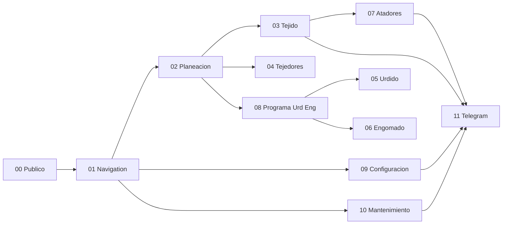

# Documentacion tecnica por fases

Esta carpeta contiene la version tecnica de la documentacion de Towell. Esta orientada a desarrollo, soporte, analisis funcional-tecnico y mantenimiento evolutivo.

## Objetivo

- ubicar rapidamente donde vive cada flujo del sistema
- entender relaciones entre rutas, controladores, modelos, servicios y vistas
- facilitar analisis de impacto antes de cambiar codigo

## Puntos de entrada recomendados

- `MANUAL-TECNICO-DETALLADO-TOWELL.md`
- `GUIA-DESARROLLADORES.md`
- `MATRIZ-TECNICA-RUTAS.md`

## Fases documentadas

1. `00-fase-publica.md` - acceso publico, autenticacion y utilidades sin `auth`
2. `01-navigation.md` - menu principal, submodulos y resolucion de acceso
3. `02-planeacion.md` - catalogos, codificacion, alineacion, utileria, programa de tejido y muestras
4. `03-tejido.md` - inventarios, marcas finales, cortes de eficiencia, reenconado y reportes
5. `04-tejedores.md` - BPM, desarrolladores, notificaciones operativas, inventario y reportes
6. `05-urdido.md` - programacion, produccion, BPM, catalogos y reportes de urdido
7. `06-engomado.md` - programacion, produccion, formulacion, BPM y reportes de engomado
8. `07-atadores.md` - programa de atado, captura operativa, catalogos y reportes
9. `08-programa-urd-eng.md` - reserva de inventario, programacion y creacion de ordenes URD/ENG
10. `09-configuracion.md` - usuarios, modulos, secuencias, mensajes, departamentos y cargas administrativas
11. `10-mantenimiento.md` - paros, fallas, operadores y reportes
12. `11-telegram.md` - gateway de mensajeria y diagnostico del bot

## Anexos

- `MANUAL-TECNICO-DETALLADO-TOWELL.md` - manual consolidado con detalle tecnico por fase y funciones
- `MANUAL-TECNICO-DETALLADO-TOWELL-PDF.html` - version imprimible/compartible del manual tecnico
- `MATRIZ-TECNICA-RUTAS.md` - trazabilidad rapida entre rutas, controladores y archivos clave
- `GUIA-DESARROLLADORES.md` - guia de inicio segun el tipo de mantenimiento o cambio

## Diagrama general tecnico

## Notas de lectura

- La documentacion se basa en rutas reales y en los archivos principales asociados a cada flujo.
- Cuando un modulo reutiliza logica de otro, se documenta la dependencia tecnica para evitar lecturas aisladas.
- Los diagramas estan en Mermaid para poder reutilizarse en GitHub o herramientas compatibles.
